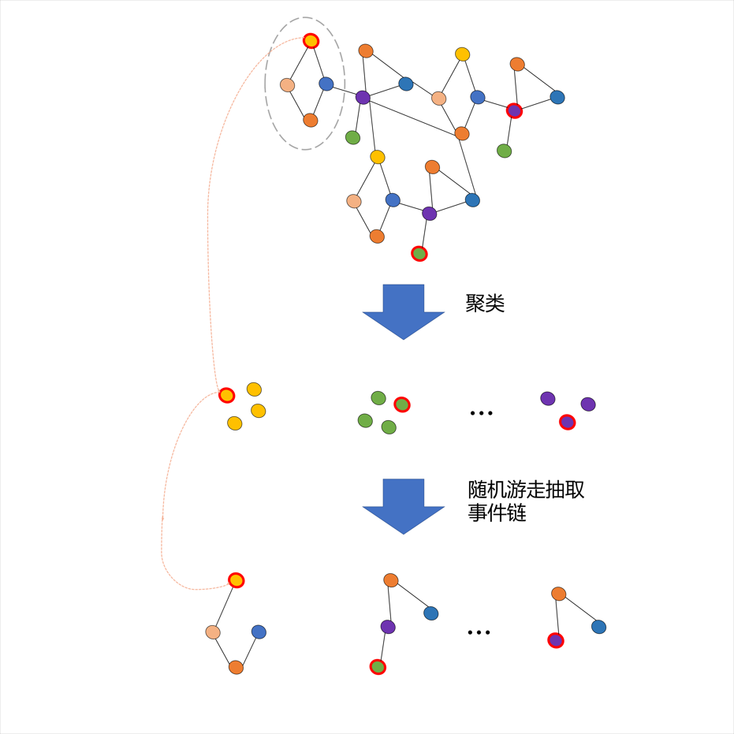
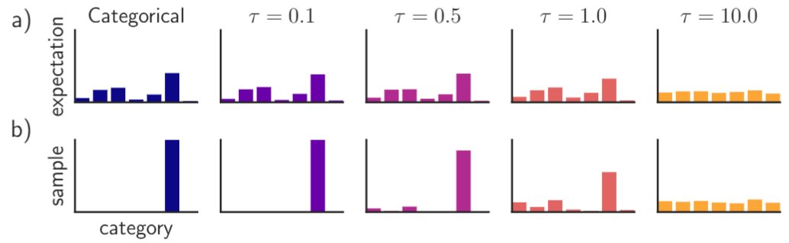
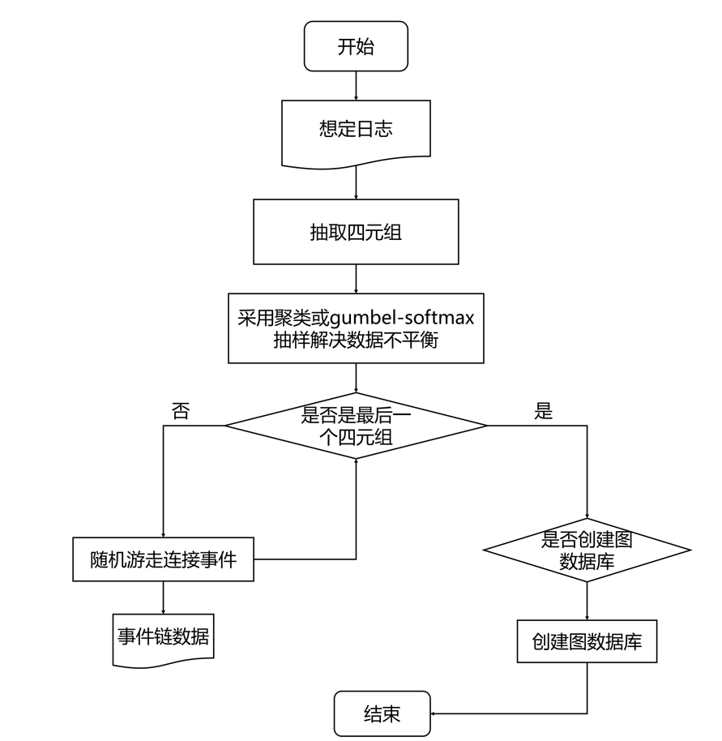
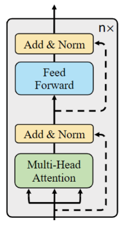
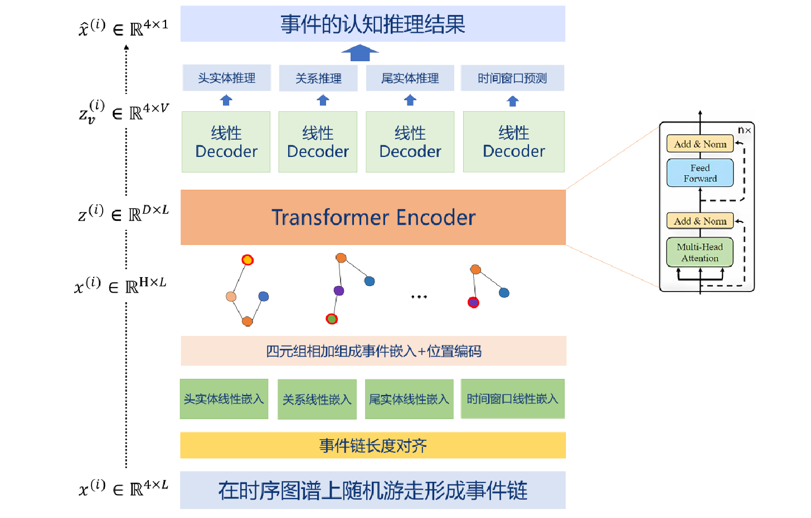
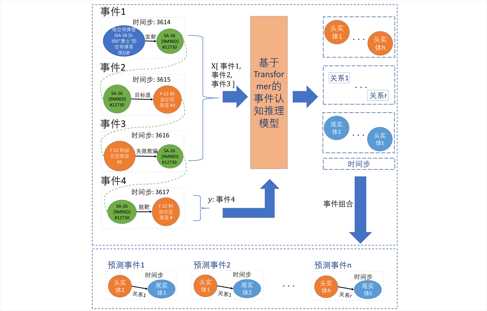
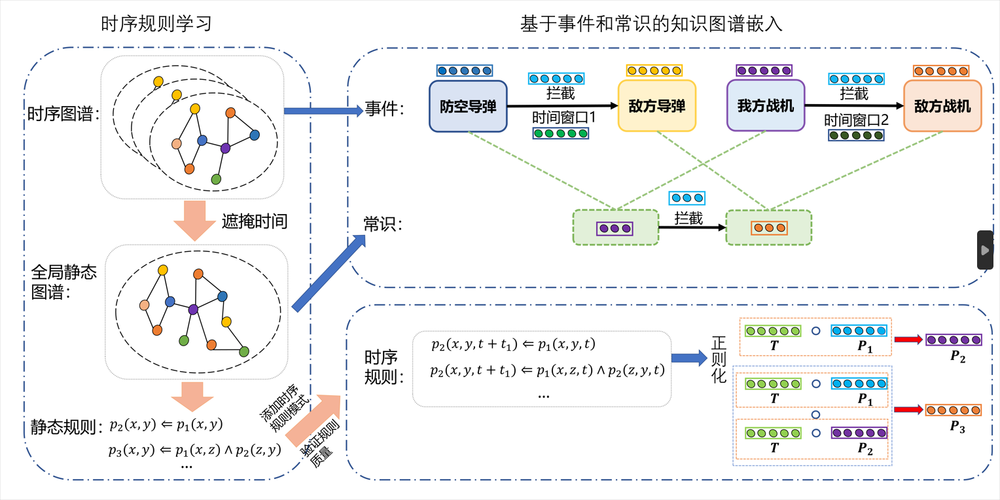
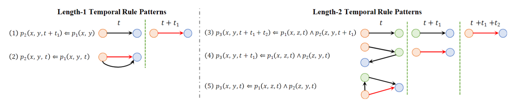

### 事件序列抽取

采用头实体、关系、尾实体和时间的随机游走方法，抽取出来的事件链是长尾数据，存在着大量不太常见的实体和关系组成的事件，它们的出现频率很低，但在FKFD应用场景中却非常重要。由于长尾实体和关系数量巨大，而它们又往往缺乏足够的训练数据，因此传统的基于统计的方法很难对它们进行准确的建模。

为了解决上述长尾问题，有下面两种解决方法：

#### 聚类

基于节点和时间的聚类的启发式方法。它的基本思想是将图中的节点和边按照它们的属性进行聚类，然后从每个聚类中选取一个代表性节点，作为链的起始点。这种方法可以避免数据不平衡的问题，并提高链的覆盖率和准确率。

具体来说，这个方法可以分为以下几个步骤：

1. 对图中的节点和边按照它们的属性进行聚类，比如将节点按照它们的度数、标签、度分布等进行聚类，将边按照它们的权重、方向等进行聚类。
2. 从每个聚类中选取一个代表性节点，作为链的起始点。这个代表性节点可以是聚类中度数最高的节点，或者是聚类中度数和标签都比较平均的节点。
3. 以选取的代表性节点为起点，按照某种策略向外扩展链。这个策略可以是简单的随机游走，也可以是基于路径规划、信息传播等的策略。
4. 通过对多个起始点进行扩展，得到一组链。可以通过链的覆盖率、准确率等指标对这些链进行评估，选择最优的链。

图x 聚类示意图

需要注意的是，这种方法也有一些局限性。首先，聚类的质量会直接影响链的质量，因此需要选择合适的聚类算法和聚类参数。其次，由于聚类是一种无监督学习方法，它不能直接考虑任务的目标，因此需要进一步结合任务目标对选取的链进行优化。

#### gumbel-softmax抽样

Gumbel-Softmax 抽样是一种常用于解决分类问题的方法，也被广泛应用于知识图谱中的长尾问题。

在传统的分类问题中，对于一个具有多个类别的输入，我们希望将其映射到一个离散的类别上。一种常见的做法是使用 softmax 函数，将输入向量转化为一个概率分布，然后根据最大概率来进行分类。但是，当输入空间非常大时，这种方法容易受到长尾分布的影响，即少数类别的样本数量很少，使得它们的概率很难被准确估计。在知识图谱中，这种问题同样存在。

为了解决这个问题，可以使用 Gumbel-Softmax 抽样。它的基本思想是引入一个从 Gumbel 分布中抽取的随机噪声，使得 softmax 函数的输出变得更加平滑。具体来说，可以通过以下步骤来实现：

1. 对于一个给定的输入向量，从 Gumbel 分布中抽取一个随机向量。
2. 将输入向量和随机向量相加，得到一个新的向量。
3. 对新向量进行 softmax 函数计算，得到一个概率分布。
4. 根据概率分布来进行分类。

图x Gumbel-Softmax采样示意图

Gumbel-Softmax 抽样的公式如下：

对于一个输入向量 $z\in \mathbb{R}^k$，其中 $k$ 是类别数量，我们可以从 Gumbel 分布中抽取一个随机向量 $g\in \mathbb{R}^k$，满足 $g_i=-\log(-\log(u_i))$，其中 $u_i$ 是从均匀分布 $U(0,1)$ 中抽取的随机数。

然后，我们可以根据下面的公式计算 Gumbel-Softmax 分布：
$$
y_i = \frac{\exp((\log  {\pi_i + g_i}) / \tau )}{ {\textstyle \sum_{j=1}^{k}} \exp((\log  {\pi_j + g_i}) / \tau )}
$$
其中 $\pi_i$ 是类别 $i$ 的先验概率，$\tau$ 是一个温度参数，用于控制分布的平滑度。当 $\tau$ 趋近于 $0$ 时，Gumbel-Softmax 分布退化为 one-hot 分布，即只有一个元素为 $1$，其余为 $0$。

通过 Gumbel-Softmax 抽样，我们可以得到一个平滑的概率分布 $y\in [0,1]^k$，可以用于多分类任务的分类器。

通过引入随机噪声，Gumbel-Softmax 抽样可以使得少数类别的概率得到更好的估计，从而更好地解决长尾问题。在知识图谱中，它可以用于实体分类、关系分类等任务，从而提高模型的表现。

#### 随机游走事件链的抽取

在构建事件知识图谱的具体的实现过程中，我们把一个四元组（s,p,o,t）当成一个事件，并使用时序知识图谱中抽取四元组的规则，把日志文件中的所有事件抽取出来。事件抽取出来之后就可以根据确定好的规则，组成事件序列。

抽取事件序列的规则如下：根据事件发生时间的先后顺序，对所有事件进行排序，使用双指针的方法逐步的把事件序列提取出来。头指针首先第一个事件的尾实体，尾指针在所有事件的头实体里匹配，如果匹配成功，把尾指针所指事件连接到头指针所指事件之后，然后头指针移动到尾指针所指事件的尾实体，尾指针继续和当前事件之后的头实体匹配，直到匹配失败，当前事件链的构造就结束。重复上述过程，直到把所有的事件链提取出来。事件链的抽取流程图如下图所示：

下图是事件链抽取的路程图：

### 在FKFD场景下的事件图谱认知推理

#### 基于Transformer的事件表征学习

在事件知识图谱推理部分，使用基于Transformer的深度学习模型对事件知识图谱进行推理。Transformer由编码器和解码器两部分组成，编码器将输入序列映射到隐藏表示，解码器根据编码器的输出和之前的预测结果，生成目标序列。每个编码器和解码器由多层堆叠的子模块组成，其中包括多头自注意力机制和前馈神经网络。

自注意力机制是Transformer的核心部分，可以将输入事件序列中的每个事件与其他事件进行交互，并计算每个事件对于整个序列的重要性分数，然后加权求和得到该事件的表示。多头自注意力机制是Transformer中最核心的组件之一。它可以将输入事件序列中的每个位置与其他位置进行交互，并计算每个位置对整个序列的重要性分数，然后根据分数进行加权求和，得到每个位置的表示。具体来说，多头自注意力机制首先将输入序列中每个位置的表示进行线性变换，得到查询、键、值三个向量。然后，对于每个位置，它将该位置的查询向量与所有位置的键向量进行点积，得到一个分数序列。接下来，使用softmax函数对分数序列进行归一化，得到每个位置对所有位置的重要性分数。最后，使用重要性分数对所有位置的值向量进行加权求和，得到该位置的表示。这个过程可以使用矩阵运算进行高效计算，并且可以通过设置多个注意力头来增强模型的表达能力。下面是多头注意力的计算公式：

1.将输入表示 $Z$ 通过 $h$ 个线性变换映射到 $h$ 个不同的子空间，得到 $h$ 个子空间的表示 $Z_i$，其中 $i\in[1,h]$。
$$
Z_i = ZW_i^Q
$$
其中 $W_i^Q\in \mathbb{R}^{d\times d_k}$ 表示第 $i$ 个子空间的查询（query）矩阵，$d_k$ 表示每个子空间的特征维度，通常设置为 $d/h$。

2.在每个子空间中分别计算自注意力，得到 $h$ 个子空间的注意力向量 $H_i$。

对于第 $i$ 个子空间的表示 $Z_i={z_{i,1},z_{i,2},...,z_{i,n}}$，我们可以按照上面的自注意力计算公式计算注意力权重 $a_{ij}^i$ 和注意力向量 $h_i^i$：
$$
a_{ij}^{i} = \frac{\exp(e_{ij}^{i})}{ {\textstyle \sum_{k=1}^{n}}\exp(e_{ik}^{i}) }
$$

$$
h_i^i = \sum_{j=1}^{n} a_{ij}^{i} z_{i,j}
$$

其中 $e_{ij}^i$ 表示 $z_{i,j}$ 和 $z_{i,i}$ 的相似度得分，可以通过点积计算得到：
$$
e_{ij}^{i} = z_{i,j}^Tz_{i,i}
$$
3.将 $h$ 个子空间的注意力向量拼接起来，得到最终的表示 $O$。
$$
O = \mathrm{Concat}(H_1, H_2, \ldots, H_h)W_O + b_O
$$
其中 $\text{Concat}$ 表示将 $h$ 个注意力向量按照最后一个维度进行拼接，$W_O\in \mathbb{R}^{hd_k\times d}$ 和 $b_O\in \mathbb{R}^{d}$ 分别表示输出层的权重矩阵和偏置向量。

前馈神经网络是Encoder中的另一个重要组件，用于增强模型的非线性表达能力。它将每个位置的表示进行线性变换和激活函数，得到一个新的表示。具体来说，它首先对每个位置的表示进行一个全连接的线性变换，然后通过一个激活函数（例如ReLU）进行非线性变换，最后再进行一次全连接的线性变换。这个过程可以有效地增强模型的非线性表达能力，并且可以通过设置不同的隐藏层大小和激活函数来满足不同的任务需求。

Transformer模型中的Encoder通过堆叠多个子模块来增强模型的表达能力，每个子模块由多头自注意力机制和前馈神经网络组成，可以高效地处理输入序列并提取相关信息。下图是Transformer中Encoder结构：

​                               

图15 Transformer中Encoder的结构

 

我们利用Transformer中的Encoder结构，基于上一步抽取出来的事件链，把一个事件链当成一个序列，输入Encoder，由事件预测模型给出推理结果。

由于双指针法提取出来的事件链的长度不相等，所以首先要对事件链进行对齐。对齐的规则是：使用占位符”\<pad\>”，把所有的事件链跟最长的事件链对齐，这样可以保证不会出现信息丢失。对齐的目的是为了使得输入序列可以被组织成一个矩阵，每一行对应一个时间步，每一列对应一个输入特征。这样，模型就可以在整个序列上进行并行计算，提高计算效率。

接下来要对事件的时间属性进行窗口化划分，取第一个开始的时间作为坐标原点，每隔一分钟划分一个窗口，这样做的目的是把时间发生的绝对时间转换成相对时间，让模型的泛化性更强。

在对齐事件链的长度之后，输入Transformer之前，要先把每个事件链中的事件再分成四元组，分别对头实体、关系、尾实体、时间窗口进行嵌入。嵌入的具体过程是使用线性层对上述四项分别嵌入，将每个项映射到一个固定维度的实数向量，表示该项在一个高维空间中的位置。从而使得模型可以在向量空间中进行处理，学习事件之间的关系和语义信息。在多层Encoder中，每个事件的向量表示会被不断调整和更新，以反映它在整个输入序列中的重要性和语义信息。

在事件序列输入到Encoder前的最后一步，要把分别嵌入的四个向量连接到一起，形成表示整个事件的向量表示。

事件序列在Transformer中的具体处理如下：输入事件嵌入向量，将输入的事件序列映射到d维向量空间中。加上位置编码，为了让模型能够识别事件发生的先后信息，将每个事件的位置编码与其嵌入向量相加。进入多头注意力机制层，首先通过线性变换将输入序列映射到多个不同的子空间，然后在每个子空间中进行注意力计算，得到每个位置的加权表示。加上残差连接和归一化层，将输入序列与多头注意力机制层的输出进行残差连接，然后通过归一化层进行归一化处理。进入前馈神经网络层，对每个位置的表示进行全连接层变换，并通过激活函数进行非线性变换。再经过一次残差连接和归一化层。将经过前一个层的输出作为下一个层的输入，重复以上处理过程，直到达到指定的层数。

由Transformer处理过后，经过4个线性的Decoder，分别对事件的头实体、关系、尾实体和事件窗口做出预测，选取其中概率较高的头实体、关系、尾实体和时间窗口进行组合，组成最后输出的事件。下图是模型的结构图和模型工作流程图：

 

图x 事件预测模型结构

图x 模型工作流程图

#### 基于矩阵分解和时序规则的认知推理

时间知识图谱存储从包含时间信息的数据中导出的事件。由于事件的时间敏感性，预测事件具有极大的挑战性。此外，之前的时间知识图谱补全方法不能同时代表事件的时效性和因果性属性。为了应对这些挑战，我们使用了逻辑和常识引导嵌入模型，以从常识的角度共同学习相关事件的时效关系和因果关系的时序敏感表示，以及事件的时间无关表示。具体来说，我们采用了一种时间规则学习算法来构建一种规则引导的谓词嵌入正则化策略，用于学习事件之间的因果关系。时序规则就是带有时间标签的事件连接，时序规则格式如下：
$$
p_{n+1}(x,y,t) \Leftarrow p_{1}(x,z_1,t_1) \wedge \ldots \wedge p_{n}(z_{n-1},y,t_n)
$$

##### 张量分解

基于张量分解的方法将整个时间知识图谱看做一个四阶张量，使用张量分解的方式把其转化为低维张量的组合，这些低维向量作为实体、关系和时间的嵌入表示。==图x== 展示了一个三阶张量分解的示意图，其中$I$，$J$和$K$分别代表张量的三个维度，$A$，$B$和$C$是张量分解得到的三个二维张量，在静态知识图谱中可以用这三个张量分别表示头实体、关系和尾实体的嵌入表示。基于张量分解的方法很少或者不使用共享参数，因此这类方法通常是轻量化而且易于训练的。

图x 三维张量分解示意图

##### 时序规则学习

采用从静态图到动态图的策略去挖掘不同的时序规则。在静态图的规则学习阶段，首先把训练集中所有的四元组转换成三元组，通过遮掩掉每个事件的事件信息（==图x== 所示）。然后通过使用任一存在的规则学习算法，我们就能得到一个全局静态知识图谱。

时序规则可以看作具有各种时间规则模式静态规则的扩展：在动态规则学习阶段，根据事件之间不同的时间序列，分成5个时序规则模式，如下图所示

图x 五种不同的时序规则模式

（1）长度是1的规则：两个事件之间存在时间先后关系：
$$
p_{2}(x,y,t + t_1) \Leftarrow p_{1}(x,y,t)
$$
（2）长度是1的规则，两个事件同时发生：
$$
p_{2}(x,y,t) \Leftarrow p_{1}(x,y,t)
$$
（3）长度是2的规则，三个事件两两之间存在时间先后关系：
$$
p_{3}(x,y,t + t_1 + t_2) \Leftarrow p_{1}(x,z,t) \wedge p_{2}(z,y,t + t_1)
$$
（4）长度是2的规则，三个事件中两个事件同时发生，并和剩下的事件构成时间先后关系：
$$
p_{3}(x,y,t + t_1) \Leftarrow p_{1}(x,z,t) \wedge p_{2}(z,y,t)
$$
（5）长度是2的规则，三个事件同时发生：
$$
p_{3}(x,y,t) \Leftarrow p_{1}(x,z,t) \wedge p_{2}(z,y,t)
$$

