## Logic and Commonsense-Guided Temporal Knowledge Graph Completion

作者：Guanglin Niu（北航）

来源：AAAI2023

论文：[[arxiv](https://arxiv.org/pdf/2211.16865)]

代码：[[github](https://github.com/ngl567/LCGE)]

引用数：

参考：[]

关键词：LCGE，time-sensitive（timeliness and causality）

### 摘要

时序知识图谱 temporal knowledge graph (TKG)存储了事件和时间，事件预测是极有挑战性的，因为事件的时间敏感属性。之前的TKG completion（TKGC，[知识图谱补全](https://blog.csdn.net/qq_39388410/article/details/107869257)）方法不能同时表示时间关系和因果关系。为了处理这个问题，我们提出了一个逻辑和常识引导嵌入模型（LCGE，Logic and Commonsense-Guided Embedding model），能同时学习事件的时间关系和因果关系的时间敏感表示，还有事件的独立性表示，从事件的常识角度。具体的，我们设计了一个时序规则去构建规则引导的谓词嵌入正则化策略来学习事件之间的因果关系。此外，我们还可以通过辅助常识准确评估事件的合理性。TKGC任务的实验结果表明，LCGE模型有效。我们的模型能够从因果推断（causal inference）的角度解释预测结果。

### 1. 介绍

知识图（KG）近年来发展迅速，它以（主语、谓语、宾语）的形式存储事实（facts）。为了进一步利用事件的时间信息，时序知识图谱（TKG）将每个事件表示为四元组（主语、谓语、宾语、时间），其中时间信息可以由时间戳或时间间隔表示（绝对时间和相对时间）。

知识图谱补全（TKGC）用来补全知识图谱，预测潜在发生的一个事件。

现在的TKGC方法分两类：对四元组的关系预测、对四元组的时间预测。

- （1）基于演化（evolution-based）的模型（因果关系）

  基于演化的模型能表示事件之间的因果关系，从而推断未来事件。如图1所示，因果关系：以一定的时间顺序，先发生的的事件是因（reason），后发生的是果（result）。

- （2）TKG嵌入模型（TKGE）（时序关系）

  这篇文章工作的重点。通过使用嵌入的实体和谓词（关系）以及时间戳对事件进行评分，来评估事件的合理性。TKGE模型认为在不同时间发生的事件是完全独立的，这些方法预测已知时间的事件（? predict the events at the known time）。

  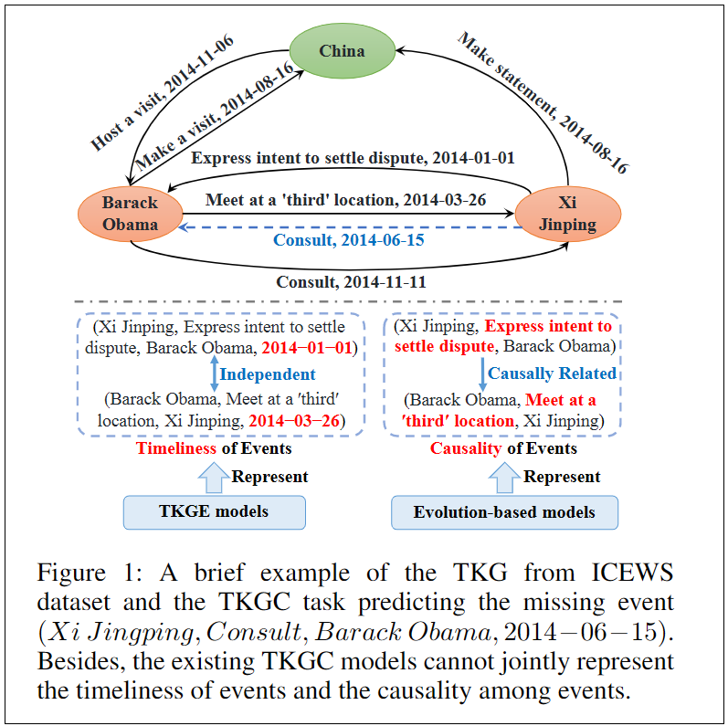

之前模型面临的挑战：

- 忽略了长期时间依赖信息。现有的TKGC模型认为，任何TKG为每个事件包含一个信息就行了，即把三元组加一个事件信息变为四元组，忽略了事件发生时间上的长期依赖关系。

- 在预测任务中，因果关系和时序关系不能同时利用。基于演化的模型很难推理和过去事件相关性较弱的事件，TKGE模型没法利用事件之间的因果关系。

- 之前几乎所有的方法都是数据驱动的，没法解释。

为了解决上述三个问题，作者提出了一个嵌入模型：Logic and Commonsense-Guided Embedding（LCGE）。

具体上，我们设计了一个时序规则引导的谓词嵌入正则化来学习事件的因果关系属性。在这个基础上，提出了一种基于joint事件和常识的KG嵌入策略，通过学习因果关系、时序关系的时间敏感表示，学习时间独立表示（从常识角度），来对每个事件评分。

贡献如下：

- 时序规则引导的谓词嵌入正则化策略，将事件之间的因果关系注入谓词嵌入中。据作者所知，这是第一次把时序规则引入到TKGE模型。
- 从因果关系、时序关系（两个合在一起叫时间敏感表示）、常识的角度建模每个事件。
- 在三个TKG的benchmark数据集上的实验结果，表明性能比SOTA有所提升。能够从时序规则的角度解释模型。

### 2. 相关工作

#### 2.1. 传统的KGE模型

KGE技术旨在通过学习实体和谓词嵌入来对事实的合理性进行评分。

#### 2.2. 时序KGE模型

在传统的KGE模型上加入了时间嵌入去表示逐时间发生的事件。

#### 2.3. 规则学习

逻辑规则（logic rules）自然适合KG补全任务。Horn规则是一种典型的的逻辑规则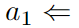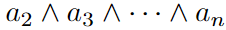，其中a_1是规则头的原子（head atom），a_2...a_n是规则体原子（body atoms）。

### 3. 方法（提出的LCGE模型）

#### 3.1. 问题定义

**时序知识图谱** 每个事件都表示为一个四元组$(s,p,o,t)$，分别表示：subject、object、predicate、timestamp or time interval。如果使用时间间隔$[t_s, t_e]$，可以转换成两个事件（时间戳）$(s,p,o,t_s)$和$(s,p,o,t_e)$。

**时序规则** 时序规则就是带有时间标签的原子连接。本篇文章的时序规则格式：

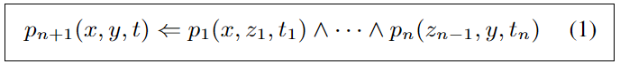

其中，$p_i(i=1,\ldots,n+1)$是谓词。$x,y,z_j(j=1,\ldots,n-1)$表示实体变量。$t,t_l(l=1,\ldots,n)$表示时间变量，且$t_1 \le t_2 \le \ldots t_n \le t$。时间规则表示如果规则体保持不变，则规则头将发生。通过将变量与特定实体和时间戳重新放置，可以获得时间规则的基础（A grounding of the temporal rule）。

#### 3.2. 时序规则学习

提出了一个新的静态到动态的策略去挖掘不同的时序规则。在静态的规则学习阶段，首先把训练集中所有的四元组转换成几个三元组，通过mask掉每个事件的事件信息（图二所示）。然后我们就能得到一个全局静态KG（GSKG），通过使用任一存在的规则学习算法，如AMIE+。具体的，时序规则可以看作具有各种时间规则模式静态规则的扩展。

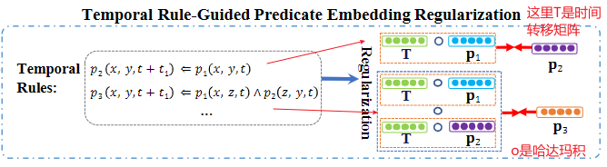

**时序规则模式的公式** 在动态规则学习阶段，根据原子之间不同的时序序列，分成5个时序规则模式（图3所示）：

- （1）length-1规则，两个原子之间，时间步不同。

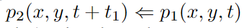

- （2）length-1规则，两个原子同时有效。

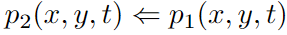

- （3）length-2规则，三个原子时间步都不同。

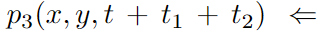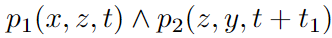

- （4）length-2规则，体原子（body atom）和头原子的时间戳不一样。

  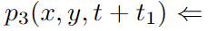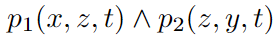

- （5）length-2规则，三个原子同时有效。

  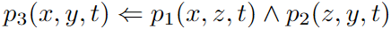

**时间规则的质量评估** 针对现有规则学习算法挖掘出的静态规则和提出的五种时态规则模式，根据已定义的时态规则模式将每种静态规则扩展为相应的候选时间规则。

为了评估每个候选时间规则的质量，我们首先将同一时间窗口中的事件合并到子图中，因为一些因果相关的事件可能发生在同一子图或相邻子图中。然后，我们搜索是所有满足候选时间规则的事件。例如：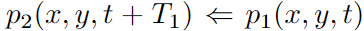就表示规则（1），如果$T_1 = 0$就表示规则（2）。因此，遵循先前规则学习模型中评估标准的定义，我们提出时间规则的支持度（ support degre，SD）、标准置信度（standard confidence，SC）和头部覆盖率（head coverage，HC），定义如下（length-1规则）：

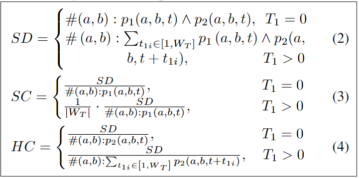

其中，$W_T$是时间窗口。length-2规则：

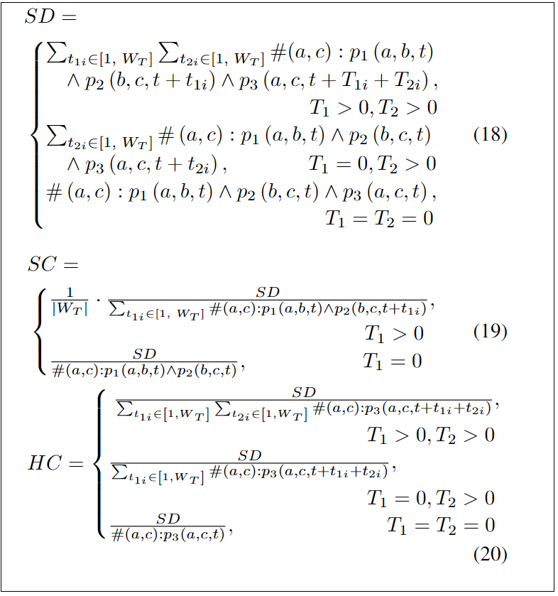

我们得到每个候选时间规则的SC和HC，通过根据时间规则的评估标准遍历时间戳$t$。满足SC和HC阈值的候选时间规则用于第3.3节中的以下正则化策略。附录A.3给出了我们提出的时间规则学习模块的整个算法。

#### 3.3. RGPR机制的设计（temporal rule-guided predicate embedding regularization）

根据生成的时间规则表明原子之间的因果关系，我们定义了一个时间转移算符$\mathbf{T}$。它确保了一个规则中的所有原子同时被表示以计算它们的相关性。举例：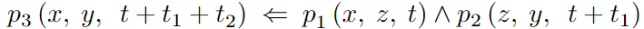，把体原子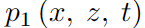映射到和头原子相同的时间窗口，需要两个时间转移操作。另外，RGPR操作$\mathbf{G}$把因果关系引入到时间规则中：

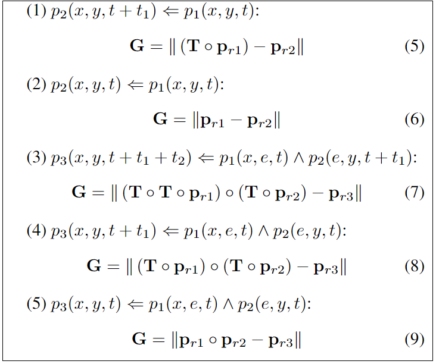

其中，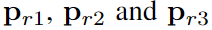表示，谓词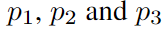的嵌入。$\circ$表示哈达玛积。作者理论上证明了模块$\mathbf{G}$能建模事件之间的因果关系。

#### 3.4. 基于联合事件和常识的KGE

我们充分利用常识的长期事件依赖来准确评估事件的合理性，因为一些违背常识的事件永远不会发生。因此，我们从时间敏感和时间独立表示的角度对每个事件进行建模。

为了学习事件的时间敏感表示，我们通过四阶张量分解来学习每个事件的时间戳。此外，事件之间的因果关系可以通过我们的RGPR机制以及主体和客体嵌入来表示。给定一个事件四元组，事件敏感性分数函数定义为：

其中，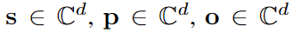，表示把$s,p,o$嵌入到了d的向量空间中。$\bar{\mathbf{o}}$是$\mathbf{o}$的共轭。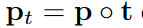表示受时间戳$t$约束的谓词嵌入.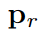是RGPR学到的因果关系表征。根据等式5-9，如果某些事件成立，根据谓词嵌入的正则化，与这些事件有因果关系的其他事件将具有更高的分数。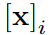表示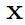的第$i$维。基于公式10中的评分函数，我们可以共同表示事件的时间性和因果关系，从而促进事件的更充分的时间敏感性表示。

为了学习与事件相关的常识的时间独立表示，屏蔽每个事件中的时间戳，以将事件四元组$(s,p,o,t)$转换为事实三元组factual triple$(s,p,o)$。常识被表示为由谓词连接的两个概念。因此，我们通过可学习概念和谓词嵌入，结合基于常识的时间独立评分函数，从常识的角度对每个事件进行评分：

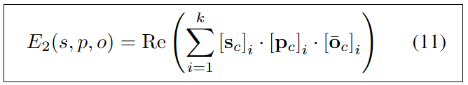

其中，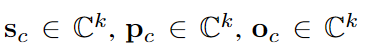表示k维嵌入。k应设置为小于d，以增强实体概念嵌入的抽象特征。

#### 3.5. 优化目标

使用了log-softmax损失函数和N3正则化去设计训练的优化目标：

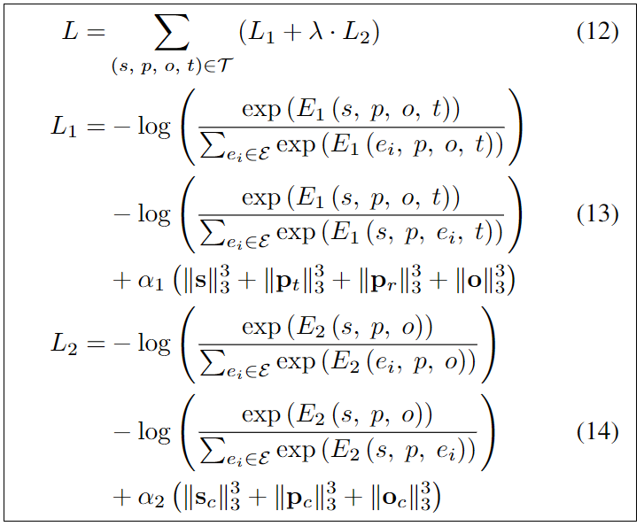

其中，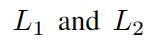分别表示，时间敏感事件、时间独立常识损失函数。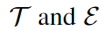是TKG中的事件和实体集合。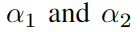分别是N3正则化的权重：实体嵌入、谓词嵌入。$\lambda$是整个损失函数中常识表征的权重，用来平衡事件的时间敏感、时间独立表征。

用Adam优化器，学习实体、谓词、概念、时间戳的嵌入。

### 4. 实验

#### 4.1. 数据集

TKG中最常用的数据集。

ICEWS14、ICEWS05-15、Wikidata12k。ICEWS14、ICEWS05-15包含了带事件步的政治事件。Wikidata12k是Wikidata的一个子集，其中，每个时间符号都是时间戳或时间间隔。每个数据集都以8:1:1分成了训练、验证、测试集。

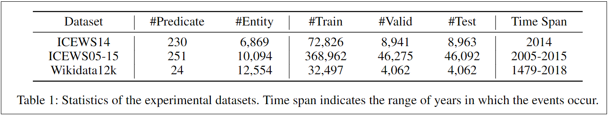

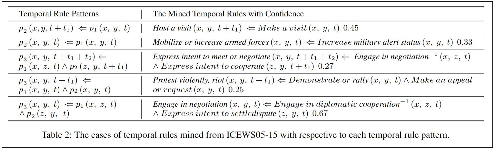
