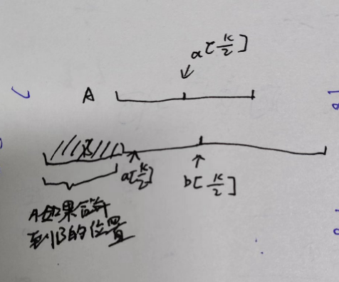

### Leetcode 4.寻找两个数组的中位数

题解：https://www.bilibili.com/video/BV1DL4y1E7ai/

其中疑惑点：在比较a[k / 2]和b[k/2]的时候，数组的删除逻辑。

当a[k/2]小于b[k/2]的时候，要删除a的前k/2的元素。

此时只需要考虑a的前k/2和b的前k/2的部分，这两部分的长度加起来是k。

如图所示，如果此时把a的前k/2的部分合并到b上，那么a的前k/2的部分一定在b[k/2]的前面，那么，a[k/2]的在b中的位置如图所示，第k大的元素必不可能在a[k/2]前面，因为到b[k/2]的位置的长度也才是k，这时候就可以把a[k/2]前面的元素删掉。