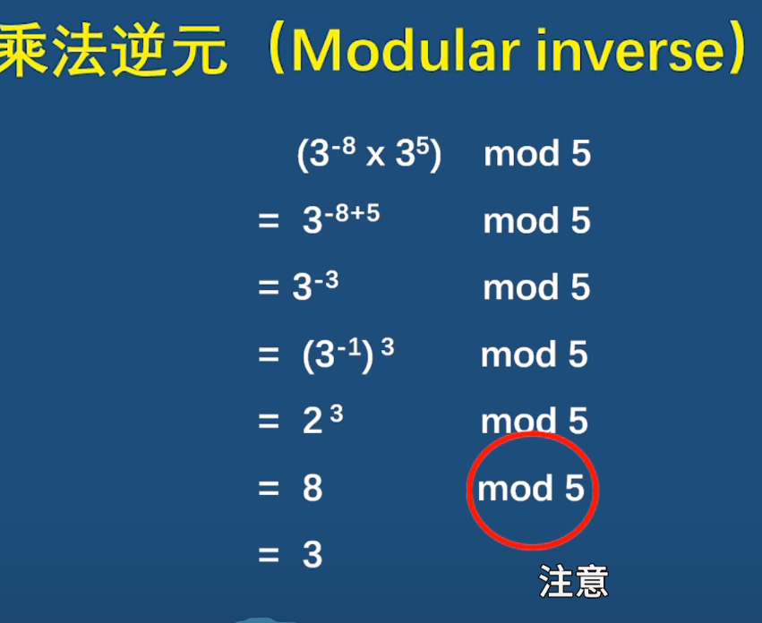

## 乘法逆元

参考：[[B站](https://www.bilibili.com/video/BV1kv4y1P7WV)]

乘法逆元：给定一个正整数`a`，在模`p`的情况下（`a`和`p`互质！），`a`存在唯一的逆元$a^-1$（`-1`不是表示a的负一次方，是乘法逆元的符号），其中$a^-1$一定小于`p`。
$$
a * a^-1 \equiv 1(\mod p)，其中\equiv是同余符号。
$$
即，两个数相乘等于`1`（在模`p`的情况下），这两个数就互为乘法逆元。

### 一些性质

模运算比较灵活，可以在计算的每个步骤选择取模或不取模。

### 费马小定理（部分）

参考：[[百度百科](https://baike.baidu.com/item/%E8%B4%B9%E9%A9%AC%E5%B0%8F%E5%AE%9A%E7%90%86/4776158)]

如果`a`和`p`互质，则有$a^{p-1} \equiv 1 (\mod p)$。

