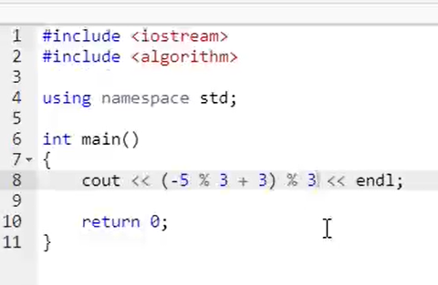
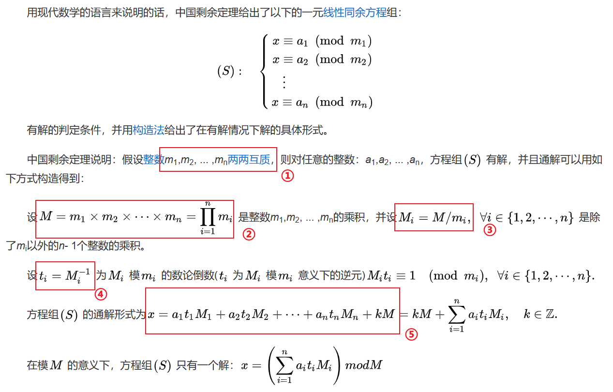

## 中国剩余定理

参考：[[csdn](https://blog.csdn.net/qq_41115702/article/details/105909120)]

模运算基本规则：[[百度百科](https://baike.baidu.com/item/%E6%A8%A1%E8%BF%90%E7%AE%97/4376110)]

中国剩余定理：[[百度百科](https://baike.baidu.com/item/%E5%AD%99%E5%AD%90%E5%AE%9A%E7%90%86/2841597)]

取模运算参考CSAPP里对取模的定义（主要是负数取模），例子：[[zhihu](https://www.zhihu.com/question/31344913/answer/250897652)]

### 使用

只需要记住定理的内容和解即可。

