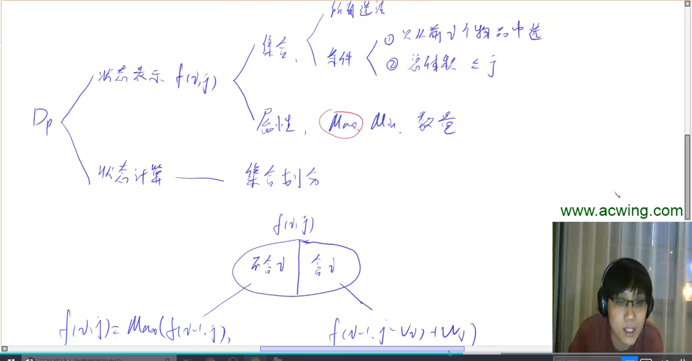
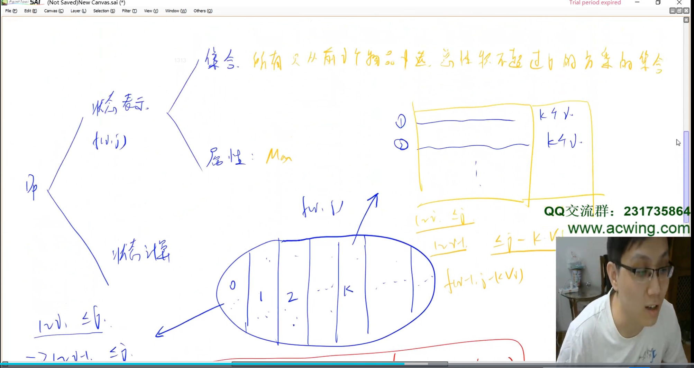
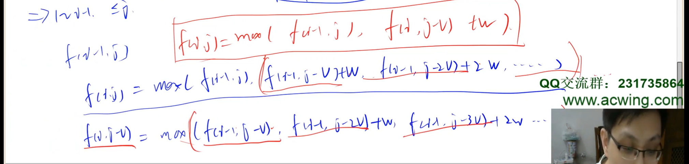
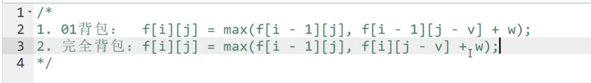

## 背包问题

### 闫式DP分析法

集合的意思是：所有选法。

举例：01背包问题。

### 背包问题分类

- 01背包：每个物品最多用一次
- 完全背包：每件物品有无限个
- 多重背包：第`i`个物品有`si`个
- 分组背包：物品有`N`组，每组有若干个，每一组里只能选一个物品

### 完全背包

在01背包的基础上，只改变了`j`循环的顺序，后面的道理可以用闫式DP分析法拆解。

二维暴力做法：

图中的意思：

- 集合：所有前`i`个物品中，体积不超过`j`的方案的集合

- 属性：求所有方案中价值的最大值

- 状态计算

  状态计算的分析方法是划分子集，集合可以划分成：选0个第`i`个物品、选1个第`i`个物品、选2个第`i`个物品、...、选k个第`i`个物品、...、选n个第`i`个物品。

  - 选0个第`i`个物品，那么`f[i][j] = max( f[i - 1][j], f[i][j] )`，不选第`i`个，价值和选前`i-1`个物品的价值一样。
  - 选1个第`i`个物品，那么`f[i][j] = max( f[i - 1][j], f[i][j - v] + w )`。
  - 选k个第`i`个物品，那么`f[i][j] = max( f[i - 1][j], f[i][j - kv] + kw )`。

  然后再经过图上的错位相减`i`和`i-1`时候的方程，得到：`f[i][j] = max( f[i - 1][j], f[i][j - v] + w )`

**和01背包的区别（方程）：**

下面的方程体现在代码上就是：01背包是从大到小枚举`j`（`f[i-1][j - v]`，`i-1`是上一个状态，要防止在更新`i`时，`i-1`已经被更新过了），完全背包是从小到大枚举`j`（`f[i][j - v]`，`i`的状态时）。

==注意：==循环顺序只有在一维优化后才要注意，二维的方法顺序没有限制。

