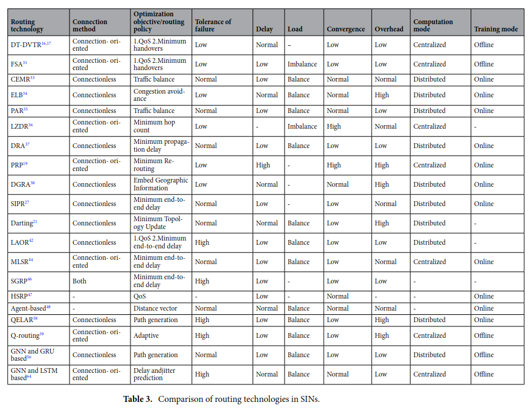

### 1. 在轨卫星异常检测方法综述

~~5.融合深度学习和迁移学习的卫星工程参数异常检测方法_王爱玲~~

在许多领域的研究中，都使用了“异常”一词，但是目前对于异常并没有一个公认的准确的定义，一般来说，普遍采用的是Hawkhins D.M.[8]给出的解释：异常是在数据集中偏离大部分数据的数据，使人怀疑这些数据是由不同的机制产生，而非随机偏差。在卫星任务中，往往是由于卫星的运行环境，即空间环境，发生变化导致的卫星运行机制的调整。例如，Gautam等人[9]的研究中，在对卫星资控系统进行异常检测时，发现了五种不同于正常行为的模式，通过咨询相关领域专家经验发现，其中有三种异常是属于卫星本身的工作模式，包括绕月轨道模式、月蚀模式、安全模式，两种是卫星确实出现异常预警，包括激光通信异常、天体跟踪器异常。

卫星工程参数与星上载荷设备的性能状态息息相关，反映了设备的功能以及工作性能的变化，是地面运控人员了解卫星平台及载荷设备运行状态的直接依据也是唯一依据［10］。星上设备按照一定速率对星上各个参数进行采样，在每次数据下行时将数据传输到地面工作站，地面工作人员对数据进行处理分析，以确定当前状态下卫星在轨运行状况是否异常。在卫星工程参数异常检测研究领域中，根据异常检测所使用的技术手段不同，目前主流的方法可以归纳为两大类：统计学方法和基于机器学习智能方法。

#### 1.1 基于统计学方法的卫星工程参数异常检测现状

基于统计学方法的卫星工程参数异常检测可包括以下五个方面，分别是基于经验的异常检测方法、基于阈值的异常检测方法、基于专家系统的异常检测方法、基于数据趋势拟合的异常检测方法、基于数据相关性的异常检测方法，下面将针对这五类方法进行详细阐述。

基于经验的异常检测算法是卫星异常检测领域最早应用的检测方法，在使用的过程中需要结合相关领域的背景信息或者先验知识，多位卫星领域的权威专家共同做出判断。

基于阈值的异常检测方法中，最常见的是阈值门限法[11]，根据事先设定的参数阈值，自动判断卫星参数是否超出阈值范围，一旦超出阈值的上下限，则报警。卫星参数阈值可以根据卫星和载荷的设计特点而确定，但是存在的一定的风险，因为卫星任务日趋复杂、星上载荷种类也愈来愈多，所涉及到的参数特征数量也随之增加，因此需要事先设定的阈值数量急剧增加，给地面管控人员带来极大的工作量；此外，卫星在轨运行过程中，各个部位的元器件会发生不同程度的老化，因此预先设定的阈值范围会失效，导致误报漏报现象增多。由于人工设定阈值存在一定的缺点，因此考虑采用通过学习历史数据的方式来确定相对准确的阈值范围，Dennis[12]采用ELMER（Envelope Learning and Monitoring via Error Relaxation）、 Machida等人先后利用回归树[13]、关系向量机（Relevance Vector Machine，RVM）[14]对历史数据进行学习，并在相关卫星参数的实践中取得了不错的效果，但是，阈值门限法只能检测出超出阈值上下限的异常参数，对于在阈值微小范围内变化异常检测效果并不理想；而李维铮等［15］使用周期图谱和自回归滑动平均模型（Autoregressive Moving Average Model，ARMA）结合的方式实现了阈值范围内 的异常值的检测，但是周期图谱的使用对数据的周期性要求较高，并不能很好地检测出长周期或者无周期数据发生的异常。

基于专家系统的异常检测将专家知识储存在地面运控系统的知识库中，卫星下行的数据经过处理后，由推理机根据知识库中的专家知识进行推理，比较被检测数据是否满足知识库中已有的结论，如果检测结果为异常，则报警通知监控终端。日本空间科学研究所（Institute of Space and Astronautical Science，ISAS）开发的ISACS—DOC系统[16]是专家系统的典型案例，目前已成功应用于GEOTAIL和NOZOMI的火星探测器的异常检测工作；除此之外，NASA开发的飞行器推理引擎（Spacecraft Health Inference Engine，SHINE）[17]和CLIPS[18]都是典型的基于专家系统的异常检测工具，尤其是CLIPS被广泛应用于卫星异常检测与故障诊断领域［19—21］。

基于数据趋势拟合的异常检测是利用技术手段对数据的趋势特征建模，从整体上了解数据的结构，以此来判定新输入的数据是否为异常。例如，阮辉等[22]基于趋势符号聚合近似（TrSAX）的方法构建的BOTS分类器，能够有效地检测卫星转速序列、角度序列、电流序列的异常；康旭等[23]提出的基于角度偏离的方法，能够有效地预测异常发生时间；此外，数据的整体性特征要与数据的点特征结合起来[24]，以此来实现对遥测数据整体趋势和细节特性的建模，但是这种算法的计算量过大，建模的时间成本过高，不同卫星所适用的建模方法也不一致，通用性较差。

基于数据相关性的异常检测方法利用卫星工程参数之间的相关性来实现异常检测任务。卫星工程参数的相关性指的是一个卫星参数在不同时间的取值、两个及两个以上工程参数的取值之间存在的某种规律。基于相关性的异常检测则是探索这种规律进而发现与正常规律差别较大的异常参数。杨甲森等人[5]结合工程数据的特点，归纳总结出了6种不同的工程数据相关性，通过选取参数并计算这些参数在不同时段的概率密度，进而计算这些概率密度分布之间的皮尔逊相关系数，抽取出这些数据在概率密度层面的相关关系，之后将这些抽取出的关系用于异常的判定；孙宇豪[25]针对多变量的相关性，结合距离相关系数完成对卫星异常的预警任务；任国恒等人[26]基于互信息、ID3算法对同步卫星的工程数据进行了相关性分析，基于此发现了影响太阳帆板状态和性能的因素之间的关联；李钰骙[27]通过LightGBM算法，设计出一个两阶段的多参数关联挖掘算法，通过两次不同粒度的筛选，筛选出相关关系强的若干参数，以实现数据的相关性分析。基于相关性的异常检测具有强大的理论基础，对于挖掘出的参数相关性也具有一定的可解释性，相较于神经网络的“黑盒子”算法更加直观；但是基于相关性的异常检测算法计算复杂度较高，随着参数数量的增多，所需要消耗的计算代价也随之增大。

#### 1.2 基于机器学习方法的卫星工程参数异常检测现状

基于机器学习方法的卫星工程参数异常检测是利用机器学习算法挖掘数据背后的价值信息。根据机器学习的发展阶段，可以将基于机器学习的卫星工程参数异常检测算法大致分为三大类，分别为基于传统机器学习、基于深度学习、基于迁移学习的卫星工程参数异常检测算法。

基于传统机器学习的卫星工程参数异常检测方法中最常见的是使用支持向量机（Support Vector Machine，SVM）[28]来对卫星工程参数学习并分类，Gao等人[29]将主成分分析（Principle Component Analysis，PCA）与SVM结合，不仅将异常数据与正常数据区分开，而且利用多个二分类SVM实现了异常类型的判定；D.Liu等[30]通过马氏距离和DTW距离改进K近邻（K Nearest Neighbors，KNN） 算法的相似性度量方式，在Wafer数据集上实现了99％的检测准确率。

以上传统机器学习方法均为监督学习算法，在具有丰富标注信息的数据集上训练得到的最优模型来对测试数据进行分类与预测，因此获得的准确率较高，但是在实际卫星任务中，由于需要确保在轨卫星顺利运行，所获取到的卫星工程参数中异常数据占比很小，无法满足监督学习算法对训练数据异常覆盖率的要求，在检测过程中仍然需要人为添加异常类型的数据，增大了检测人员的工作量。为了解决数据体量大标注困难的问题，考虑使用无监督学习的异常检测方法。机器学习中最经典的无监督学习算法是聚类，所以基于聚类的算法在卫星工程参数的异常检测中应用最为广泛。Azevedo等[31]利用经典的K-means算法，通过使用欧氏距离和马氏距离改进相似性度量的方式，实现了卫星参数中离群点的检测，但是由于卫星运行周期内元器件发生老化，K-means算法无法正确计算数据点之间的距离，因此检测效果较差；王婵等[32]基于子空间搜索来降低维数灾难，使用聚类算法实现了皮纳卫星姿态确定与控制系统中程序跑飞引起的太阳敏感器数据紊乱故障诊断，对单点异常的检测效果较好，当异常值众多时，容易将异常值归为一个正常的类别，从而出现漏报情况。

伴随着深度学习相关技术的不断发展，凭借其较为优秀的特征提取能力，基于深度学习的卫星工程参数异常检测方法得以广泛应用。最具有代表性的应用于卫星工程参数异常检测领域的深度学习方法是长短时记忆网络（Long Short—TermMemory，LSTM）。由于卫星工程参数是对星上载荷运行参数的周期性采样所得到的数据[33]，因此具有时序特征，可表示为$X_i(t),t=1,2,\ldots,n$，其中$n$为遥测数据的数量，$t$为采样时间。所以对卫星参数进行异常检测时，可以将其看做时序数据进行处理。LSTM对时序数据的记忆效果较好，因此，董静怡等[34]利用LSTM对卫星参数进行学习并预测，在验证集上取得了理想的结果，然而高准确率所引起的高误报率在卫星异常检测领域带来的影响可能是致命的；山梦娜[35]在 LSTM的网络中加入注意力机制，除了数据自身的属性特征外，还加入了描述数据变化规律的参数，从而提升了预测精度，但是该方法只在温度参数数据集上具有较高的准确率，对于电流、电压等参数数据集的检测效果并不理想，通用性较差；基于以上使用LSTM作为监督学习手段进行异常检测的不足，考虑使用半监督学习的方法对卫星工程参数进行异常检测。Pankaj等[36]采用LSTM对航天飞机电力供应系统相关参数实现异常检测，在训练时只使用正常数据，避免了异常数据 不足而带来的影响，但是其预测的周期较短，对于周期性较长的卫星工程参数数 据则无法达到良好的检测效果。

此外，以上方法均是针对某一特定卫星或者载荷进行训练设计，在新卫星上的异常检测效果并不理想，往往需要重新训练建模，检测效率较低。为了解决上 述方法所存在的通用性差的问题，考虑采用迁移学习的方法对卫星工程参数进行异常检测。陈俊夫等[37]针对获取标签数据困难这一问题，采用一维卷积神经网络对两个卫星的电源分系统遥测数据实现迁移学习，然而仍需要目标域数据中存在少量带标签的数据样本对预训练好的网络进行微调。王爱玲等[38]利用深度残差收缩网络的结构框架，训练过程中同时将无标签的目标域卫星工程参数数据加入到网络的训练过程中，有效获取了数据的特征表示，然而对卫星工程参数的异常检测工作仅局限于判断数据是否发生异常的二分类问题。

#### 1.3 专利

北京空间飞行器总体设计部[38]提供的基于遥测数据的卫星异常状态检测系统，充分利用历史遥测参数样本，结合卫星遥测参数数据特点和数据变化规律，将一段时间的遥测数据与其历史样本数据的相关度比较以及极值点误差的比较，实现不需要设计知识，仅需少量历史数据的卫星异常状态检测和提取，克服了现有的异常状态检测方法对专家经验知识的依赖性问题和现有检测方法无法解决遥测参数未超出正常范围的异常变化问题，为卫星管理人员分析卫星状态变化提供有效、直观的方法和工具。航天东方红卫星有限公司[39]提出了一种基于遥测数据小波变换的卫星异常检测方法，利用小波变换的多分辨率分解的特点，采用基本小波对遥测数据进行小波分解，得到高频分量和低频分量。通过对遥测数据高频小波系数重构的信号进行基于窗口的平稳性分析，并将窗口内数据的均方差作为数据平稳性的评价函数检测卫星的异常。中国人民解放军国防科技大学[40]公开了一种基于多参数关联的在轨卫星异常状态监测方法及系统以解决无法检测多个遥测参数耦合的故障。航天恒星科技有限公司[41]公开了一套可适用于多GNSS卫星的快速监测技术，从数据源头进行分析，通过多测站确定卫星健康状态、信号监测告警、UERE告警、空间信号完好性告警、广播轨道钟差URE告警和广播系统时告警等多种手段进行判定，在不同的条件下使用相应的方法，最终综合六种手段的处理结果，获得卫星的真实工作状态。南京航空航天大学[42]公开了一种针对卫星遥测数据，通过对抗网络自编码器的异常检测方法，采用纯数据驱动模型。在变分自编码器基础上，引入对抗网络思想，将双向LSTM(长短时记忆网络)作为判别器，利用重构数据和原始数据的误差来判断卫星遥测数据是否出现异常。南京航空航天大学[43]公开了一种基于贝叶斯神经网络的卫星异常检测方法，依据卫星数据来构建传统的长短时神经网络，引入贝叶斯思想，建立贝叶斯长短时神经网络。长光卫星技术有限公司[44]采用SLLE算法提取高维数据特征，并结合统计SPE和T2设计故障检测方案，最后通过卫星遥测数据模拟仿真，验证了卫星姿态控制系统故障检测方案的有效性，该方法有效地提高了卫星异常状态的检测能力，具有一定的工程实际应用价值。中国科学院微小卫星创新研究院，上海微小卫星工程中心[45]提供了一种基于改进的高斯过程回归模型的卫星异常检测方法，根据与响应变量的相关距离及异常发生前后相关距离变化的大小来确定预测变量，然后建立GPR模型，计算预测变量对应的响应变量集的后验分布，根据模型的泛化误差，确定预测范围，并根据预测范围，判断是否发生异常。北京中科宇航探索技术有限公司[46]公开了一种卫星异常数据识别方法及装置，可实现实时在线检测，具有简捷的递推关系，计算量小不会造成系统的额外负担；基于历史统计数据，具有一定弹性，能克服异常数据的不利影响，也使判别系统在异常数据的影响下快速恢复，避免死锁，提高卡尔曼滤波估计的可靠性。西安交通大学，中国西安卫星测控中心[47]提供了一种快速实时检测卫星遥测时序数据异常的方法，方法从时域和频域多重角度分析数据，综合了四种实时异常检测技术，包括时域统计量异常检测、时域一阶导数异常检测、频域相似性异常检测、频域统计量异常检测。中国西安卫星测控中心[48]针对我国地面测控网覆盖率较低、难以及时对境外卫星开展异常处置的现状，提出一种基于星间链路网络寻优的卫星异常处置方法，用于解决我国卫星在境外发生异常而无法在短时间内进行处置的问题，通过星间链路网络用表的查询寻优，利用改进粒子群的信息融合(AWIPSO‑DS)优化函数，合理规划选择最优路径，可快速完成网内节点卫星的星间测控链路建立寻优，从而实现卫星异常应急处置。西安交通大学，中国电子科技集团公司第五十四研究所[49]提出了一种对有缺失卫星数据进行参数异常模式检测的方法，该方法利用一种全新的神经网络模型，结合卫星时序数据固有的时间依赖特性，实现在有大量缺失数据情况下对卫星异常模式进行准确检测的过程，保证了卫星故障诊断和健康管理系统的稳定性。中国科学院微小卫星创新研究院，上海微小卫星工程中心[50]提供了一种卫星异常检测系统，包括：第一特征提取及异常检测模块，被配置为实时采集各个遥测参数的主份数据，并根据其遥测参数的特征，检测该主份数据是否发生异常情况；其中所述遥测参数的特征包括模态转换关系、模态转换顺序及模态最长持续时间。哈尔滨工业大学[51]公开了一种基于时域反卷积重建自编码器的无监督卫星异常检测方法、装置、设备及介质。中国科学院空天信息创新研究院[52]提供了一种卫星异常数据处理方法、装置、设备及存储介质，涉及卫星数据处理技术领域，其中，该方法包括：解析卫星格式化数据的行标识，解析卫星格式化数据中各数据行的成像行计数，解析卫星格式化数据中各数据行的行时数据和影像数据，基于行时数据块和影像块进行影像生成和几何定位处理，得到卫星数据产品。清华大学[53]公开了基于异步自回归预测模型的卫星故障检测方法及装置，实现了快速、准确、鲁棒的自动化卫星异常检测。中国科学院国家空间科学中心[54]公开了中心约束对比学习特征变换的自集成卫星异常检测方法，可普适于面向航天器任务目标的载荷单机设备状态判别学习与自动状态识别，提高了自适应性和自动化水平。

### 2. 空间网络路由异常检测（星间链路异常异常检测）

王东会[67]提出一种考虑异常中断的导航星座星间链路路由改进算法，其中的链路异常中断检测与识别算法使用卫星内部维持的1个测距表和1个路由表进行相关的计算，判断链路是否出现异常。

网络中的术语异常检测（也称为异常值分析）是指在网络中查找不符合预期正常行为的异常模式的问题[68](https://www.nature.com/articles/s41598-021-01638-z#ref-CR68).异常检测是多种应用的基本问题，各个研究领域已经研究了几十年。因为SIN也是一个动态网络[69](https://www.nature.com/articles/s41598-021-01638-z#ref-CR69)，SIN中的异常检测可以借鉴动态网络异常检测方法的经验。

#### 2.1 动态网络中的异常检测

过去，网络科学研究集中在静态网络上，其链接在点头之间是固定的。然而，随着研究的不断深入，人们发现大多数自然和社会系统都是动态网络，与静态网络不同，它们的结构或属性不断变化。70.本文中提到的社交网络、引文网络、电网、全球金融系统和SIN是动态网络的例子。插入和删除顶点（对象）、插入和删除边（关系）以及修改特征（例如，顶点或边标签）[71](https://www.nature.com/articles/s41598-021-01638-z#ref-CR71)都是动态变化的示例。

在这些随时变化的网络中，一些元素表现出异常行为，其变化规则或特征与其他元素不同。这些场景包括：在社交网络中传播虚假信息，引用网络中学术合作突然中止，电网中特定节点的用电量激增，全球金融系统中的大量资金流动，SINS中的节点受到威胁，等等。

有四种不同类型的异常：顶点、边、子图和事件。

- **异常顶点。**异常顶点是指顶点的子集，使得子集中的每个顶点与图中的其他顶点相比具有*“活动*”或*“不规则”*的演变。
- **边缘异常。**与异常顶点一样，异常边意味着查找边的子集，以便子集中的每个边都具有*“活动*”或*“不规则”*演变，可以选择标识它们异常的时间点。
- **异常子图。**这种类型的异常，是动态网络所特有的，包括频繁分裂、合并、消失和重新出现或表现出其他行为的社区。网络中的异常子图通常以子图的形式出现，例如流量网络中的拥堵区和社交网络中的热组。
- **异常事件和更改。**与前面讨论的不同，这种异常仅在动态图中发现。事件发生在孤立的时间点，当图形与之前和后续时间点的图形不同时。如果时间点是隔离的，则周围的时间点非常不同，表明发生了异常事件。此外，新边缘的持久性表明，这是一个变化，而不是一个事件。

动态网络的一个基本问题是异常检测，即查找不同的对象、关系或时间点。然而，如何在动态网络中挖掘古怪的元素是一个更复杂的问题。最初，技术侧重于静态图中的异常检测，主要关注网络的结构特征，并通过寻找结构中的奇怪变化来检测异常元素。然而，值得注意的是，动态网络除了结构属性外，还包含属性质量。因此，动态网络数据的异常检测问题必须同时考虑图形成员的结构和特征。

Aggarwal等[72]注意图流中的异常检测。他们认为图流中的异常是连接不同紧密区域的边缘，然后提出使用结构连通性模型对动态网络中的边缘进行建模。Ranshous等.[73](https://www.nature.com/articles/s41598-021-01638-z#ref-CR73)专注于边缘异常检测，并将动态网络建模为随时间变化的边缘，并在此基础上检测不规则边缘。他们设置了三个经验异常指标——样本得分、优先依恋分数和同质分数——对变化边缘进行评分以定义异常。Manzoor等.[74](https://www.nature.com/articles/s41598-021-01638-z#ref-CR74)专注于异构图中的异常检测。异构图是点（边）可以具有多种形式的图，例如知识图谱。Yu等.[75](https://www.nature.com/articles/s41598-021-01638-z#ref-CR75)首次将深度学习技术应用于动态网络异常检测。之后，Guo等.[76](https://www.nature.com/articles/s41598-021-01638-z#ref-CR76)提出了一种基于图神经网络的网络异常检测算法，该算法可以捕获节点和边的属性和时变特征，并充分利用它们来学习每个节点的表示向量。此方法可以捕获结构和属性异常。Ranshous等.[71](https://www.nature.com/articles/s41598-021-01638-z#ref-CR71)构建了两级分类法。他们首先根据社区、压缩、分解、距离和概率模型对方法进行了划分。然后，根据检测到的异常类别细分异常检测方法。

#### 2.2 SIN 中的异常检测方法

由于空间环境中的高维护和运营成本以及潜在风险，准确检测SIN中的异常至关重要，但由于几个原因具有挑战性。SIN 容易受到各种奇怪行为的影响，这些行为可能是由不可抗拒的自然力量或恶意的人为攻击引起的。它甚至可能是来自各种内部和外部因素的复杂系统相互作用。检测这些系统中的异常是一个复杂的问题，并且由于SIN的独特性质而变得更加困难77，[78](https://www.nature.com/articles/s41598-021-01638-z#ref-CR78) 。

以前的大多数作品[79](https://www.nature.com/articles/s41598-021-01638-z#ref-CR79)，[80](https://www.nature.com/articles/s41598-021-01638-z#ref-CR80)，[81](https://www.nature.com/articles/s41598-021-01638-z#ref-CR81)在探测卫星系统中的异常时，主要集中在单参数测量的简单阈值技术上，以提醒操作员注意异常事件。Sylvain等.[79](https://www.nature.com/articles/s41598-021-01638-z#ref-CR79)引入基于机器学习算法的创新异常检测方法。该方法可以检测普通监控系统没有立即检测到的异常行为。但是，这种方法的误报率相对较高。Kyle等.[80](https://www.nature.com/articles/s41598-021-01638-z#ref-CR80)展示LSTM预测航天器遥测的可行性，并提出一种不依赖于稀缺标签或错误参数假设的新型动态阈值方法。Corey等.[81](https://www.nature.com/articles/s41598-021-01638-z#ref-CR81)引入了 GSOC 自动遥测监视方法，称为自动遥测运行状况监视系统 （ATHMoS）。ATHMoS 使用监督式学习方法尝试通过将新的遥测数据与过去的名义和异常数据进行比较来解决异常检测问题。然而，这些方法无法检测到更多的细微差别异常，当几个变量以罕见的组合出现时，就会发生细微的异常。因此，阿尔邦等人。[82](https://www.nature.com/articles/s41598-021-01638-z#ref-CR82)介绍了如何训练单类支持向量机 （OCSVM） 以使用来自卫星通信网络的历史多变量数据检测异常。经过训练的OCSVM同时检查多个变量，而不是孤立地查看每个变量，并且能够执行实时异常值检测并量化异常值的异常程度。OCSVM 的优点是训练数据不需要包含异常，也不需要标记“正常”与“异常”数据。假设在高维时间序列数据（如应答器频谱）中查找异常值的挑战已被接受。它可以使用递归神经网络，特别是长短期记忆（LSTM）网络来检测异常。[83](https://www.nature.com/articles/s41598-021-01638-z#ref-CR83)，[84](https://www.nature.com/articles/s41598-021-01638-z#ref-CR84)，[85](https://www.nature.com/articles/s41598-021-01638-z#ref-CR85).Gunn等.[86](https://www.nature.com/articles/s41598-021-01638-z#ref-CR86)考虑在高维时间序列数据中检测异常值并使用 LSTM 网络进行异常检测的问题。这种方法显著改进了简单的阈值模型以及移动平均和静态预测变量。尽管许多文献研究都研究了基于规则或基于机器学习的异常检测方法，但他们并没有广泛探索基于张量的分解方法。Shin等.[87](https://www.nature.com/articles/s41598-021-01638-z#ref-CR87)提出了一个基于集成张量的异常检测框架（ITAD），通过同时分析多个遥测数据来减少KOMPSAT-2卫星遥测数据集中的误报，从而同时合并来自多个遥测的信息。与其他方法相比，ITAD在精度和F1分数方面实现了更高的性能。ITAD通过正确识别实际异常和微不足道的异常值，显著减少了误报的数量。

在安全领域，知识图谱的应用仍处于探索阶段。但是，图模型已经在许多安全领域场景中应用，并取得了良好的效果。网络安全知识图谱将更多知识融入到原始图模型中，为异常检测、分析和响应提供更多语义信息。Zhuo等[88]总结并设计了一种基于网络安全知识图谱的异常检测方案。

