### 2022.12.08

disc + ViT-1，准确率是disc计算的，infonce的实现是把所有同类和不同类加起来求平均

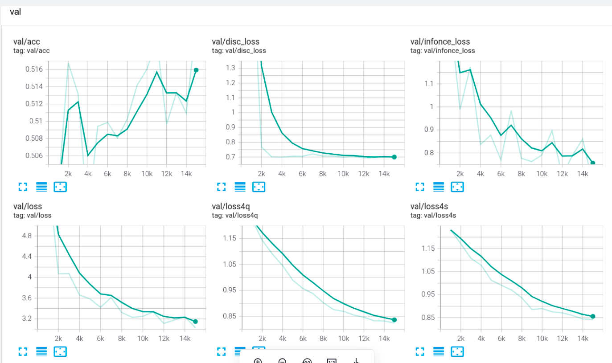

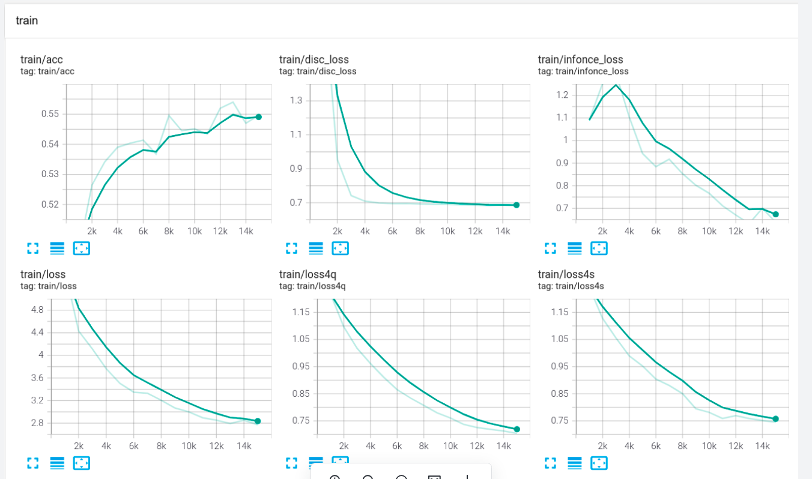

只有ViT-1

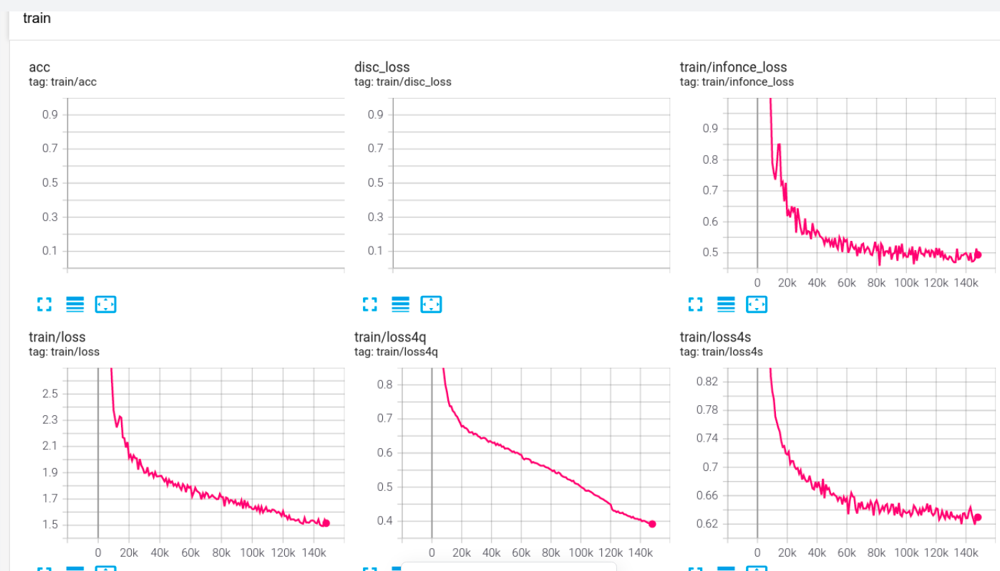

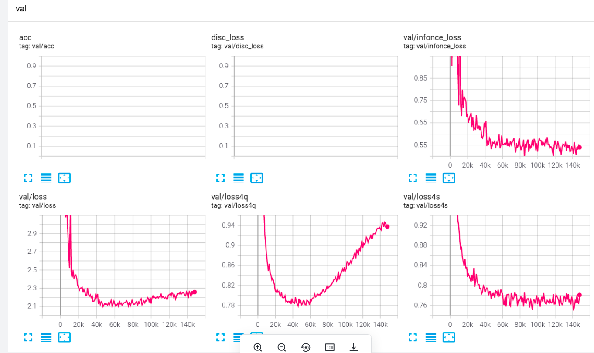

### 2022.12.14

第3999个episodes开始出现损失计算为nan。infonce计算方式如下，存在的问题如下。infonce出现负值。

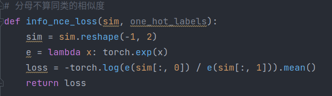

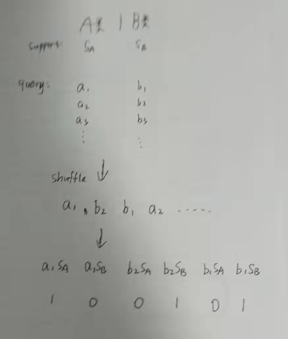

出现nan的可能原因：[[知乎](https://zhuanlan.zhihu.com/p/89588946)]

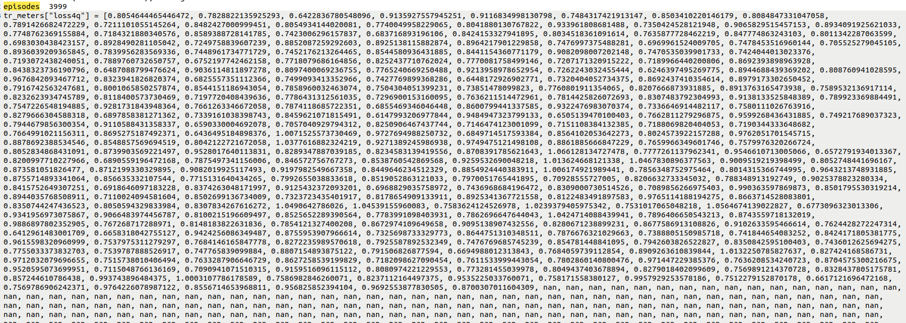

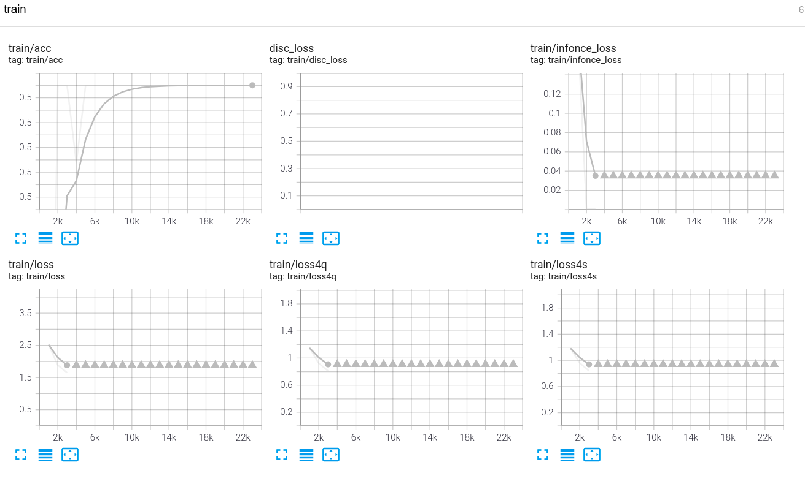

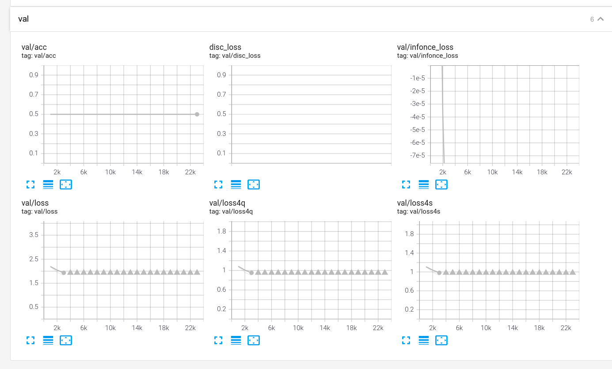

现在把损失改回来，分母上包含同类和不同类。计算损失之前，对ViT的(128,2)的特征做归一化处理。

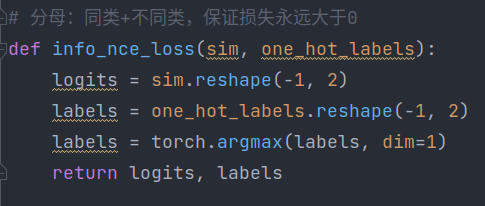

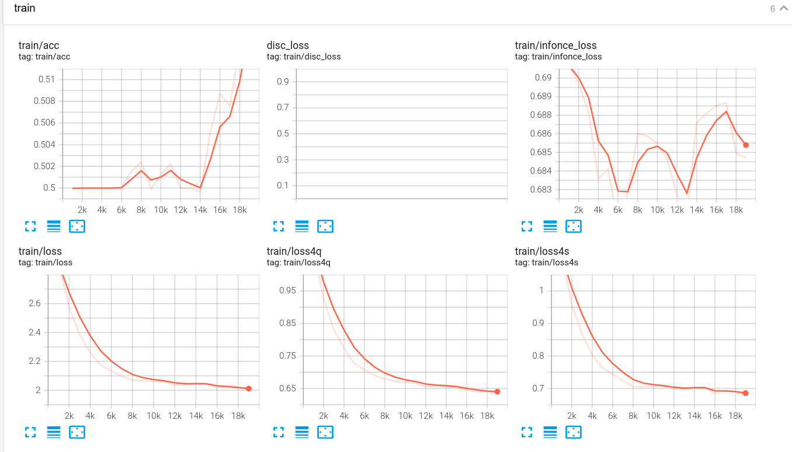

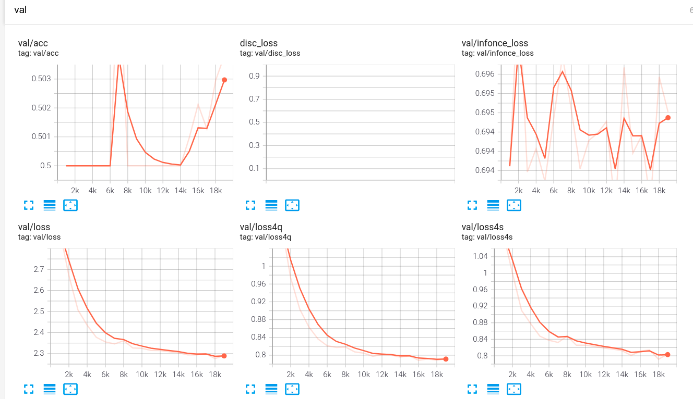

ViT改为6层，输出的特征改成(128,1)，准确率不计算。

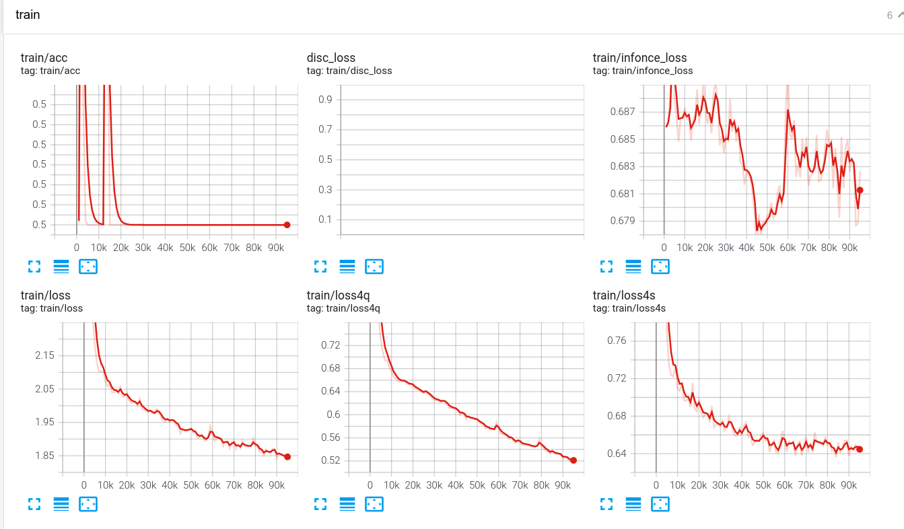

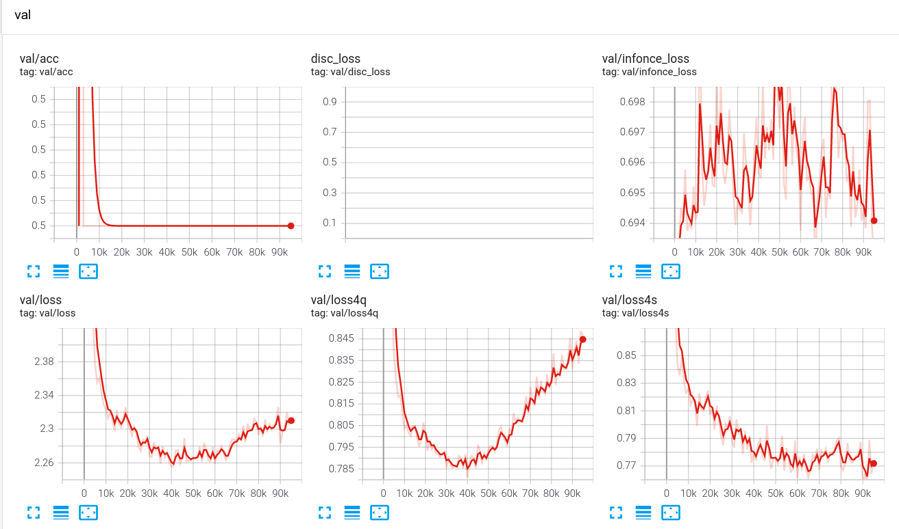

再上面实验的基础上加了discriminator，用来计算准确率

