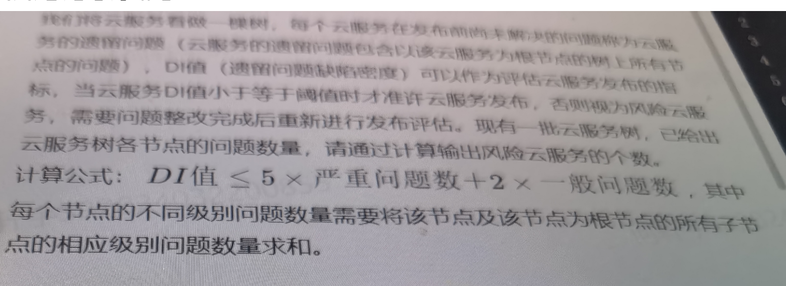
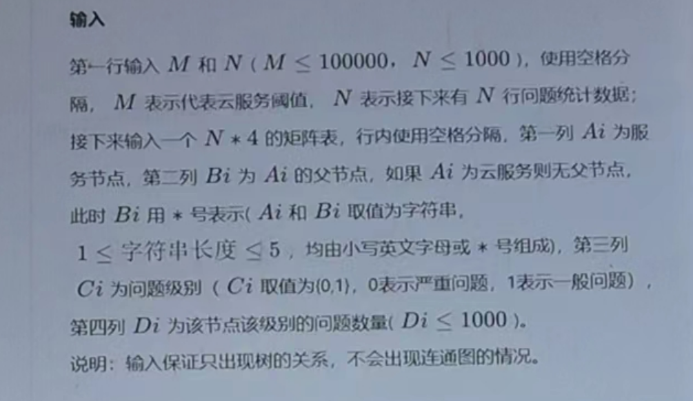
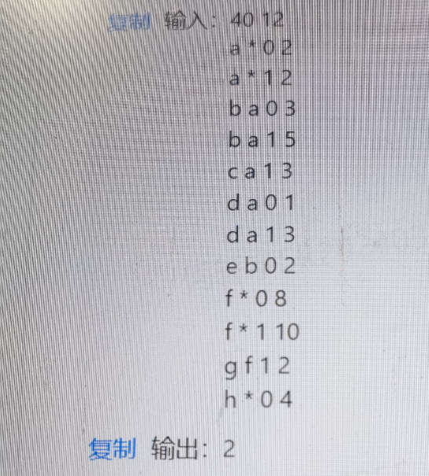
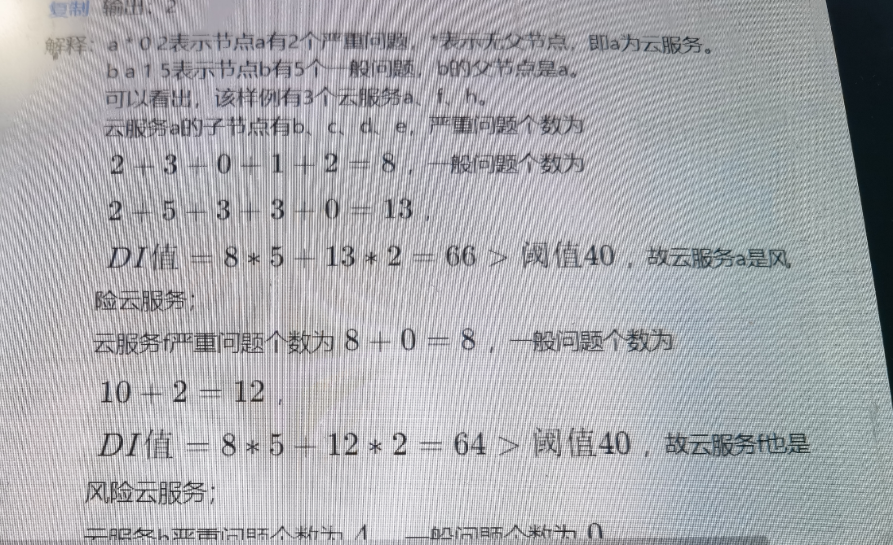

我们将云服务器看做一棵树，每个云服务再发布前面未解决的问题称为云服务的遗留问题（云服务的遗留问题包含以该云服务为根节点的树上所有节点的问题），DI值（遗留问题缺陷密度）可以作为评估云服务发布的指标，当云服务DI值小于等于阈值时才准许云服务发布，否则视为==风险云服务==，需要问题整改完成后重新进行发布评估。现有一批云服务树，已给出云服务树各节点的问题数量，请通过计算输出风险云服务的个数。









```java
import java.util.*;
import java.io.*;

class Main {
    
    
    static final int N = 1010;
    
    static int[] pre = new int[N];
    static int[] p0 = new int[N];
    static int[] p1 = new int[N];
    static boolean[][] st = new boolean[N][2];
    
    
    static int find(int x) {
        if (x == pre[x]) return x;
        return pre[x] = find(pre[x]);
    }
    
    
    static void merge(int root, int child, String type) {
        int proot = find(root), pchild = find(child);
        if (proot != pchild) {
            pre[pchild] = proot;
        }
        if (type.equals("0")) p0[proot] += p0[child];
        if (type.equals("1")) p1[proot] += p1[child];
    }
    
    public static void main(String[] args) throws IOException {
        BufferedReader br = new BufferedReader(new InputStreamReader(System.in));
        String[] s = br.readLine().split(" ");
        int m = Integer.parseInt(s[0]);
        int n = Integer.parseInt(s[1]);
        // List<String> rootList = new ArrayList<>();
        Set<String> rootList = new HashSet<>();
        Map<String, Integer> map = new HashMap<>();
        int idx = 1;
        while (n -- > 0) {
            s = br.readLine().split(" ");
            String child = s[0];
            String father = s[1];
            String type = s[2];
            int num = Integer.parseInt(s[3]);
            if (father.equals("*")) {
                if (!map.containsKey(child)) {
                    map.put(child, idx);
                    idx ++;
                }
                int i = map.get(child);
                rootList.add(child);
                pre[map.get(child)] = i;
                if (type.equals("0")) p0[i] = num;
                else p1[i] = num;
            }
            else {
                if (!map.containsKey(child)) {
                    map.put(child, idx);
                    idx ++;
                }
                int i = map.get(child);
                if (pre[i] == 0) {
                    pre[i] = i;
                }
                if (type.equals("0")) p0[i] = num;
                else p1[i] = num;
                merge(map.get(father), i, type);
            }
            
        }
        
        // System.out.println(idx);
        
        // for (int i = 1; i < idx; i ++) {
        //     System.out.println(p0[i]);
        // }
        
        int res = 0;
        for (String root : rootList) {
            int rootIdx = map.get(root);
            int tmp = 5 * p0[rootIdx] + 2 * p1[rootIdx];
            // System.out.println(root + ", " + rootIdx + ", " + tmp);
            if (tmp > m) res ++;
        }
        System.out.println(res);
    }
    
    
}
```

输入

```
40 12
a * 0 2
a * 1 2
b a 0 3
b a 1 5
c a 1 3
d a 0 1
d a 1 3
e b 0 2
f * 0 8
f * 1 10
g f 1 2
h * 0 4
```

输出

```
2
```

