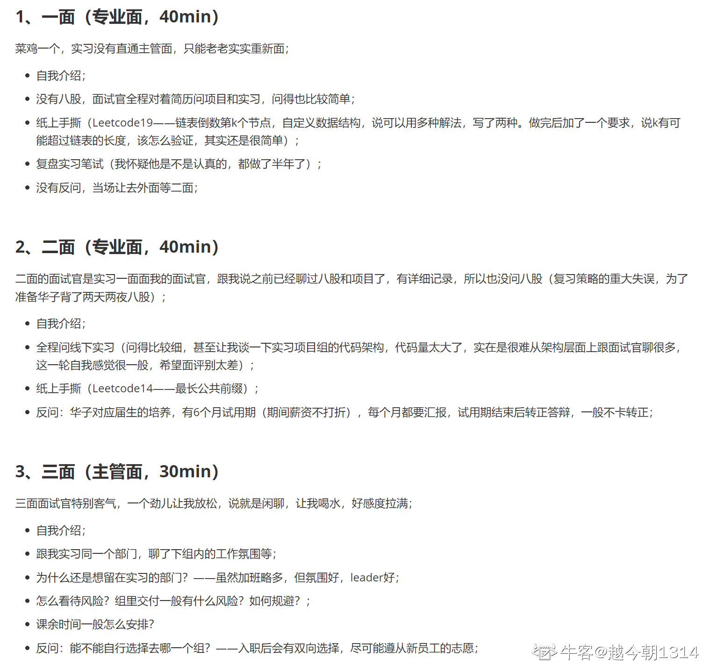

## 华为面经

### 面经1

暑期

https://www.nowcoder.com/feed/main/detail/9dd52cfd177d4392b9820db9e554f0cd?sourceSSR=search

4.19 机考
5.13 技术面（60mins）
首先，面试官上来介绍一下时间分配：半小时问问题，半小时手撕。
一、自我介绍。
二、问简历上的科研项目经历。
​2.1 介绍一下项目，项目难点，怎么解决的
​2.2 项目达到的效果、项目优势体现在哪里、指标、应用场景、怎么应用，为什么这么设计
​2.3 怎么跟导师讨论项目上面遇到的问题
​2.4 项目从0到1的过程（这个问题和面试官讨论比较久）
​2.5 项目的分工分配，你在项目中充当一个什么样的角色
三、写过需求分析文档吗
四、你认为一个工业项目从开始到落地应该经历哪些步骤
五、结合你刚才的描述的步骤再来描述一遍你的项目
六、手撕代码环节
​6.1 面试官给一些测试用例让我输入，然后看结果
​6.2 你的代码可以直接用在相关场景上吗？
​6.3 为什么不能？  应该怎么改？
​6.4 你的代码可以怎么优化，为什么 ？回答了几个之后继续追问  还能进一步优化吗...
​6.5 代码截图上传
七、反问环节
​7.1 部门业务
​7.2 您觉得我哪些方面可以继续改进
​7.3 什么时候可以知道面试结果
面试完十分钟短信后告知通过了。
5.26 主管面（30mins)
一、自我介绍
二、问项目
​2.1 介绍一下你的科研项目
​面试前针对我的项目做了一个ppt，所以直接对着ppt跟面试官介绍了。介绍完之后面试官表示很满意。
​2.2 你在项目中扮演一个什么样的角色
​2.3 在做项目的过程中，遇到了什么困难，怎么解决的
​2.4 你的团队有哪个人，怎么样分工的
​2.5 项目写了多久，代码量多少
三、着重说一下你的优缺点
四、针对你的缺点，你做了哪些改变
五、团队协作经历
六、主要使用什么语言
七、职业生涯规划
八、对华为文化的了解
九、反问环节
​9.1 实习生培养方案
​9.2 您可以评价一下我吗
        听完评价，感觉这次面试应该通过了。
​9.3 什么时候可以知道面试结果
面完之后系统上面一直显示还在面试中，最后到当天晚上才出结果，入池。
入池后和hr沟通了一下，被告知正在走报批流程，通过后才有offer。
爱信等！！！！

### 面经2

华为暑期实习面经

https://www.nowcoder.com/feed/main/detail/d56241c715684eaeab49551f9b255f12?sourceSSR=search

5.22线下面试，一面二面一上午面完
一面：（40min）
1、自我介绍
2、C++八股
C++内存管理
New和malloc的区别，追问new内部调用malloc具体是怎么调用的，没答上来
介绍一下智能指针
shared_ptr怎么析构的
3、深挖项目，主要是问了我在学校的硕士课题。算法是怎么实现的？最大问题是什么？有什么创新点？项目聊了很久
4、手撕代码，《leetcode 20 有效的括号》第一次用纸笔写代码，有一点小问题，面试官提醒改了过来。
二面：(30min)
1、自我介绍
2、本科的成绩排名
3、笔试多少分
4、数学建模竞赛中做了什么工作，怎么协调（第一次有公司问数学建模竞赛）
5、深挖硕士课题的项目
6、介绍一下时间轮定时器
7、给我了一些建议，主要是说我简历上有一个烂大街的webserver项目，面试官会扣印象分

6.4 发offer
上海无线通软

### 面经3

https://www.nowcoder.com/feed/main/detail/ede029a6044d419298812887a05561f7?sourceSSR=search

2012实验室 - 通用软件开发
1面：
leecode541
3道笔试题怎么做的
对docker和k8s的理解程度
docker种的namesapce隔离有几种
自己做的项目介绍（有没有发布到线上，写了多少行代码）
看我本科做了一个电子设计大赛，问我怎么做的，把自动化中的控制器、执行器、传感器负反馈调节说了一下
对机器学习、深度学习的理解程度。
10分钟出结果

2面：
分别在第一段实习和第二段实习中学习到了什么
有什么难点，怎么解决的
进程和线程的区别
虚拟内存和物理内存怎么映射的
两个进程可以访问同一块内存吗
code：面试官自己出的题目，给一个字符串列表，一个字符串，字符串尽可能使用字符串列表中的单词拼接，返回无法拼接的最小字符数。
反问：为什么华为的面试这么宽泛，华为校招重视啥？
回答：八股哪些东西可以通过google学习，应届生主要重视遇到问题的解决能力。

更新：主管面挂

第二志愿还能投吗，有没有人捞一下

### 面经4

华为暑期实习面经

https://www.nowcoder.com/feed/main/detail/93be3995c2ed418a94afa712844249ff?sourceSSR=search

一、技术面（30min)
问了一下项目的具体内容
c++类中的虚函数
c++对于内存的分配（堆/栈）
TCP/UDP的区别
手撕：识别包含(),{}的字符串是否能配对

二、主管面(30min)
项目内容/难点/怎么解决/是否能优化
为什么选择华为
在校的社团/班干经历
如何平衡学习和竞赛
遇到什么努力很久但是没有实现的事情
最近读过的技术书/书
华为压力比较大，家人对于来华为工作的想法
自己能给华为带来什么

### 面经5

华为线下面经

https://www.nowcoder.com/feed/main/detail/1571fa8d1576414d9c76223dc0d3fafe?sourceSSR=search

八月底投的，因为参加了华为实习，以为会早点安排面试，结果合肥都面完了也没排上，学长联系了一下，安排到了上海线下面，头一天晚上赶去，第二天上午速通
1面
面试官很友善，说总时长40min，会有一个笔试环节。自我介绍完让挑一个比较熟悉的项目或比赛展开讲讲，讲的过程中会问一些问题。
投的通软，比赛讲的是机器学习，感觉面试官也懂，问了模型如何剪枝优化，剪枝分为哪几类，预剪枝和后剪枝是怎么做的，评价指标是什么，这些知识是自己学的吗，从哪学的，答自学的周志华。聊的挺愉快，然后给了两张纸，一张题目一张答题纸，题目是判断是否是二叉搜索树，lc98，两分钟直接写完给面试官讲，讲完后说没问题，反问环节主要是聊天，走之前问了一下面了多久，面试官笑着说35分钟。
2面
茶歇等了会就通知二面，面试官就在1面面试官旁边，进去先和1面面试官打了招呼。
二面面试官也是先让讲一个项目，中间说我不用讲这么细（哈哈，可能不感兴趣），然后说没问题，来做个笔试。
笔试题目是输入年月日时分秒，输出和某个时间点之间的秒数，刚看到没想那么多，后续面试官一点点提示说要考虑边界，考虑闰年，闰月，一步步引导，手写完给面试官看了看说没问题，然后聊天问我玩不玩游戏，他们做gpu相关，我说玩，玩什么游戏，我说巫师三，他说知道，然后问我用不用C++，我说本科学过，考试考90+，现在主要用python，面试官说那学的还不错，（我以为要问我八股了），问我python写不写类，大概写多少行，我就讲深度学习代码中常见的类，dataset，dataloader，model这些，行数不多，几百行，面试官说可以，然后聊了点别的问我面试一共有几面，我说这个过了的话有三面主管面，面试官笑着说那肯定有了。
3主管面
主管面等了挺久，到11.37，觉得上午应该面不完了，结果收到了通知，这次是在一面面试官后边，主管面一直在问我的研究方向，创新点在哪，学校毕业要求达到了么，毕业课题能不能做出来，做不出来怎么办（我也担心啊），这些问完我就有点绷不住了，说话开始磕吧，反问就问国内gpu优化的方向在哪，给我讲了讲优化首先要定位瓶颈，再去找原因然后克服，后续也不问我性格方面的问题，如何看待华为这些，结束后心里感觉坏了，主管面是不是要g，一直刷新状态，等了十几分钟显示通过了，心终于落地。

总结，前两面都很愉快，一个八股没问，主管面有点麻。

### 面经6

https://www.nowcoder.com/discuss/454579593324851200

记——23届华为暑期实习面经

2022年面的，过了很久，现在将其整理出来了......

2022.4.7 一面

1. 自我介绍（要求本科、研究生阶段的经历都要介绍，以及本科成绩、研究生成绩，本科和研究生阶段学的最好的专业课有啥，还问了下本科为什么考研、为什么不工作）
2. 科研项目/科研方向说了一下
3. 项目介绍（项目价值、项目设计思路、项目难点）
4. 看我科研是搞计算机视觉的，问我为什么不选择算法岗，而选择开发？
5. 使用线程池可能带来哪些风险和有哪些好处
6. 线程池参数有哪些
7. 常用的线程池工作队列
8. Java反射机制的原理？描述一下反射机制是什么？
9. 看我科研用的是python，想问我python，我果断说不会原理...
10. 手撕算法题：一个二叉树 从左至右遍历它的叶子节点

2022.4.7 二面

1. 自我介绍
2. 受到过的最委屈的一件事
3. 最刻骨铭心的一件事
4. 为什么选择考研？有没有想过没考上后会去干什么
5. 怎么释放压力
6. 逛过什么技术论坛吗
7. 了解过什么开源项目吗
8. ... ...

二面主要根据个人经历问吧

### 面经7

华为 暑期实习面经

https://www.nowcoder.com/feed/main/detail/9884b998f9f74b02854cfb657871856d?sourceSSR=search

写一下面经攒人品吧
5.17 9：30 技术面
1.先问了为什么选这个专业
（还能为什么，计算机去不了呗）编，说我非常喜欢工科，然后这个专业过了。
2.然后问了研究生的研究方向
研究生搞机器学习的，给他解释了一些简单的原理
3.问大厂会不会用到这个技术
解释，总结来说可能不会
4.然后问为什么不打算继续搞算法
（总不能说我菜，卷不过吧。）说更喜欢开发balabala
5.问实习做了什么，收获是什么
6.问项目觉得最有价值的是什么
webserver。。。哈哈哈！面试官都惊讶了，问为什么是这个，给他解释说这个训练技能比较全面，把用到的说一说balabala
7.问学生会，一些闲聊
8.写题目
用本地ide，要共享屏幕，前高频次个k个数，还和我说不用用最优的方法，只需要得出正确答案就好了，测试案例也只有一个，逆反上来了，就用堆排序！
9.反问
问了部门业务
问了对c++语言前景的看法balabala

总体来说觉得面试官很和蔼，但是问题还蛮刁钻，而且竟然没问八股，有些担心，不问八股会不会是池子已经满了所以根本不关心专业能力。。。10分钟官网状态更新，华子是真的快啊，等待主管面，哎华子收了我吧。

### 面经8

0527华为云软开面经

https://www.nowcoder.com/feed/main/detail/3a8f521780a549389bc3ca55f47a5dd8?sourceSSR=search

突然想起来一面还有个场景题，大概内容是
“有一千万个ip地址，他们是离散的不是连续的，输入一个ip地址，如何快速判断它是否在这一千万个里面，这个函数你会如何设计”
一面
自我介绍
问项目（感觉面试官对我某个项目真的很感兴趣，全程无八股）
手撕 一个很简单的动态规划
反问
反问完面试官又问了一下项目压测方面问题

面完秒过，hr跟我反馈说，面试官挺满意的

二面
自我介绍
职业规划是什么
实习时长多久
华为核心价值观了解多少
反问

嘶，十分钟结束，，感觉面试官似乎很忙比较仓促，但是面完秒绿了

开泡

### 面经9

### 面经10

华为无线通软面经

https://www.nowcoder.com/feed/main/detail/74713baa394e45b7b6c8974084409471?sourceSSR=search

无线通用软开base东莞；我已入池 感觉凉好
一面：static关键字+lc503
二面：问paper难点+lc967
主管面：聊天+问paper难点+进程与线程区别
留学生跟国内应届生一个时间发offer 大概在12月上中旬；
是看我没有实习就问的这么水吗

### 面经11

华子通软云核心面经—火速入池

https://www.nowcoder.com/feed/main/detail/a344b84b9f794ea79e34a1cc95ce7ab5?sourceSSR=search

昨天10.11从四点半一直面到晚上七点半，感觉我是最后一个离开的候选者了，直接麻了，整体难度不大

一面 40min

1. muduo 网络库项目介绍一下，Reactor 模型具体如何处理事件
2. select 和 epoll 用法不同，区别在哪
3. 其中你学到了什么，用到了哪些设计模式
4. git 使用吗，遇到冲突如何解决
5. 数据库的 ACID 特性
6. 线程和进程的区别
7. 算法题：输出金字塔形状的数据，手写代码，代码有哪些可以优化的地方，可以划分为几个不同的功能函数

类似于：输入 n，例如 n = 4，最终输出
   1
  121
 12321
1234321

二面 30min

1. 实习项目介绍一下
2. 实习中 nginx 服务器如何模拟波动的网络环境
3. 实验室项目具体说一下

（... 还有一些问题忘了）

4. 算法题：LC328 奇偶链表，类似于：1-2-3-4-5-6，重组为 1-3-5-2-4-6（和 LC143 可能还不太一样

主管面 45min

1. 自我介绍 5min
2. 毕业设计题目，大致介绍一下
3. 实验室和华为合作的项目你负责什么部分
4. 实习工作和在实验室工作区别，实验室有加班吗
5. 实验室项目难点如何，最后实际应用了吗
6. 科研中，如果和同学或者师兄观点不一样如何处理
7. 了解华为价值观吗，加班怎么看
8. 反问部门具体做什么工作，对校招生的培养

（...还有一些细节问题忘了）

### 面经12

https://www.nowcoder.com/discuss/501087455676813312?sourceSSR=search

5.23 一面：

总的来说问的比较基础（这可能和我自我介绍的时候特地提到我Java基础比较扎实有关），但是面试官不会听我诱导，有几道没答上来他都不问我别的（比如JVM那里问我参数我没答上来，我说我对垃圾回收等其他方面比较了解然后他完全没理我）

有一点压力面的意思，面试官全程不苟言笑

1.稍微聊了一下项目（JPEG压缩编码），问了项目中有哪些创新点

2.学校绩点如何，有拿过奖学金吗

3.==和equals的区别

4.抽象类和接口的区别

5.抽象类可以没有抽象方法吗

6.String=new(“abc”)和String=“abc”的区别

7.JVM如何扩展堆内存（这个没答上来）

8.列几个常用的线程池（没答上来，当时光去准备阻塞队列拒绝策略这些了）

9.8个基本数据类型分别是什么

10.parseInt和valueOf的区别

11.hashMap和treeMap区别

12.包装类型的缓存机制

13.sleep和wait的区别

14.java实现锁的几种方式

15.如何实现一个单例模式

16.接口在哪些设计模式中有应用到

17.观察者模式了解过吗

18.手撕算法：字符串解析+二分查找

一开始的时候想到二分查找了，但是没想到把IP解析为数字，和面试官扯了很多跑题的思路，后来才反应过来然后又说了半天才让对方理解我的思路（悲

给定多个IP区间（XXX.XXX.XXX.XXX-XXX.XXX.XXX.XXX），判断一个IP是否在任意一个区间中

19.反问：问了GTS具体负责哪些业务，平时用到了什么框架

5.29 二面：

总的来说发挥比较不错，就是处理分歧那里我说的实在是跑题了，最后面试官提到我给人的印象像是那种“懒得和你争论，有那个功夫我自己都把代码写完了”的技术宅形象（

1.为什么不读研

2.如何看待ChatGPT

3.觉得ChatGPT是否会导致程序员失业，分析它的优势和劣势

4.个人平时会在哪些方面用到GPT

5.在工作中如何去合理地应用ChatGPT（GPT这里聊了很久，大概有1/3的时间都在聊对GPT的看法）

6.未来的职业规划

7.平时如何去学习一个新的知识体系

8.做过的最失败的项目是什么

9.项目中遇到了哪些困难，如何去解决

10.项目中和其他人有分歧如何处理（这里没答好）

11.你说到你平时是如何学习新知识的，举一个具体的例子

12.为什么选择了华为，对你而言华为相比其他公司有什么优势

13.如何看待华为的加班文化

14.反问：

有哪些技术栈可以提前准备：非常巧妙地避开了我的问题，说只要我的学习能力足够优秀，加上认为我有很好的学习方法，不需要准备什么也可以很快融入公司（？

面试官对我的看法：对于我对新技术的看法和学习方法上表达了肯定，同时说在处理分歧上可以再改进一下，还说我很像年轻时候的他（草

5.30 保温，hr发来贺电，说主管对我的评价很不错

6.2 保温，hr说我面评非常好，排名很靠前（其实这里我当时是不敢信的，因为技术面我发挥实在不能说是乱杀）

6.4 hr通知第一次性格测评没过，审批第二次补测中

6.7 做完第二次性格测评，参照了很多网上提到的要点

6.10 hr通知我第二次测评还是有一些问题

当时心态已经有些崩了，因为我是把很大希望寄托在华为上的，而且这次实在想不明白哪里填的还有问题，现在再去找其他公司的暑期实习已经很困难了

后来两个星期基本上一直在投其他公司的日常实习和一些没招完的暑期实习的简历

6.19 保温，hr说第二次测评问题不是很大，加上排名很靠前所以还是有审批的机会的，让我这段时间留意手机

讲道理我当时已经放弃华为了在准备其他公司的面试流程了，实在是没想到测评连挂两次+笔试151还会有拿offer的机会

6.20 收到oc电话，当时在做其他公司的笔试没有接听，但是和对接的hr提了一嘴，随后hr去找给我打电话的负责人了

6.21 早上起来收到offer邮件