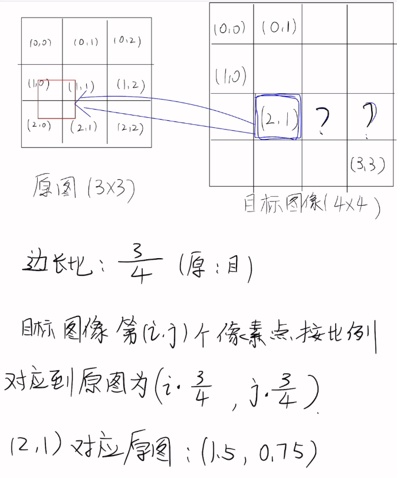
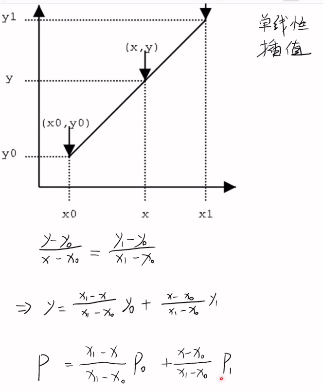
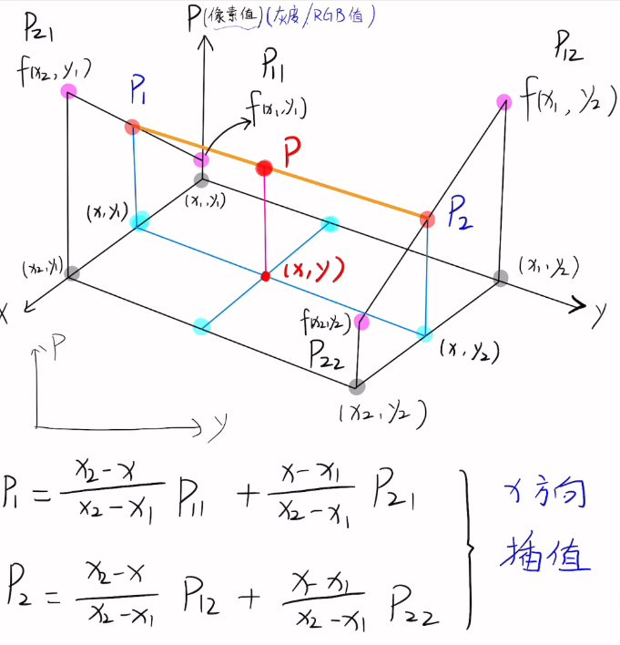
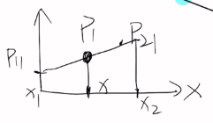
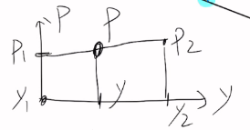
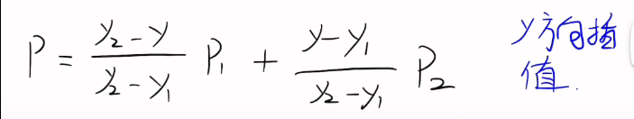
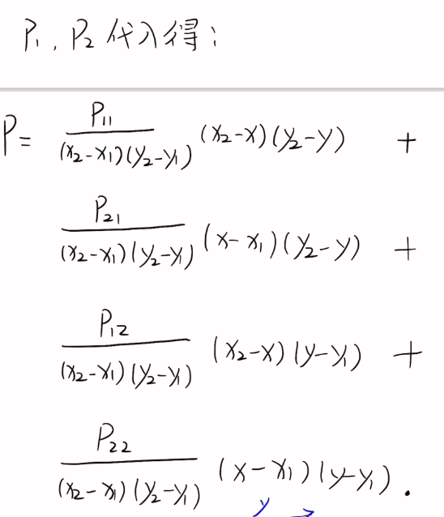
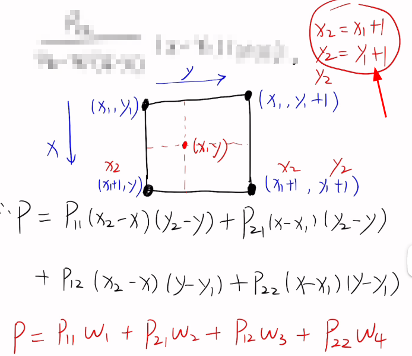

### 双线性插值

参考：[[B站](https://www.bilibili.com/video/BV1j44y1L7Vo)]

用途：数字图像处理

如下图所示，我们把 3x3 的图像放大为 4x4 的图像，那么，目标图像中的像素值应该去原图中找。比如我们要求目标图像 (2, 1) 处的像素值，根据原图和目标图像边长的比例 3/4，我们让 (2 x 3/4, 1x 3/4) 得 (1.5, 0.75) ，对应到原图上就是和四个像素点相关的区域，具体的计算方法就是双线性插值法。

​	先来了解什么是单线性插值：

- **单线性插值**

  如下图所示，已知两点的坐标 x0 和 x1 ，以及它两点的像素值 y0 和 y1 ，那么根据斜率公式就可以计算 新的坐标 x 处的像素值 y 。

  

  

- **双线性插值**

  双线性插值就是作了两次单线性插值，第一次从 x 方向，第二次从 y 方向，当然也可以反过来。如下图所示：要求点 (x, y) 处的像素值，过这个点作平行 y 轴的线，交左边的平面于 (x, y1) ，用单线性插值法求出点 (x, y1) 的像素值 P1 ，同样的方法求出 P2 ，然后过 (x, y) 作 x 轴的平行线，再用单线性插值求 P ，即下图中的红线。

  

  把 P1 ， P2 代入：

  

  以最上面 3x3 的图能推出下图红圈里的关系，代入上面的公式，可以把式子化简为下面的式子，拿其中一个参数 W1 举例，W1 表示，离点 (x1, y1) 越近，(x1, y1) 处的像素对目标像素值的影响越大。

  