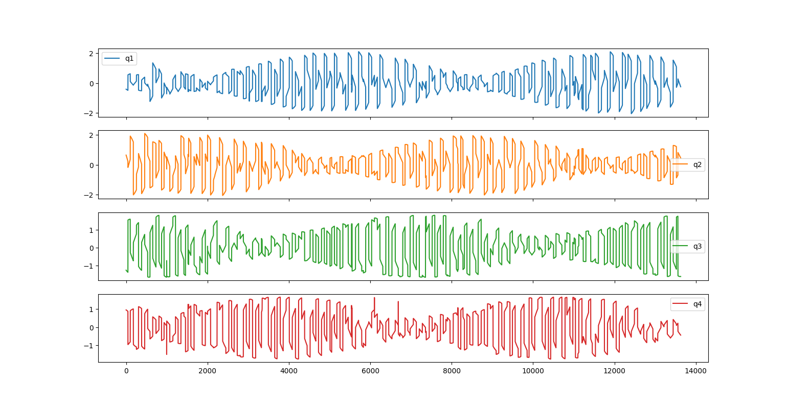
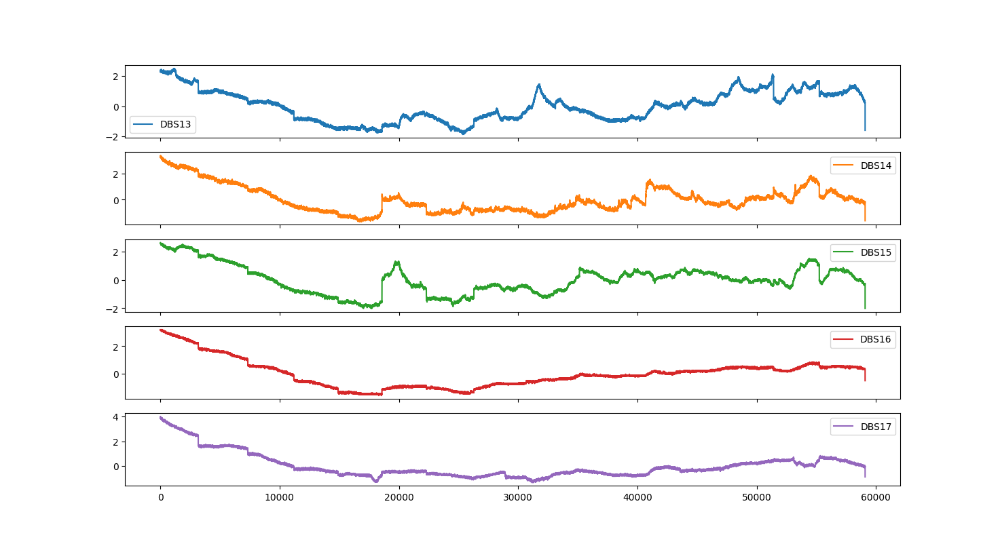

### 实验报告

本次实验使用了五个不同的模型，用来对多维时序数据进行预测。五个模型的介绍如下：

- DLinear：它是线性模型，将原始数据分别分解为移动平均分类量、季节趋势分量。然后将两个单层线性层应用于每个分量，我们将两个特征相加，得到预测结果。
- PatchTST：它是基于Transformer的模型，把时间序列分成子序列级别的patch，作为Transformer的输入，通道之间独立，每个通道只处理一个维度的时序数据，通道之间权重共享。
- LSTM：长短期记忆网络，它在RNN的基础上加入了输入门、遗忘门和输出门单元，可以保存时序中的长期依赖关系，我们直接把多维时序数据输入模型，得到预测结果。
- GRU：门控循环单元，它是LSTM一个简化的变体，有重置门和更新门，看可以捕捉到时序数据中的短期和长期依赖关系。
- SVR：支持向量回归，SVR在线性函数两侧制造了一个区间，对于所有落入到该区间内的样本，都不计算损失，只有区间之外的，才计入损失函数。之后再通过最小化该区间的宽度与总损失来最优化模型。我们为每一维的时序数据都训练了一个SVR模型，把每个模型的预测结果合并到一起作为最后的预测结果。

五个模型中，DLinear和PatchTST在时序预测任务常用的数据集上已经取得了较好的结果。这些数据集包括：电力变压器温度（ETT系列）、道路占用率（Traffic）、用电量（Electricity）、汇率（Exchange-Rate）、温度和湿度（Weather）、患流感的比例（ILI）。

在本次实验中，我们使用了航天数据，预测一天内航天器的座舱温度（五维），和卫星姿态数据（四维）。

这次实验中，采用输入序列长度是336，输出（预测）长度是96的设置。

| 座舱温度数据集 | MSE   | MAE   |
| -------------- | ----- | ----- |
| DLinear        | 0.010 | 0.056 |
| PatchTST       | 0.009 | 0.052 |
| LSTM           | 0.012 | 0.065 |
| GRU            | 0.010 | 0.057 |
| SVR            | 0.017 | -     |

| 卫星姿态数据集 | MSE   | MAE   |
| -------------- | ----- | ----- |
| DLinear        | 0.607 | 0.586 |
| PatchTST       | 0.720 | 0.648 |
| LSTM           | 0.672 | 0.627 |
| GRU            | 0.663 | 0.625 |
| SVR            | 1.057 | -     |

据实验结果来看，提到的五个模型在座舱温度数据上的预测结果好于卫星姿态数据集。
