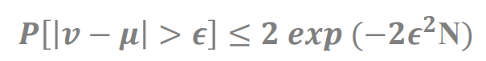
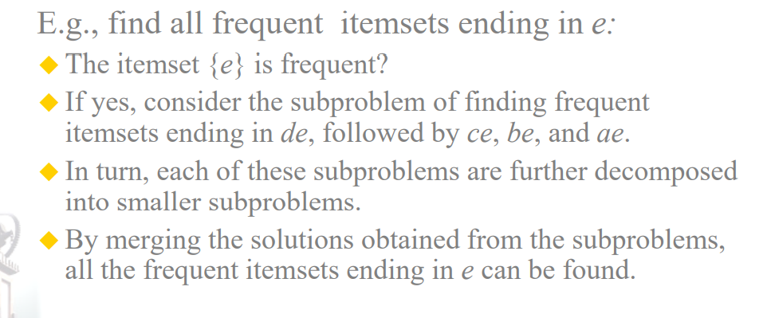

### 一、引言

- 数据中的知识发现包括哪几个步骤？

  数据库中知识发现（knowledge discovery in database, KDD），KDD是将未加工的数据转换为又用信息的整个过程。

  输入数据->数据预处理->数据挖掘->后处理->信息

  答：知识发现，即对数据进行选择和处理，自动发现新的、正确的、有用的模式，从 而对现实世界中的对象进行建模。通常主要分为以下四个过程：数据整理（形成目标 数据集）、数据选择和预处理（数据清理、数据规约和数据映射）、数据挖掘（选择 算法并搜索感兴趣的模式或模型）、解释和评估（分析发现的结果）。

- 数据挖掘应用

  - 聚类分析
  - 预测建模
  - 关联分析
  - 异常检测
  
  答：数据分析、决策支持、对象识别、文本分类、文本挖掘、网络挖掘、流数据挖掘、 语音识别、传感数据建模、无人驾驶、用户定制、疾病诊断、生物数据分析等。

### 二、学习的可行性

- Hoeffding 不等式

  

- 用 Hoeffding 不等式说明学习的可行性

  即使当N很大的时候，采样分布和真实分布的差距很大的概率会很小。

### 三、数据和数据预处理

- **有哪四种不同的属性类型？分别可以进行什么操作？（p17）**

  - 标称（nominal）

    众数、熵、列联相关、 $\chi^2$ 检验

  - 序数（ordinal）

    中值、百分位、秩相关、游程检验、符号检验

  - 区间（interval）

    均值、标准差、皮尔逊相关、t和F检验

  - 比率（ratio）

    几何平均、调和平均、百分比变差

- **非对称属性？（p18）**

  对于非对称属性（asymmetric attribute），出现非零属性值才是重要的。

  只有非零值才重要的二元属性是非对称的二元属性。

- **数据对象之间相似度、相异度计算（p41-p42）**

  - 相异度

    - 欧氏距离
    - 曼哈顿距离
    - 马氏距离（p48）

    距离的性质：非负性、对称性、三角不等式。

  - 相似度

    - 二元数据相似度度量（p43）：算0-0（SMC）和不算0-0（Jaccard）

    - 余弦相似度

    - 广义 Jaccard 系数（Tanimoto系数）

      广义 Jaccard 系数可以用于文档数据，并在二元属性情况下规约为Jaccard系数。用 $EJ$ 表示。
      $$
      EJ(x,y) = \frac{x \cdot y}{\Vert x\Vert^2 + \Vert y\Vert^2 - x \cdot y}
      $$
      
    - 相关性（Correlation）（p46）
    - 组合异种属性的相似度（p49）
  
- **数据预处理的主要任务**

  ~~聚集、抽样、维归约、特征子集选择、特征创建、离散化和二元化、变量变换~~

  数据清理、聚集、转换、缩减、离散化

  数据清理，例程通过填写缺失的值，光滑噪声数据，识别或删除离群点，并解决 不一致性来清理数据。 

  数据集成，集成多个数据库、数据立方体或文件。 

  数据变换，数据规范化和聚集。 

  数据规约，数据集的简化表示，但产生同样的分析结果，包括维规约和数值规约。 

  数据离散化，数据规约的一部分，但是对于数值数据来说特别重要，通过将一个 连续的属性划分为区间来减少数据体积

- **处理缺失值的方法？**（ppt 37）

  - 缩减数据集，淘汰所有缺失值的样本

  - 填补缺失值

    专家给出填补意见，或者用常数填补：一个数、特征平均、最可能的值（其他样本中该属性的值）。

### 四. 决策树学习

- **决策树学习的基本思想**

  决策树是运用于分类的一种树结构，其中的每个内部节点代表对某一属性的一次测试，每条边代表一个测试结果，叶节点代表某个类或类的分布。决策树的决策过程需要从决策树的根节点开始，待测数据与决策树中的特征节点进行比较，并按照比较结果选择选择下一比较分支，直到叶子节点作为最终的决策结果

  (1)评估每一个属性，选择最好的一个属性 k 作为决策树的根节点。 (2)根据属性 k 的每种可能取值得到根节点的子节点，将训练集划分到合适的子节 点上。 (3)对于每个子节点，选择该子节点中最好的一个属性作为该子节点的值，然后按 照(2)的方式划分该子节点。不断的重复此过程，直到满足一定的条件

- **分类错误率，熵，信息增益的概念，如何根据不同度量选择最佳划分（p97）**

  - 信息增益的概念（p98）：父子节点熵的差值就是信息增益，信息增益越大，划分越好。

  - 三种度量：熵、Gini、分类误差（p97）

    ~~度量值越小越好。（例p99 图 4-14）~~

- **缺失值对决策树有何影响？（ppt 60）**

  - 影响不纯度度量的计算
  - 如何把有缺失值的实例分配给子结点
  - 一个有缺失值的测试实例如何分类

- **给定混淆矩阵，分类效果度量不同指标的含义及计算方法。（p91）**

  - 错误率
  - 准确率

    

- **评估分类器性能的留一法和 k 折交叉验证（p115）**

  留一是留一个验证集。

- **过拟合和欠拟合**

  - 过拟合：树的规模变得太大，训练误差还在降低，检验误差开始增大
  - 欠拟合：树的规模很小，训练和检验误差都很大。

### 五．神经网络

- 神经网络如何学习？ 有何特点？（ppt 6）

  - 给网络的节点随机初始化权重，输入样本，最小化损失函数的值，通过梯度的反向传播，更新网络参数，迭代多次。在测试阶段，给没见过的数据分类。
  - 需要很长时间训练、对不完整和有噪声的数据容忍度很高

- 梯度下降算法

  可以写线性回归的例子。

- 多层神经网络使用什么算法进行训练？（ppt 29）

  一个隐层的MLP，正向传播（sigmod(f(x))），反向传播更新梯度。

### 六．贝叶斯学习

- 根据贝叶斯理论，如何计算一个假设 h 成立的后验概率？

  根据贝叶斯理论公式

  $p(h|D) = \frac{p(D|h)p(h)}{p(D)}$  

- 极大后验概率假设和极大似然假设有何区别？

  

- 最小描述长度的基本思想

  

- 贝叶斯最优分类器的基本思想

  

- 朴素贝叶斯分类算法

- 贝叶斯信念网络的预测和诊断

- 偏差方差分析

### 七．基于实例的学习

- K 近邻学习算法（p128）

- K 近邻学习计算距离时为何要进行归一化

  多个特征值时，其中某个特征数量级比较大，其他特征较小时，分类结果会被特征值所主导，而弱化了其他特征的影响，这是各个特征值的量纲不同所致，需要将数据归一化处理。

- 局部加权线性回归（ppt 30）

- ==基于案例的学习与 k 近邻学习的异同==

  - case based learning
  
- 懒惰学习和积极学习的区别

  - 积极学习：如果训练数据可用，就开始学习从输入属性到类标号的模型映射。
  
  - 懒惰学习：推迟对训练数据的建模，直到需要分类测试样例时再进行。存储所有训练样本。
  
  

### 八．集成学习

- 集成学习的定义

  - 集成：机器学习中，用多个模型的集合获得比单个模型更好的预测结果。

-  集成学习的两个主要问题

  - 如何得到若干个个学习器
  - 如何选择一种结合策略，将这些个体学习器集合成一个强学习器。

- Stacking 基本思想及其伪代码

  首先再训练集中的样本（有放回抽样）训练一个多分类器的集成，这个集成称为Tier-1分类器，把Tier-1的输出送入Tier-2分类器（meta分类器）。使用meta分类器代替每个分类器的投票，由meta分类器输出最后的预测。

  

- Bagging 基本思想及其伪代码

  Bagging是一种投票方法，通过在有轻微不同的训练集上对基础学习器进行训练，使基础学习器变得不同。

  

- Boosting 基本思想及其伪代码

  给训练集里的样本分配权重。

  

- 为何集成学习有效

  集成学习的一个必要和充分条件是，如果基础分类器是准确和多样的，那么这些分类器的集成将比其任何单个分类器更准确。

### 九．分类技术

- 基于规则的分类器有何优点，==需要解决什么问题==

  - 和决策树一样有高度表达能力

  - 易于解释

  - 构造简单

  - 快速对新样本分类

  - 性能和决策树相当

    需要解决的问题

    基于规则的分类器所产生的规则集的两个重要性质： 互斥规则：规则集 R 中不存在两条规则被同一条记录触发，两条规则是相互独立 的，此性质确保每条记录至多被 R 中的一条规则覆盖。 穷举规则：对属性值的任意组合，R 中都存在一条规则加以覆盖，此性质确保每一 条记录都至少被 R 中的一条规则覆盖。 这两个性质共同作用，保证每一条记录被且仅被一条规则覆盖。 问题（1）：如果规则集不是穷举的，那么必须添加一个默认规则 rd:()→yd来覆盖 那些未被覆盖的记录。yd 是默认类，通常被指定为没有被现存规则覆盖的训练记 录的多数类。 问题（2）：如果规则集不是互斥的，那么一条记录可能被多条规则覆盖，这些规 则的预测可能会相互冲突，通常使用有序规则和无序规则加以解决。 基于规则的分类器正是解决问题（2）的有序规则

- 序列覆盖算法（p130）

  - 初始化一个空的决策列表R，Learn-One-Rule函数用于提取包含当前训练记录集的y类的最佳规则。在规则提取过程中，y类的所有训练记录都被认为是正的，而其他的则是负的。一旦找到规则，规则所涵盖的训练记录将被删除。把新规则加到R中。
  - 

- 支持向量机基本原理

  通过在数据上找到一个最大边缘超平面，对数据进行分类。

### 十． 聚类分析

- 聚类的定义

   聚类 (Clustering) 是按照某个特定标准 (如距离)把一个数据集分割成不同的类或簇，使得 同一个簇内的数据对象的相似性尽可能大，同时不在同一个簇中的数据对象的差异性也尽可能地大 。

- 聚类的类型（p308）

  - 层次的（嵌套的）、划分的（非嵌套的）
  - 互斥的、重叠的、模糊的
  - 完全的、部分的

    （1）层次聚类（嵌套）：以层次树的形式组合在一起的嵌套簇的集合。 （2）划分聚类（非嵌套）：各个簇之间不重叠，每一个数据对象只属于一个簇中。 （3）排斥聚类：非排斥的聚类中，点可以属于多个簇；排斥聚类可以代表多个类 或 边界点。 （4）重叠聚类：一个点可以属于多个簇，簇与簇之间相互有重叠。 （5）模糊聚类：模糊聚类中，一个点属于每一个簇的权重在（0,1）之间，所有权 重 之和为 1。概率聚类具有相似的特征。 （6）完全聚类：完全聚类将每一对象都划分给一个簇。 （7）部分聚类：没有将每一对象都划分给一个簇。

- 簇的类型（p308）

  - 好分的簇

    分离很好的簇：簇内距离小于簇间距离。
  - 基于中心的簇
  - 基于连续性的簇
  - 基于密度的簇
  - 共享属性
  - 由目标函数定义

    

- 层次聚类的两种主要类型
  - 凝聚的：从点作为个体簇的概念，每一步合并两个最接近的簇。
  - 分裂的：从包含所有点的某个簇开始，每一步分裂一个簇，直到仅剩下单点簇。

- 计算簇间相似性的单链（MIN）和全链（MAX）方法
  - MIN：两个簇间最近两个点的距离（欧氏距离）
  - MAX：最远两个点的距离

- K 均值和 k 中心点算法

   - 
   - k中心点算法（ppt 63）

     

     - 多次执行k均值算法，选择SSE最小的那次的k中心点。
     - 先用层次聚类确定k个中心（k相对较小，样本也不多的情况）。
     - 选k+个中心点，再从这些中选k个。
     - ？==Bisecting K-means ==

   - 后处理
     - 再划分簇。把SSE最大的那个簇再次划分
     - 再加一个中心。该点和所有质心离得都远
     - 分散一个簇。把当前簇里的点重新划分到其他簇中
     - 合并簇。离得最近的质心，簇合并

- DBScan 算法（p328）

   DBScan是一种简单的、有效的基于密度的聚类算法，它解释了基于密度的聚类方法的许多重要概念。

   任意两个足够靠近（相互之间的距离在Eps之内）的核心点放在同一个簇中。同样，任何于核心点足够靠近的边界点也放到与核心点相同的簇中。噪声点被丢弃。

   

   DBSCAN算法

   1. 将所有点标记为核心点、边界点或噪声点
   2. 删除噪声点
   3. 为距离在Eps只内的所有核心点之间赋予一条边
   4. 每组连通的核心点形成一个簇
   5. 将每个边界点指派到一个与之关联的核心点的簇中

   

- 聚类评估（p 332）

   - 监督分类的评估指标：（见）
     - 准确率：预测对的 / 总数
     - ~~精确率：TP / (TP + FP)，这是针对预测结果算的~~
     - ~~召回率：TP / (TP + FN)，样本中的正例有多少被预测正确了，这是针对原来的样本的~~
     
       
     
   - 非监督簇评估：使用凝聚度和分离度
   
   - 非监督簇评估：使用邻近矩阵
   
   - 层次聚类的非监督评估
   
   - 簇有效性的监督度量
   
     
   
     簇内度量：SSE：$\sum\limits_{x \in C_i} dist(c_i, x)^2$
   
     簇的凝聚度： $WSS =  \sum\limits_i \sum\limits_{x \in C_i} (x - m_i)^2$
   
     簇的分离度： $BSS = \sum\limits_i \vert C_i \vert (m - m_i)^2$ 
   
     
   
     
   
     轮廓系数：对单个点来说
   
     

### 十一． 关联分析

- 概念：项集，频繁项集，支持度，置信度，极大频繁项集，闭频繁项集

  - 项集：令 $I = \{i_1, i_2, ..., i_d \}$ 是购物篮数据中所有项的集合，而 $T = \{t_1, t_2, ..., t_N\} $ 是所有事务的集合。每个事务 $t_i$ 包含的项集都是 $I$ 的子集。在关联分析中，包含 $0$ 个或多个项的集合被称为项集。

  - 频繁项集：满足最小支持度阈值的所有项集

  - 支持度：（p202）

    - 支持度计数( $\sigma$ )：对一个项集来说，有多少个事务包含该项集，那么支持度计数就是几
      $$
      \sigma(X) = \vert  \{t_i \vert X \subseteq t_i, t_i \in T \}  \vert
      $$

    - 支持度确定规则可以用于给定数据集的频繁程度

      $X, Y$ 是不相交的项集，即 $X \cap Y = \emptyset$，$N$ 是事务总数
      $$
      支持度 \quad s(X \to Y) = \frac{\sigma(X \cup Y)}{N}
      $$
      

  - 置信度：确定 $Y$ 在包含 $X$ 的事务中出现的频繁程度。
    $$
    c(X \to Y) = \frac{\sigma(X \cup Y)}{\sigma(X)}
    $$
    
  - 极大频繁项集：它是这样的频繁项集，直接超集都是不频繁的。
  
  - 闭频繁项集：
  
    - 闭项集：一个项集的直接超集都不具有和它相同的支持度计数 
    - 闭频繁项集：首先是一个频繁项集，然后是闭的，并且它的支持度大于或等于最小支持度阈值（也就是 频繁项集 + 闭项集）
  
- Apriori 算法（）

  - 前提：先验原理：如果一个项集是频繁的，则它的所有子集一定也是频繁的。一个项集的支持度决不会超过它的子集的支持度。这个性质也称为支持度度量的反单调性(anti-monotone)。

  - Apriori算法是第一个关联规则挖掘算法，它开创性的使用基于支持度的剪枝技术，系统的控制候选项集指数增长。

    

- FP 增长算法（p227）
  - 采用完全不同的方法来发现频繁项集。该算法不同于Apriori算法的“产生-测试”泛型，而是使用一种称作FP树的紧凑数据结构组织数据，并直接从该结构中提取频繁项集。
  
  - FP树的概念：最长公共前缀

  - 条件FP树
  
    
  
- 关联模式评估

  - 兴趣度度量
    一个规则的兴趣度常基于相依表(contingency table)中列出的频度计数来计算。

    

  - 基于统计的度量

    

    - lift：$lift(A \to B) = \frac{c(A \to B)}{s(B)}$ 
    - Interest: $I(A, B) = \frac{s(A, B)}{s(A) \times s(B)} = \frac{Nf_{11}}{f_{1+}f_{+1}}$ ， $N$ 是相依表中右下角的总数
    - PS: $Nf_{11} - f_{1+}f_{+1}$ 
    - $\phi$ : $\frac{f_{11}f_{00} - f_{01}f_{10}}{\sqrt{f_{1+}f_{+1}f_{0+}f_{+0}}}$ ，对角线相乘减边缘。相关度：从-1到+1，完全负相关到完全正相关。

### 十二． 维度约减

选择特征子集进行降维。

- #### 过滤方法和包裹方法有何区别及优劣

  目标函数分两种：过滤方法，包裹方法

  - 过滤方法：过滤式方法先对数据集进行特征选择，然后再训练学习器。特征选择过程与后续学习器无关，这相当于先对初始特征进行“过滤”，再用过滤后的特征训练模型。（评估特征子集的方法主要是看子集里的内容：类间距离，统计相关性，信息理论的测量。评估特征子集的特征独立于学习器。无监督的。）

    

  - 包裹方法：包裹式从初始特征集合中不断的选择特征子集，训练学习器，根据学习器的性能来对子集进行评价，直到选择出最佳的子集。（目标函数是一个学习器，使用特征子集得到的准确率验证特征子集。）

    

  - 优缺点

    wrapper: 优点：从最终学习器的性能来看，包裹式比过滤式更好；

    缺点：由于特征选择过程中需要多次训练学习器，因此包裹式特征选择的计算开销通常比过滤式特征选择要大得多。

    filter：优点：计算量少。缺点：根据不同策略选出的特征不同，难以确定最优的策略。

- 五种不同的特征搜索方法，[基本思想](https://blog.csdn.net/iteye_7408/article/details/82209784) 及其伪代码

  - naive sequential feature selection(**朴素序列特征选择**)

    算法描述：将M个特征逐个送入评价函数，选择得分最高的N个特征组成特征子集。

    算法评价：简单，但没有考虑特征间的相关性，因此通常性能不好。例如，有{1,2,3,4,5}这五类样本，一共有A,B,C三个特征，现要从中选出2个特征来区分这5类。特征A能将其分为 {1}，{2}，{3}，{4，5}这4类，特征B能将其分为{1}，{2，3}，{4，5}这3类，特征C只能将其分为{1，2，3，4}，{5} 这2类。那么显然最优特征是A，然后是B，最后是C，朴素序列特征选择算法会选择特征A和B，但是特征A和B并不能区分4和5类。 其实最优选择应该是A和C，只有特征A和C能将5类区分开来。

  - **序列前向选择( SFS , Sequential Forward Selection )**

    算法描述：每次选择一个特征x加入特征子集Y，使得特征函数J( Y+x )最大。简单说就是，每次都选择一个使得特征函数的取值达到最优的特征加入，其实就是一种简单的贪心算法。“前向”的意思就是这个算法只能加入特征而不能去除特征。

    

  - **序列后向选择( SBS , Sequential Backward Selection )**

    算法描述：首先将全部特征加入特征集合Y，然后每次从特征集Y中去除一个特征x，使得J(Y-x)最优。“后向”的意思就是特征只能去除而不能加入。

  - **双向搜索( BDS , Bidirectional Search )**

    为了确保序列前向选择与序列后向选择会搜索到相同的子集，需要确保：

    (1) 被SFS选中的特征SBS就不能去除

    (2) 被SBS去除的特征SFS就不能选择

    算法描述：使用序列前向选择(SFS)与序列后向选择(SBS)分别从两端开始搜索，两者搜索到一个相同的特征子集Y才停止搜索。

    

  - **序列浮动前向选择( SFFS , Sequential Floating Forward Selection )**

    算法描述：从空集开始，每轮在未加入的特征中选择一个集合x，使得J(Y+x)达到最优，将x加入Y，然后在已选择特征集中选择集合z，使得J(Y-z)达到最优，然后再Y中剔除z。

    

    

- 维度约减结果评估

filter和wrapper之后的准确率。

