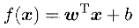
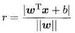
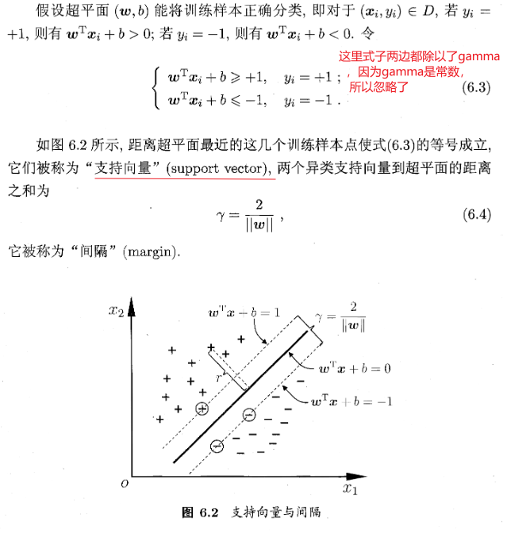
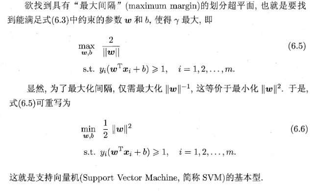
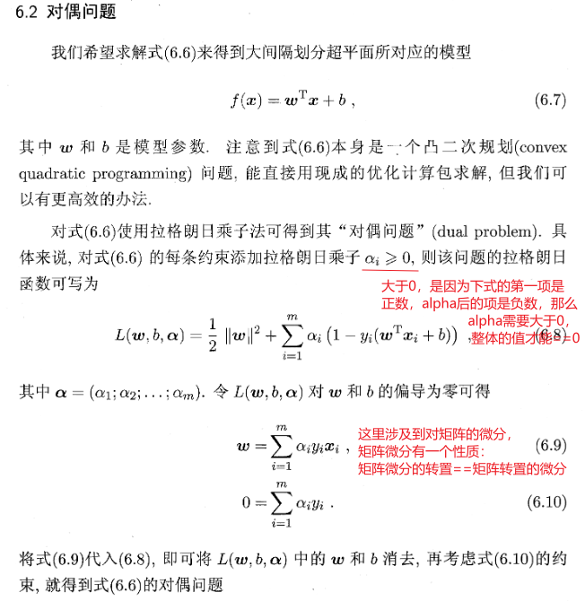
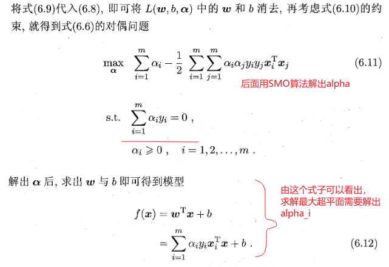
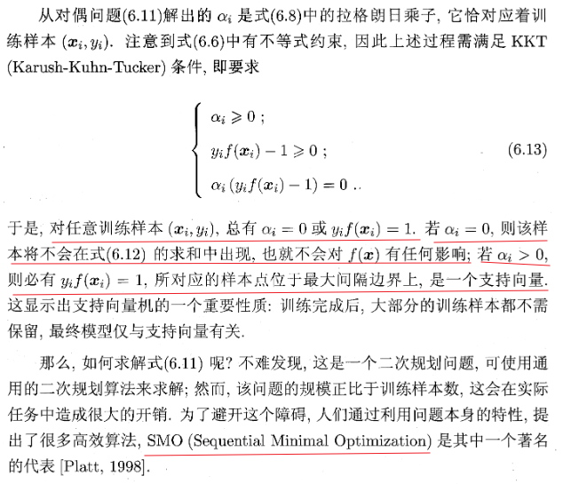
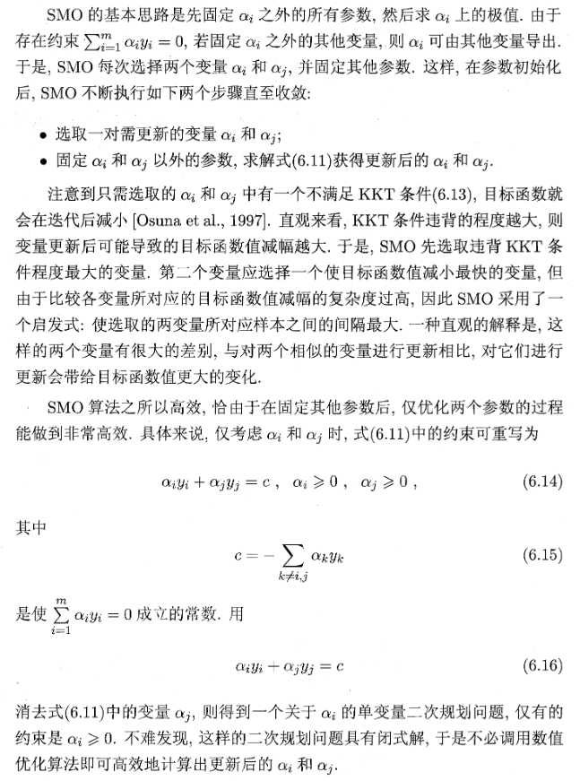
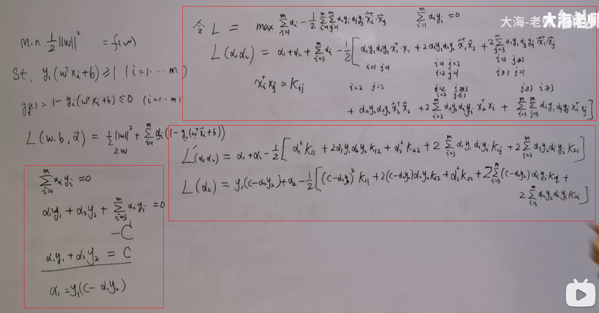
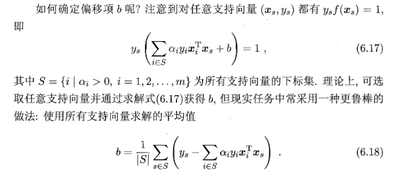

### SVM（支持向量机）的推导

参考：西瓜书第6章，南瓜书，[[B站SMO算法](https://www.bilibili.com/video/BV1mE411p7HE)]

#### SVM问题定义

SVM解决二分类问题。支持向量：离最大超平面最近的向量。

首先给定一个数据集：，要把所有样本分开。设这个超平面的方程是：。那么数据集中的点到这个平面的距离就是：

#### 对偶问题

#### SMO算法

·

