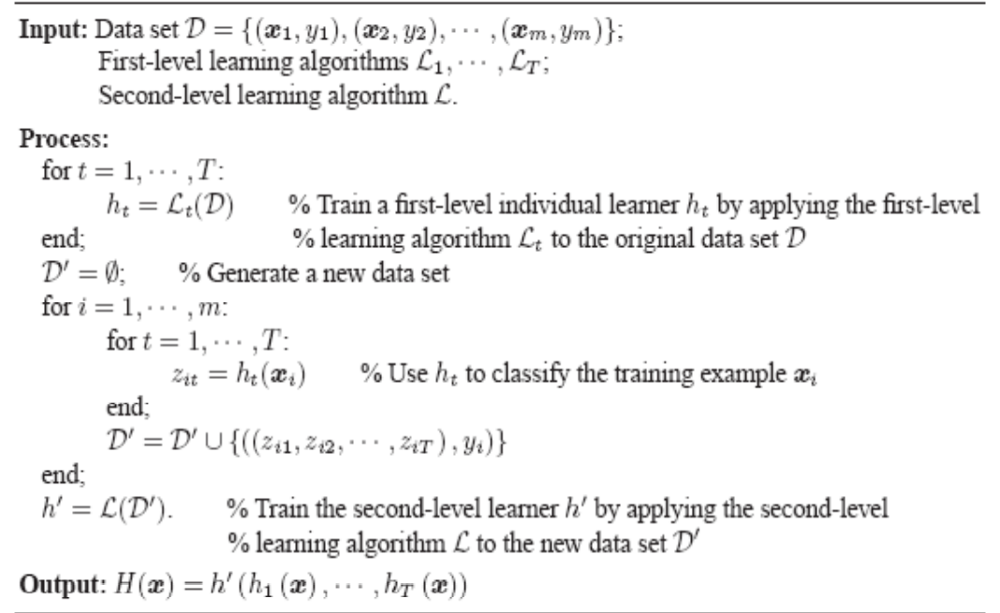
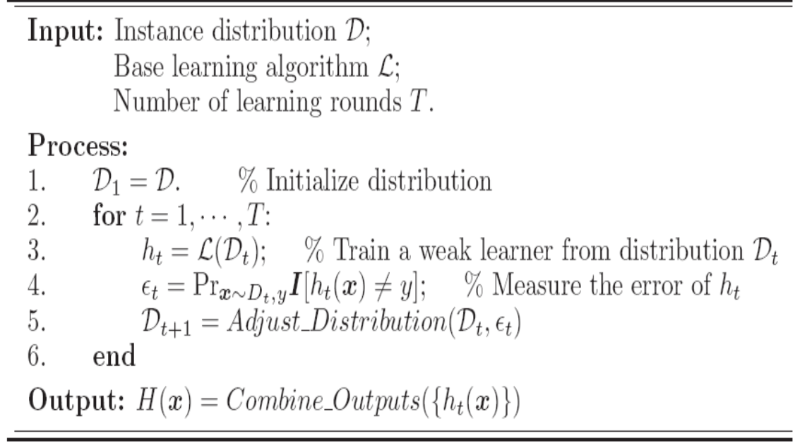
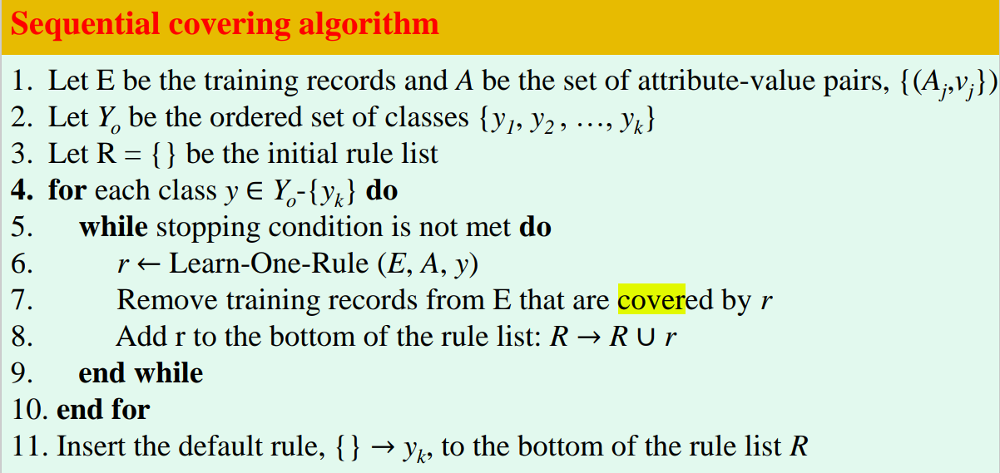

### 一、引言

- 数据中的知识发现包括哪几个步骤？

  数据库中知识发现（knowledge discovery in database, KDD），KDD是将未加工的数据转换为又用信息的整个过程。

  输入数据->数据预处理->数据挖掘->后处理->信息

- 数据挖掘应用

  - 聚类分析
  - 预测建模
  - 关联分析
  - 异常检测

### 二、学习的可行性

- Hoeffding 不等式

  

- 用 Hoeffding 不等式说明学习的可行性

### 三、数据和数据预处理

- **有哪四种不同的属性类型？分别可以进行什么操作？（p17）**

  - 标称（nominal）

    众数、熵、列联相关、 $\chi^2$ 检验

  - 序数（ordinal）

    中值、百分位、秩相关、游程检验、符号检验

  - 区间（interval）

    均值、标准差、皮尔逊相关、t和F检验

  - 比率（ratio）

    几何平均、调和平均、百分比变差

- **非对称属性？（p18）**

  对于非对称属性（asymmetric attribute），出现非零属性值才是重要的。

  只有非零值才重要的二元属性是非对称的二元属性。

- **数据对象之间相似度、相异度计算（p41-p42）**

  - 相异度

    - 欧氏距离
    - 曼哈顿距离
    - 马氏距离（p48）

    距离的性质：非负性、对称性、三角不等式。

  - 相似度

    - 二元数据相似度度量（p43）：算0-0和不算0-0（Jaccard）

    - 余弦相似度

    - 广义 Jaccard 系数（Tanimoto系数）

      广义 Jaccard 系数可以用于文档数据，并在二元属性情况下规约为Jaccard系数。用 $EJ$ 表示。
      $$
      EJ(x,y) = \frac{x \cdot y}{\Vert x\Vert^2 + \Vert y\Vert^2 - x \cdot y}
      $$
      
    - 相关性（Correlation）（p46）
    - 组合异种属性的相似度（p49）
  
- **数据预处理的主要任务**

  ~~聚集、抽样、维归约、特征子集选择、特征创建、离散化和二元化、变量变换~~

  数据清理、聚集、转换、缩减、离散化

- **处理缺失值的方法？**（ppt 37）

  - 缩减数据集，淘汰所有缺失值的样本

  - 填补缺失值

    专家给出填补意见，或者用常数填补：一个数、特征平均、最可能的值（其他样本中该属性的值）。

### 四. 决策树学习

- **决策树学习的基本思想**

  决策树是运用于分类的一种树结构，其中的每个内部节点代表对某一属性的一次测试，每条边代表一个测试结果，叶节点代表某个类或类的分布。决策树的决策过程需要从决策树的根节点开始，待测数据与决策树中的特征节点进行比较，并按照比较结果选择选择下一比较分支，直到叶子节点作为最终的决策结果

- **分类错误率，熵，信息增益的概念，如何根据不同度量选择最佳划分（p97）**

  - 信息增益的概念（p98）

  - 三种度量：熵、Gini、分类误差（p97）

    度量值越小越好。（例p99 图 4-14）

- **缺失值对决策树有何影响？（ppt 60）**

  - 影响不纯度度量的计算
  - 如何把有缺失值的样本分配给子结点
  - 一个有缺失值的测试样本如何分类

- **给定混淆矩阵，分类效果度量不同指标的含义及计算方法。（p91）**

  - 错误率
  - 准确率

- **评估分类器性能的留一法和 k 折交叉验证（p115）**

  留一是留一个验证集。

- **过拟合和欠拟合**

  - 过拟合：树的规模变得太大，训练误差还在降低，检验误差开始增大
  - 欠拟合：树的规模很小，训练和检验误差都很大。

### 五．神经网络

- 神经网络如何学习？ 有何特点？（ppt 6）

  - 给网络的节点随机初始化权重，输入样本，最小化损失函数的值，通过梯度的反向传播，更新网络参数，迭代多次。在测试阶段，给没见过的数据分类。
  - 需要很长时间训练、对不完整和有噪声的数据容忍度很高

- 梯度下降算法

  可以写线性回归的例子。

- 多层神经网络使用什么算法进行训练？（ppt 29）

  一个隐层的MLP，正向传播（sigmod(f(x))），反向传播更新梯度。

### 六．贝叶斯学习

- 根据贝叶斯理论，如何计算一个假设 h 成立的后验概率？

  根据贝叶斯理论公式

- 极大后验概率假设和极大似然假设有何区别？

### 七．基于实例的学习

- K 近邻学习算法（p128）

- K 近邻学习计算距离时为何要进行归一化

  多个特征值时，其中某个特征数量级比较大，其他特征较小时，分类结果会被特征值所主导，而弱化了其他特征的影响，这是各个特征值的量纲不同所致，需要将数据归一化处理。

- 局部加权线性回归（ppt 30）

- ==基于案例的学习与 k 近邻学习的异同==

  - case based learning
  
- 懒惰学习和积极学习的区别

  - 积极学习：如果训练数据可用，就开始学习从输入属性到类标号的模型映射。
  
  - 懒惰学习：推迟对训练数据的建模，直到需要分类测试样例时再进行。存储所有训练样本。
  
  

### 八．集成学习

- 集成学习的定义

  - 集成：机器学习中，用多个模型的集合获得比单个模型更好的预测结果。

-  集成学习的两个主要问题

  - 如何得到若干个个体学习器
  - 如何选择一种结合策略，将这些个体学习器集合成一个强学习器。

- Stacking 基本思想及其伪代码

  首先再训练集中的样本（有放回抽样）训练一个多分类器的集成，这个集成称为Tier-1分类器，把Tier-1的输出送入Tier-2分类器（meta分类器）。使用meta分类器代替每个分类器的投票，由meta分类器输出最后的预测。

  

- Bagging 基本思想及其伪代码

  Bagging是一种投票方法，通过在有轻微不同的训练集上对基础学习器进行训练，使基础学习器变得不同。

  

- Boosting 基本思想及其伪代码

  给训练集里的样本分配权重。

  

- 为何集成学习有效

  集成学习的一个必要和充分条件是，如果基础分类器是准确和多样的，那么这些分类器的集成将比其任何单个分类器更准确。

### 九．分类技术

- 基于规则的分类器有何优点，==需要解决什么问题==

  - 和决策树一样有高度表达能力
  - 易于解释
  - 构造简单
  - 快速对新样本分类
  - 性能和决策树相当

- 序列覆盖算法

  - 初始化一个空的决策列表R，Learn-One-Rule函数用于提取包含当前训练记录集的y类的最佳规则。在规则提取过程中，y类的所有训练记录都被认为是正的，而其他的则是负的。一旦找到规则，规则所涵盖的训练记录将被删除。把新规则加到R中。
  - 

- 支持向量机基本原理

  通过在数据上找到一个最大边缘超平面，对数据进行分类。

### 十． 聚类分析

- 聚类的定义

   聚类 (Clustering) 是按照某个特定标准 (如距离)把一个数据集分割成不同的类或簇，使得 同一个簇内的数据对象的相似性尽可能大，同时不在同一个簇中的数据对象的差异性也尽可能地大 。

- 聚类的类型

  - 层次的（嵌套的）、划分的（非嵌套的）
  - 互斥的、重叠的、模糊的
  - 完全的、部分的

- 簇的类型

  - 好分的簇
  - 基于中心的簇
  - 基于连续性的簇
  - 基于密度的簇
  - 共享属性
  - 由目标函数定义

- 层次聚类的两种主要类型
  - 凝聚的：从点作为个体簇的概念，每一步合并两个最接近的簇。
  - 分裂的：从包含所有点的某个簇开始，每一步分裂一个簇，直到仅剩下单点簇。

- 计算簇间相似性的单链（MIN）和全链（MAX）方法
  - MIN：两个簇间最近两个点的距离（欧氏距离）
  - MAX：最远两个点的距离