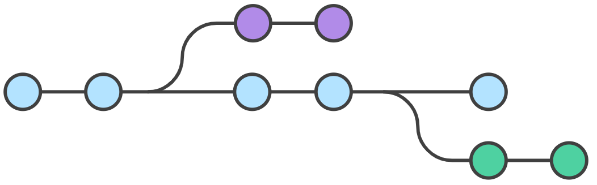

## Git基本使用

参考：[[菜鸟教程](https://www.runoob.com/git/git-workflow.html)]

### Git工作流程

- 克隆 Git 资源作为工作目录。
- 在克隆的资源上添加或修改文件。
- 如果其他人修改了，你可以更新资源。
- 在提交前查看修改。
- 提交修改。
- 在修改完成后，如果发现错误，可以撤回提交并再次修改并提交。

下图展示了 Git 的工作流程：


### Git创建仓库

#### git init

Git 使用`git init`命令来初始化一个 Git 仓库，Git 的很多命令都需要在 Git 的仓库中运行，所以`git init`是使用 Git 的第一个命令。

在执行完成`git init`命令后，Git 仓库会生成一个 .git 目录，该目录包含了资源的所有元数据，其他的项目目录保持不变。

**使用方法**

使用当前目录作为 Git 仓库，我们只需使它初始化。

```
git init
```

该命令执行完后会在当前目录生成一个 .git 目录。

使用我们**指定目录**作为Git仓库。

```
git init newrepo
```

初始化后，会在 newrepo 目录下会出现一个名为 .git 的目录，所有 Git 需要的数据和资源都存放在这个目录中。

如果当前目录下有几个文件想要纳入版本控制，需要先用 git add 命令告诉 Git 开始对这些文件进行跟踪，然后提交：

```shell
$ git add *.c
$ git add README
$ git commit -m '初始化项目版本'
```

以上命令将目录下以 .c 结尾及 README 文件提交到仓库中。

> **注：** 在 Linux 系统中，commit 信息使用单引号 **'**，Windows 系统，commit 信息使用双引号 **"**。
>
> 所以在 git bash 中 **git commit -m '提交说明'** 这样是可以的，在 Windows 命令行中就要使用双引号 **git commit -m "提交说明"**。

#### git clone

我们使用 **git clone** 从现有 Git 仓库中拷贝项目（类似 **svn checkout**）。

克隆仓库的命令格式为：

```shell
git clone <repo>
```

如果我们需要克隆到指定的目录，可以使用以下命令格式：

```
git clone <repo> <directory>
```

#### 配置

git 的设置使用 **git config** 命令。

显示当前的 git 配置信息：

```shell
$ git config --list
credential.helper=osxkeychain
core.repositoryformatversion=0
core.filemode=true
core.bare=false
core.logallrefupdates=true
core.ignorecase=true
core.precomposeunicode=true
```

编辑 git 配置文件:

```shell
$ git config -e    # 针对当前仓库 
```

或者：

```shell
$ git config -e --global   # 针对系统上所有仓库
```

设置提交代码时的用户信息：

```shell
$ git config --global user.name "runoob"
$ git config --global user.email test@runoob.com
```

如果去掉 **--global** 参数只对当前仓库有效。

### Git基本操作

Git 的工作就是创建和保存你**项目的快照及与之后的快照进行对比**。

主要有6个命令：**git clone**、**git push**、**git add** 、**git commit**、**git checkout**、**git pull**。


**说明：**

- workspace：工作区
- staging area：暂存区/缓存区
- local repository：版本库或本地仓库
- remote repository：远程仓库

#### 提交与修改

| 命令         | 说明                                     |
| :----------- | :--------------------------------------- |
| `git add`    | 添加文件到暂存区                         |
| `git status` | 查看仓库当前的状态，显示有变更的文件。   |
| `git diff`   | 比较文件的不同，即暂存区和工作区的差异。 |
| `git commit` | 提交暂存区到本地仓库。                   |
| `git reset`  | 回退版本。                               |
| `git rm`     | 将文件从暂存区和工作区中删除。           |
| `git mv`     | 移动或重命名工作区文件。                 |

#### 提交日志

| 命令               | 说明                                 |
| :----------------- | :----------------------------------- |
| `git log`          | 查看历史提交记录                     |
| `git blame <file>` | 以列表形式查看指定文件的历史修改记录 |

#### 远程操作

| 命令         | 说明               |
| :----------- | :----------------- |
| `git remote` | 远程仓库操作       |
| `git fetch`  | 从远程获取代码库   |
| `git pull`   | 下载远程代码并合并 |
| `git push`   | 上传远程代码并合并 |

### Git分支管理

几乎每一种版本控制系统都以某种形式支持分支，一个分支代表一条独立的开发线。

使用分支意味着你可以从开发主线上分离开来，然后在不影响主线的同时继续工作。



Git 分支实际上是指向更改快照的指针。

有人把 Git 的分支模型称为**必杀技特性**，而正是因为它，将 **Git** 从版本控制系统家族里区分出来。

创建分支命令：

```shell
git branch (branchname)
```

切换分支命令:

```shell
git checkout (branchname)
```

当你切换分支的时候，Git 会用该分支的最后提交的快照替换你的工作目录的内容， 所以多个分支不需要多个目录。

合并分支命令:

```shell
git merge 
```

你可以多次合并到统一分支， 也可以选择在合并之后直接删除被并入的分支。

开始前我们先创建一个测试目录：

```shell
$ mkdir gitdemo
$ cd gitdemo/
$ git init
Initialized empty Git repository...
$ touch README
$ git add README
$ git commit -m '第一次版本提交'
[master (root-commit) 3b58100] 第一次版本提交
 1 file changed, 0 insertions(+), 0 deletions(-)
 create mode 100644 README
```

#### 列出分支

列出分支基本命令：

```
git branch
```

没有参数时，**git branch** 会列出你在本地的分支。

```
$ git branch
* master
```

此例的意思就是，我们有一个叫做 **master** 的分支，并且该分支是当前分支。

当你执行 **git init** 的时候，默认情况下 Git 就会为你创建 **master** 分支。

如果我们要手动创建一个分支。执行 **git branch (branchname)** 即可。

```
$ git branch testing
$ git branch
* master
  testing
```

现在我们可以看到，有了一个新分支 **testing**。

当你以此方式在上次提交更新之后创建了新分支，如果后来又有更新提交， 然后又切换到了 **testing** 分支，Git 将还原你的工作目录到你创建分支时候的样子。

接下来我们将演示如何切换分支，我们用 git checkout (branch) 切换到我们要修改的分支。

```shell
$ ls
README
$ echo 'runoob.com' > test.txt
$ git add .
$ git commit -m 'add test.txt'
[master 3e92c19] add test.txt
 1 file changed, 1 insertion(+)
 create mode 100644 test.txt
$ ls
README        test.txt
$ git checkout testing
Switched to branch 'testing'
$ ls
README
```

当我们切换到 **testing** 分支的时候，我们添加的新文件 test.txt 被移除了。切换回 **master** 分支的时候，它们又重新出现了。

```shell
$ git checkout master
Switched to branch 'master'
$ ls
README        test.txt
```

我们也可以使用 git checkout -b (branchname) 命令来创建新分支并立即切换到该分支下，从而在该分支中操作。

```shell
$ git checkout -b newtest
Switched to a new branch 'newtest'
$ git rm test.txt 
rm 'test.txt'
$ ls
README
$ touch runoob.php
$ git add .
$ git commit -am 'removed test.txt、add runoob.php'
[newtest c1501a2] removed test.txt、add runoob.php
 2 files changed, 1 deletion(-)
 create mode 100644 runoob.php
 delete mode 100644 test.txt
$ ls
README        runoob.php
$ git checkout master
Switched to branch 'master'
$ ls
README        test.txt
```

如你所见，我们创建了一个分支，在该分支上移除了一些文件 test.txt，并添加了 runoob.php 文件，然后切换回我们的主分支，删除的 test.txt 文件又回来了，且新增加的 runoob.php 不存在主分支中。

使用分支将工作切分开来，从而让我们能够在不同开发环境中做事，并来回切换。

#### 删除分支

删除分支命令：

```shell
git branch -d (branchname)
```

例如我们要删除 testing 分支：

```shell
$ git branch
* master
  testing
$ git branch -d testing
Deleted branch testing (was 85fc7e7).
$ git branch
* master
```

#### 分支合并

一旦某分支有了独立内容，你终究会希望将它合并回到你的主分支。 你可以使用以下命令将任何分支合并到当前分支中去：

```shell
git merge
```

```shell
$ git branch
* master
  newtest
$ ls
README        test.txt
$ git merge newtest
Updating 3e92c19..c1501a2
Fast-forward
 runoob.php | 0
 test.txt   | 1 -
 2 files changed, 1 deletion(-)
 create mode 100644 runoob.php
 delete mode 100644 test.txt
$ ls
README        runoob.php
```

以上实例中我们将 newtest 分支合并到主分支去，test.txt 文件被删除。

合并完后就可以删除分支:

```shell
$ git branch -d newtest
Deleted branch newtest (was c1501a2).
```

删除后， 就只剩下 master 分支了：

```shell
$ git branch
* master
```

#### 合并冲突

合并并不仅仅是简单的文件添加、移除的操作，Git 也会合并修改。

```shell
$ git branch
* master
$ cat runoob.php
```

首先，我们创建一个叫做 change_site 的分支，切换过去，我们将 runoob.php 内容改为:

```php
<?php
echo 'runoob';
?>
```

创建 change_site 分支：

```shell
$ git checkout -b change_site
Switched to a new branch 'change_site'
$ vim runoob.php
$ head -3 runoob.php
<?php
echo 'runoob';
?>
$ git commit -am 'changed the runoob.php'
[change_site 7774248] changed the runoob.php
 1 file changed, 3 insertions(+)
```

将修改的内容提交到 change_site 分支中。 现在，假如切换回 master 分支我们可以看内容恢复到我们修改前的(空文件，没有代码)，我们再次修改 runoob.php 文件。

```shell
$ git checkout master
Switched to branch 'master'
$ cat runoob.php
$ vim runoob.php    # 修改内容如下
$ cat runoob.php
<?php
echo 1;
?>
$ git diff
diff --git a/runoob.php b/runoob.php
index e69de29..ac60739 100644
--- a/runoob.php
+++ b/runoob.php
@@ -0,0 +1,3 @@
+<?php
+echo 1;
+?>
$ git commit -am '修改代码'
[master c68142b] 修改代码
 1 file changed, 3 insertions(+)
```

现在这些改变已经记录到我的 "master" 分支了。接下来我们将 "change_site" 分支合并过来。

```shell
$ git merge change_site
Auto-merging runoob.php
CONFLICT (content): Merge conflict in runoob.php
Automatic merge failed; fix conflicts and then commit the result.

$ cat runoob.php     # 打开文件，看到冲突内容
<?php
<<<<<<< HEAD
echo 1;
=======[[]]
echo 'runoob';
>>>>>>> change_site
?>
```

我们将前一个分支合并到 master 分支，一个合并冲突就出现了，接下来我们需要手动去修改它。

```shell
$ vim runoob.php 
$ cat runoob.php
<?php
echo 1;
echo 'runoob';
?>
$ git diff
diff --cc runoob.php
index ac60739,b63d7d7..0000000
--- a/runoob.php
+++ b/runoob.php
@@@ -1,3 -1,3 +1,4 @@@
  <?php
 +echo 1;
+ echo 'runoob';
  ?>
```

在 Git 中，我们可以用 git add 要告诉 Git 文件冲突已经解决

```shell
$ git status -s
UU runoob.php
$ git add runoob.php
$ git status -s
M  runoob.php
$ git commit
[master 88afe0e] Merge branch 'change_site'
```

现在我们成功解决了合并中的冲突，并提交了结果。

### Git 查看提交历史

Git 提交历史一般常用两个命令：

- **git log** - 查看历史提交记录。
- **git blame \<file>** - 以列表形式查看指定文件的历史修改记录。

#### git log

在使用 Git 提交了若干更新之后，又或者克隆了某个项目，想回顾下提交历史，我们可以使用 **git log** 命令查看。
**git log** 命令用于查看 Git 仓库中提交历史记录。
**git log** 显示了从最新提交到最早提交的所有提交信息，包括提交的哈希值、作者、提交日期和提交消息等。
**git log** 命令的基本语法：

```shell
git log [选项] [分支名/提交哈希]
```

常用的选项包括：

- `-p`：显示提交的补丁（具体更改内容）。
- `--oneline`：以简洁的一行格式显示提交信息。
- `--graph`：以图形化方式显示分支和合并历史。
- `--decorate`：显示分支和标签指向的提交。
- `--author=<作者>`：只显示特定作者的提交。
- `--since=<时间>`：只显示指定时间之后的提交。
- `--until=<时间>`：只显示指定时间之前的提交。
- `--grep=<模式>`：只显示包含指定模式的提交消息。
- `--no-merges`：不显示合并提交。
- `--stat`：显示简略统计信息，包括修改的文件和行数。
- `--abbrev-commit`：使用短提交哈希值。
- `--pretty=<格式>`：使用自定义的提交信息显示格式。

我们可以用 --oneline 选项来查看历史记录的简洁的版本。

```shell
$ git log --oneline
$ git log --oneline
d5e9fc2 (HEAD -> master) Merge branch 'change_site'
c68142b 修改代码
7774248 (change_site) changed the runoob.php
c1501a2 removed test.txt、add runoob.php
3e92c19 add test.txt
3b58100 第一次版本提交
```

这告诉我们的是，此项目的开发历史。
我们还可以用 --graph 选项，查看历史中什么时候出现了分支、合并。以下为相同的命令，开启了拓扑图选项：

```shell
*   d5e9fc2 (HEAD -> master) Merge branch 'change_site'
|\  
| * 7774248 (change_site) changed the runoob.php
* | c68142b 修改代码
|/  
* c1501a2 removed test.txt、add runoob.php
* 3e92c19 add test.txt
* 3b58100 第一次版本提交
```
现在我们可以更清楚明了地看到何时工作分叉、又何时归并。
你也可以用 **--reverse** 参数来逆向显示所有日志。

```shell
$ git log --reverse --oneline
3b58100 第一次版本提交
3e92c19 add test.txt
c1501a2 removed test.txt、add runoob.php
7774248 (change_site) changed the runoob.php
c68142b 修改代码
d5e9fc2 (HEAD -> master) Merge branch 'change_site'
```

如果只想查找指定用户的提交日志可以使用命令：git log --author , 例如，比方说我们要找 Git 源码中 Linus 提交的部分：

```shell
$ git log --author=Linus --oneline -5
81b50f3 Move 'builtin-*' into a 'builtin/' subdirectory
3bb7256 make "index-pack" a built-in
377d027 make "git pack-redundant" a built-in
b532581 make "git unpack-file" a built-in
112dd51 make "mktag" a built-in
```
#### git blame

pass

### Git 标签

pass

### 回退版本

在Git中，你可以使用以下命令来回退到之前的版本：

1. **查找提交历史：** 首先，使用 `git log` 命令查找要回退到的目标版本的提交哈希值。在命令行中输入以下内容：

   ```bash
   git log
   ```

   这将显示提交历史，包括每个提交的哈希值、作者、日期和提交消息。找到你想要回退到的目标版本的提交哈希值。

2. **回退到特定版本：** 假设你要回退到特定的提交版本，可以使用 `git reset` 命令。将下面的命令中的 `<commit-hash>` 替换为你想要回退到的提交的哈希值。

   ```bash
   git reset --hard <commit-hash>
   ```

   这会将你的工作区和暂存区回退到指定的提交版本，并且所有后续的提交都会被移除。

3. **强制推送：** 如果你回退后想要将这些变更推送到远程仓库，你需要使用 `git push` 命令，但由于你已经回退到了一个历史版本，你可能需要使用强制推送。请注意，强制推送可能会覆盖远程仓库中的历史提交，因此请谨慎使用。

   ```bash
   git push origin <branch-name> --force
   ```

   将 `<branch-name>` 替换为你正在使用的分支名称。

请确保在执行这些操作之前，你已经备份了重要的数据和文件，以免意外丢失数据。

### git reset

`git reset` 命令在Git中用于移动分支指针、撤消提交等操作。以下是一些 `git reset` 命令的常用形式：

1. **软重置 (Soft Reset)：** 这种形式的重置只会移动分支指针，不会更改工作区和暂存区的内容。

   ```bash
   git reset --soft <commit>
   ```

2. **混合重置 (Mixed Reset)：** 默认情况下，如果不指定选项，`git reset` 将执行混合重置。它会移动分支指针并且重置暂存区，但不会修改工作区。

   ```bash
   git reset <commit>
   ```

3. **硬重置 (Hard Reset)：** 这种形式的重置将分支指针、暂存区和工作区都移动到指定的提交，会丢弃未提交的更改。

   ```bash
   git reset --hard <commit>
   ```

4. **重置到指定文件：** 有时候你可能只想重置某个特定的文件到指定的提交状态。

   ```bash
   git reset <commit> -- <file>
   ```

5. **使用相对引用：** 你还可以使用相对引用，例如 HEAD~2 表示倒数第二个提交。

   ```bash
   git reset --soft HEAD~2
   ```

   在所有命令中，将 `<commit>` 替换为你想要回退到的提交的哈希值、分支名或相对引用。请注意，`--soft`、`--mixed` 和 `--hard` 分别表示不同的重置级别。

请注意，在执行重置操作之前，请确保你已经备份了重要的数据，因为硬重置可能会永久性地删除未提交的更改。

### 回退版本之后恢复最新版本

`git reset --hard` 命令会强制将分支指针、暂存区和工作区都移动到指定的提交，丢弃了指定提交之后的所有修改。如果你使用了 `git reset --hard` 回退到版本1之后，版本2和版本3的提交确实会从当前分支的历史中移除。

如果你希望恢复到之前的提交状态，但同时也希望保留版本2和版本3的提交，有几种方法可以尝试：

1. **使用 `git reflog`：** Git 会保留所有分支在过去几个月内的引用历史记录，可以使用 `git reflog` 命令查找并恢复之前的提交。

   ```bash
   git reflog
   ```

   找到你想要恢复的提交的哈希值，然后使用 `git reset --hard` 将分支指针恢复到该提交。

2. **创建临时分支：** 在回退之前，你可以基于版本3的提交创建一个临时分支，这样你就可以在需要的时候切换回来。

   ```bash
   git branch temp-branch <commit-hash-of-version-3>
   ```

   然后在需要的时候可以切换回这个临时分支。

请注意，使用 Git 命令时要小心，尤其是对于 `--hard` 选项。在进行任何重要操作之前，请确保备份重要的数据和文件。