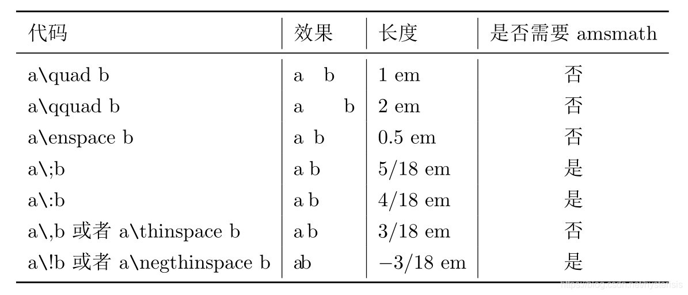
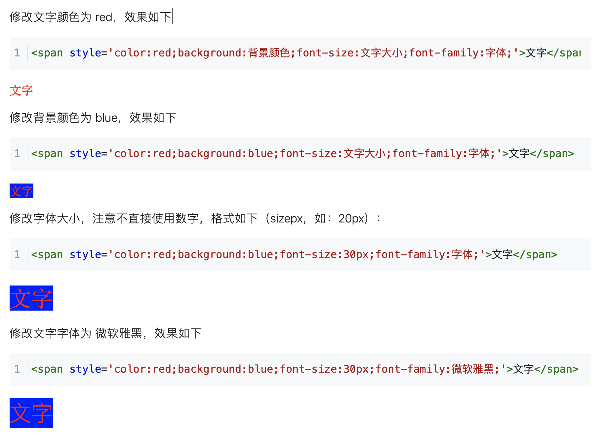

##### [超详细 LaTex数学公式](https://blog.csdn.net/ViatorSun/article/details/82826664)

##### 数学公式的例子：

$$
\begin{aligned}
\frac{\partial}{\partial \theta} \mathcal{L}_{\mathrm{MLE}} &=\mathbb{E}_{w \sim \tilde{p}(w \mid c)} \frac{\partial}{\partial \theta} \log u_\theta(w, c)-\frac{\partial}{\partial \theta} \log Z(c) \\
&=\mathbb{E}_{w \sim \tilde{p}(w \mid c)} \frac{\partial}{\partial \theta} \log u_\theta(w, c)-\mathbb{E}_{w \sim p_\theta(w \mid c)} \frac{\partial}{\partial \theta} \log u_\theta(w, c) \\
&=\sum_w \tilde{p}(w \mid c) \frac{\partial}{\partial \theta} \log u_\theta(w, c)-\sum_w p_\theta(w \mid c) \frac{\partial}{\partial \theta} \log _\theta(w, c) \\
&=\sum_w\left[\tilde{p}(w \mid c) \frac{\partial}{\partial \theta} \log u_\theta(w, c)-p_\theta(w \mid c) \frac{\partial}{\partial \theta} \log u_\theta(w, c)\right] \\
&=\sum_w\left[\left(\tilde{p}(w \mid c)-p_\theta(w \mid c)\right) \frac{\partial}{\partial \theta} \log u_\theta(w, c)\right]
\end{aligned}
\tag{9}
$$

- 空格

  


##### 页内跳转

```html
<a href="#233">我想笑</a>
<span name = "233">233</span>
```

##### 修改字体大小


