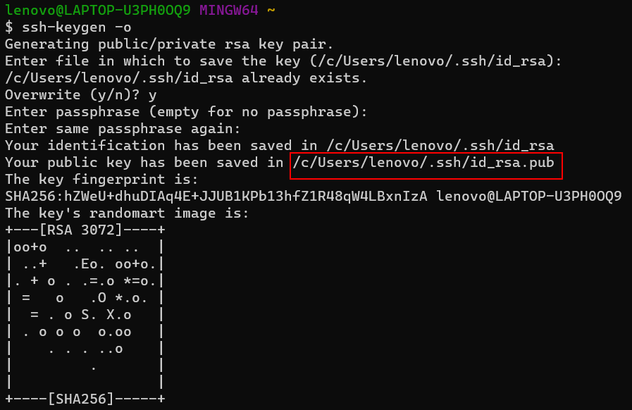

### 在github上新创建一个仓库

创建一个名称为Typora的仓库


### 在本地创建公钥

​	第一次使用github需要在本地创建公钥，用来免密连接github。

1. 创建公钥

   在windows上打开windows terminal，输入`ssh`，ssh窗口打开后，输入`ssh-keygen -o`，设置公钥的保存地址，默认是`/c/Users/lenovo/.ssh/id_rsa.pub`。

   

2. 把公钥复制到github上

   在github中的settings中找到**SSH and GPG keys**选项，新建一个ssh key，把上面文件里的公钥复制进去。


### 把本地文件上传到新建的仓库中

1. 设置账号和邮箱

   ```bash
   # 注册时的用户名和邮箱
   git config --global user.name "MasterKID223"
   $ git config --global user.email "1370630681@qq.com"
   ```

   

2. 建立本地仓库

   按照github上新建仓库里的提示创建本地仓库，然后把所有的笔记上传到github上。


### 把笔记同步到Ubuntu上

- 按照相同的额步骤，建立Ubuntu上的仓库，并把github上的仓库clone下来。

- 然后使用`git push`和`git pull`命令实现两个电脑之间的笔记同步和更新。
