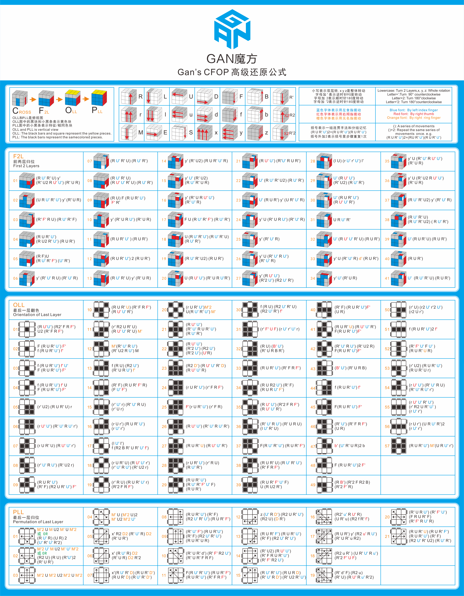

### 魔方底层顺序

相对位置：红蓝橙绿

蓝色在红色的左边

绿色在红色的右边

蓝色在橙色的右边

绿色在橙色的左边

### 支点类型（一开始就相对位置正确）

1. B2L'FD'(蓝色朝前)

   

2. B2U'RL'FL2(绿色朝前) 跷跷板

   

   这种情况下白红和白橙构成了跷跷板，然后用白绿去撬跷跷板，白绿转下去的时候，刚好相对位置全部正确。

   

3. 常见的普通支点

   

   

   

   只需要把白红转下去，白蓝再转相对位置就正确了。

   

4. 只需要一步就可以调整成3中支点的情况

   

   

   

   只要是红蓝、红绿、蓝橙在相近的位置，都可以考虑一下怎 么一步调整成支点的情况。

   做一个F2，白蓝就在白红的左边了。

    →  或者 

5. 好块和坏块

   **坏块**： 在顶层底层，并且朝侧面的块，它们需要2步才能到正确位置。要集中精力要处理的。

   

   **好块**： 一步就可以到正确位置，在顶层、底层或者中间层。

6. 两步调整成支点

   一般是某个面转180°就可以调整好位置：

    →  或者 

   

7. 三支点例子

   白红和白蓝已经是支点了，在归位白红和白蓝的过程中，白橙很容易归位：

     

   另一个形态的三支点，但是解法一样：

     

   跷跷板也是一个典型的三支点情况。

### 支点练习
