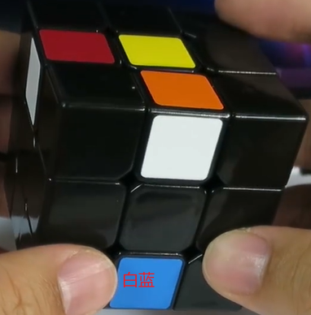
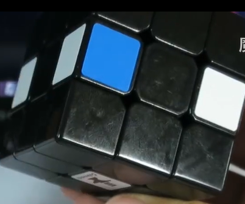
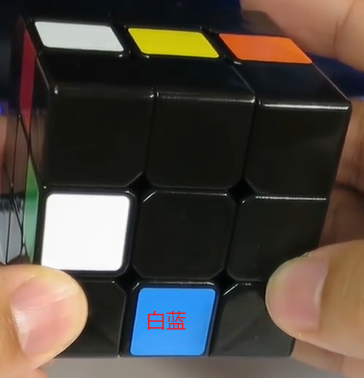
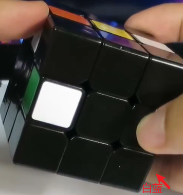
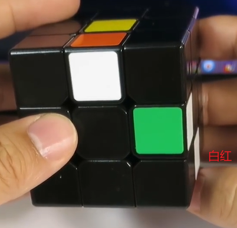
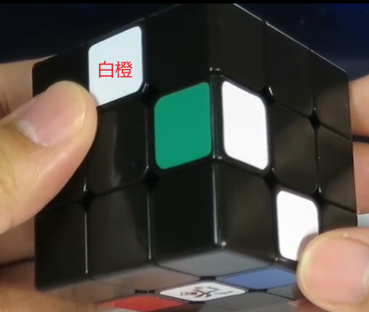
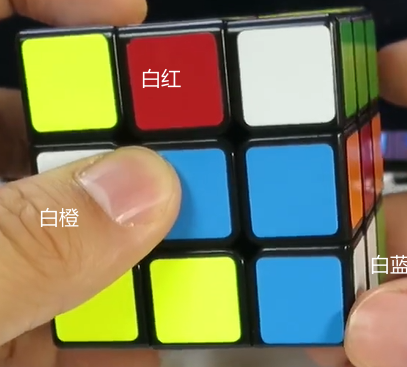
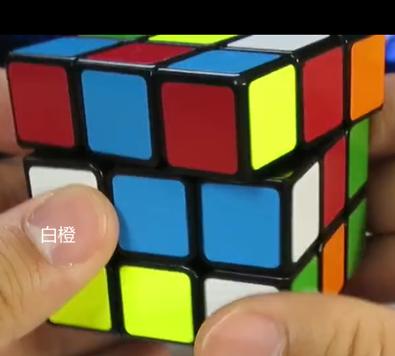
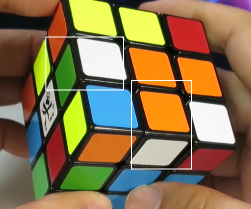
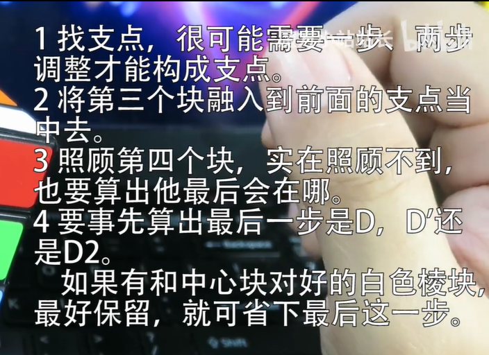

## 把第三个点融入到两支点的复原过程中

### 三支点例子

1. B2U'R'LFL'D(红色朝前)

    → 

2. B2UFL'D'U2(橙色朝前)

    → 

3. B2URL'B'F'D(绿色朝前)

   跷跷板解法：

    → 

   上节提到的三支点：

    → 

### 四支点例子  

1. R2F'B'L'D'UR'(蓝色朝前)

    →   

### 总结

### 软件的使用

