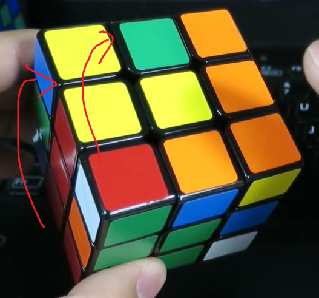

找到角棱块。

### 四种基本情况

注意：对槽的时候，藏角转上来的棱不能是对好的。

1. 顶层颜色异色（白色不在顶层）：楞和角块都在顶层，角块去接棱块。（右手边）

    

2. 顶层颜色异色（白色不在顶层）：楞和角块都在顶层，角块去接棱块。（左手边）

    

3. 棱块和角块在顶层已经对齐，待插入。（接孩子放学，右手边）

    

4. 棱块和角块在顶层已经对齐，待插入。（接孩子放学，左手边）

    

### 调整成上述四种情况

**顶层异色的情况：**

在有棱借用的时候，比较容易还原上面的情况。

如果没有可以借用的棱，就用自己的棱，自己的棱转上来肯定是乱的：

除了这条棱，其他棱都对好了： ，就借自己的槽，先转一下顶层： ，然后做一个R： ，再把绿红棱转回来： ，然后把红绿角块转会原位： 。

**顶层同色的情况就是接孩子放学：**

 

**白色在顶层，棱块也在顶层的情况：**

 → 先把棱块和中心颜色对好： ，然后往远离正确槽位的地方藏棱： ，然后把顶层的角块对过来： ，然后就转化成了第3，4中情况。

**角块在底层，棱块在顶层：**

 → U'L'UL（远切回回）就变成了第3，4种情况。

