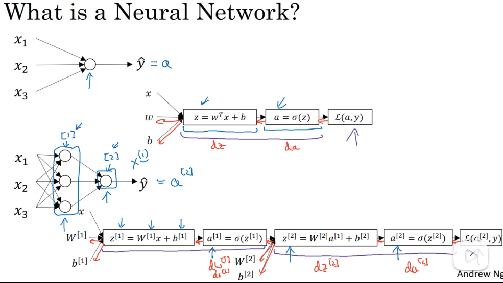
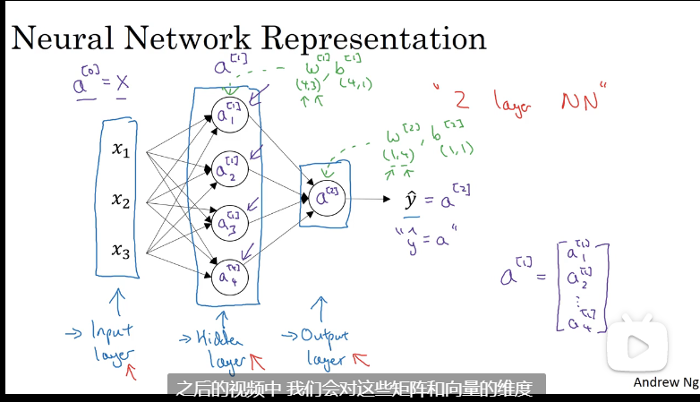
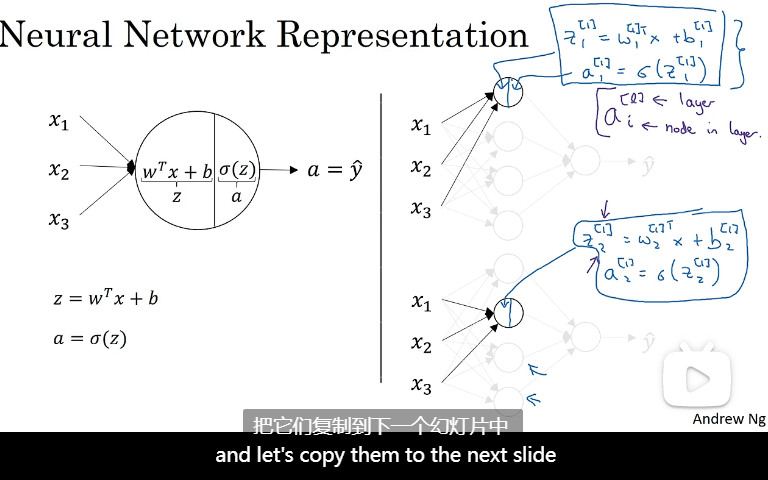
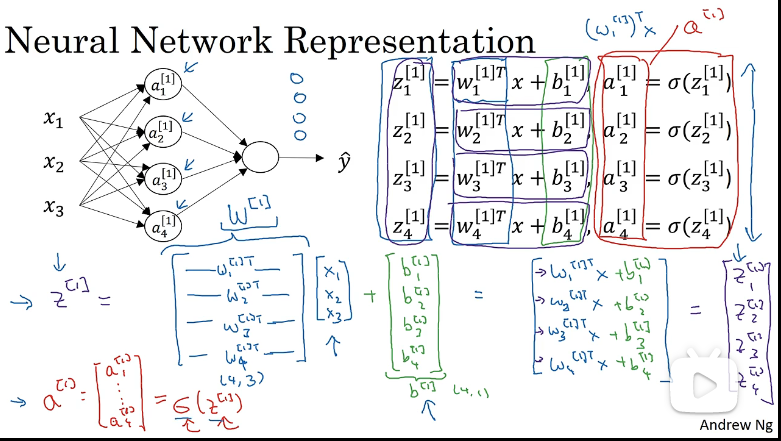
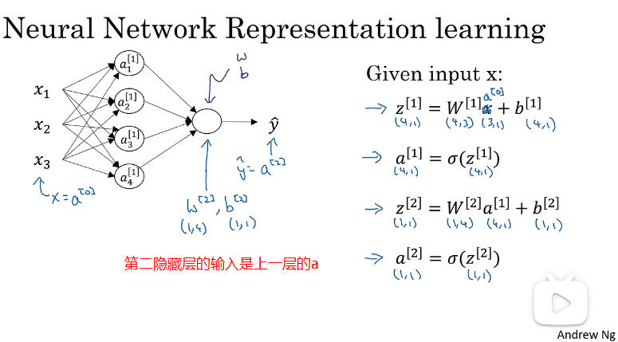
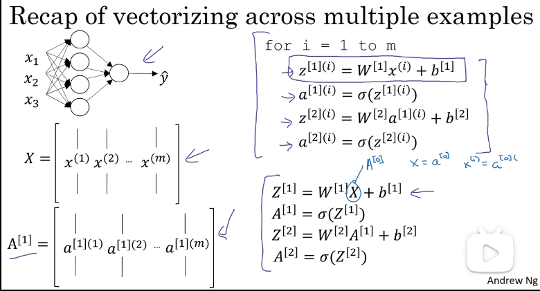

### 3.1 神经网络的概述

### 3.2 神经网络表示

下图是一个双层的网络，输入层一般不算一层。使用 $a^{[上标]}$ 来表示第几层，`w,b`加上标表示第几层的参数。

### 3.3 计算神经网络的输出

1. 把每一层的每一个节点都分成两部分

   - 计算 `z = wx+b`

   - 计算`a = sigmod(z)`，此时a变成下一层的输入

     

2. 输入是`(3,1)`的向量，经过第一隐藏层的计算之后，隐藏层变成一个`(4,1)`的向量，作为下一层的输入。

   

   

### 3.4 多个样本的向量化

上面的三小节就是以3个样本(多样本)的例子来说明向量化的。

下面是一个batch只有一个样本的计算过程：

