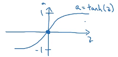
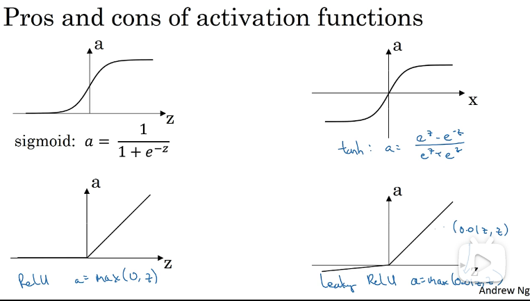

### 3.6 激活函数

**为了给模型添加非线性因素，去掉某些不重要的样本特征，防止出现过拟合导致模型能力降低，同时也是除去一些干扰特征，筛选出有用的特征。**

1. `tan h(z)`

   - 函数

   $$
   tanh(z) = \dfrac{e^z - e^{-z}}{e^z + e^{-z}}
   $$

   - 图像：

   

   - 特点：

     让数据的平均值为0左右，有类似数据中心化的效果，让下一层学习更方便些。

2. - 

2. `ReLU`

   - 函数
     $$
     f(z) = max(0, z)
     $$
     

   - 图像

     

     

   - 作用

     训练时比`tanh(z)`快。当输出是0或1，二分类问题时，隐藏层的输出可以使用`ReLU`，最后的输出层可以使用`sigmid(z)`。

     

