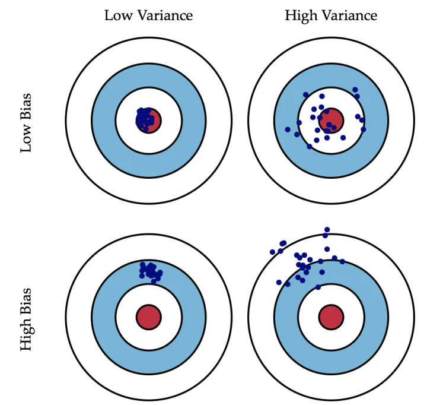
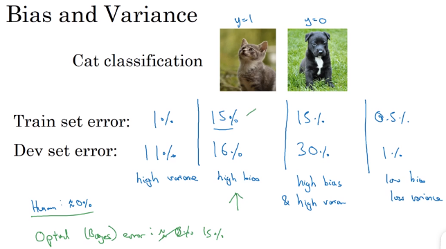

### 1.1 数据集的划分

通常划分为训练集、验证集、测试集。

- 验证集：评估模型的好坏，一般在训练过程中隔一段时间就保存一次best_model。

- 划分

  小数据集：7/3

  一般：6/2/2

  100w+：98/1/1， 99.5/0.4/0.1

  

### 1.2 偏差和方差

- **偏差：**描述的是预测值（估计值）的期望与真实值之间的差距。偏差越大，越偏离真实数据，如下图第二行所示。

- **方差：**描述的是预测值的变化范围，离散程度，也就是离其期望值的距离。方差越大，数据的分布越分散，如下图右列所示。

- **例子**

  

  下面的四种情况，依次对应上面的四幅图

  

