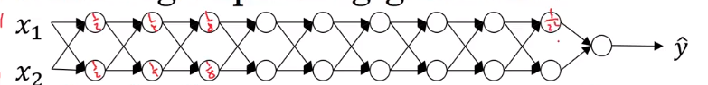
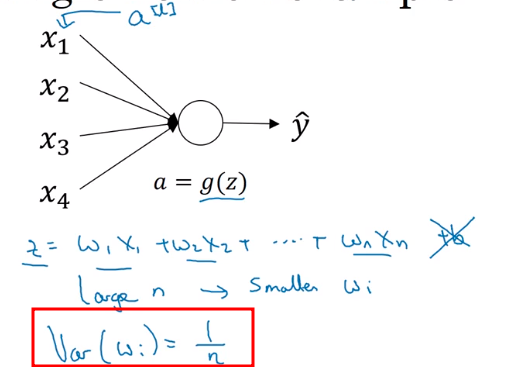

### 1.10 梯度消失与梯度爆炸

对于一个深度为L的网络来说，它的输出是：
$$
假设每一层的权重矩阵W = \begin{pmatrix} 1.5 & 0 \\ 0 & 1.5  \end{pmatrix}, \\
\hat{y} = W^{[L]}\begin{pmatrix} 1.5 & 0 \\ 0 & 1.5  \end{pmatrix}^{L-1}X,
$$
这时产生梯度爆炸情况，因为1.5 > 1。
$$
假设每一层的权重矩阵W = \begin{pmatrix} 0.5 & 0 \\ 0 & 0.5  \end{pmatrix}, \\
\hat{y} = W^{[L]}\begin{pmatrix} 0.5 & 0 \\ 0 & 0.5  \end{pmatrix}^{L-1}X,
$$
这时产生梯度消失情况，因为0.5 > 1。

### 1.11 神经网络的权重初始化

给出下面的网络：

为了减少梯度消失和爆炸的影响，就要把W的值设置的既不比1小很多，也不比1大很多。

那么，每一层所有w的方差需要满足：
$$
方差:var(w) = \dfrac{1}{n}，其中，n是每层w的个数。
$$
之后，每一层的权重矩阵的初始值就设置为：
$$
W^{[L]} = H \times W \times \sqrt{\Theta}, \\
当使用Relu函数时，var(w) = \dfrac{2}{n}, \Theta = \dfrac{2}{n^{[L-1]}},n^{[L-1]}是该层上每个神经元的特征数量。 \\
当Relu函数是tanh时，\Theta = \dfrac{1}{n^{[L-1]}}。或者,\Theta = \dfrac{2}{n^{[L-1]} + n^{[L]}}
$$
