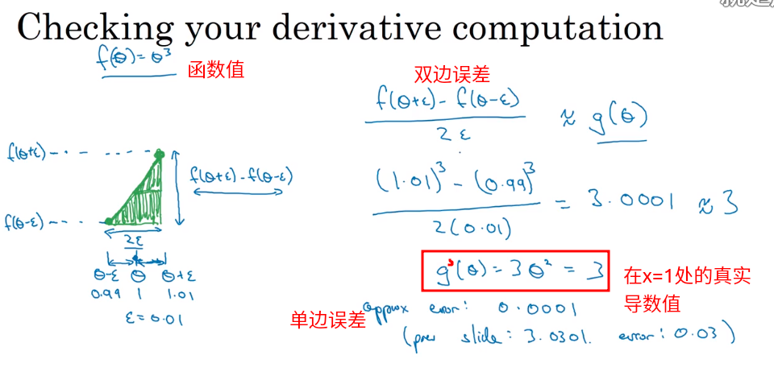
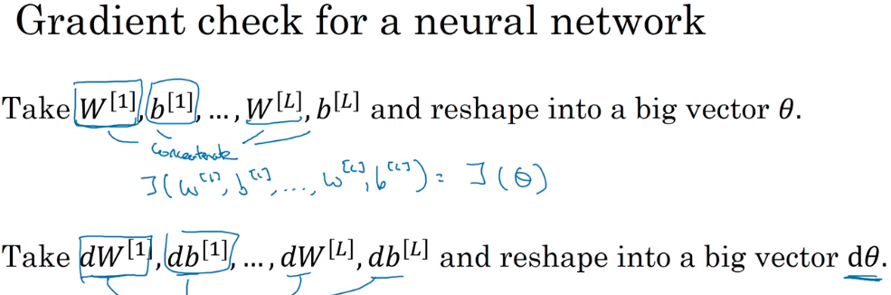
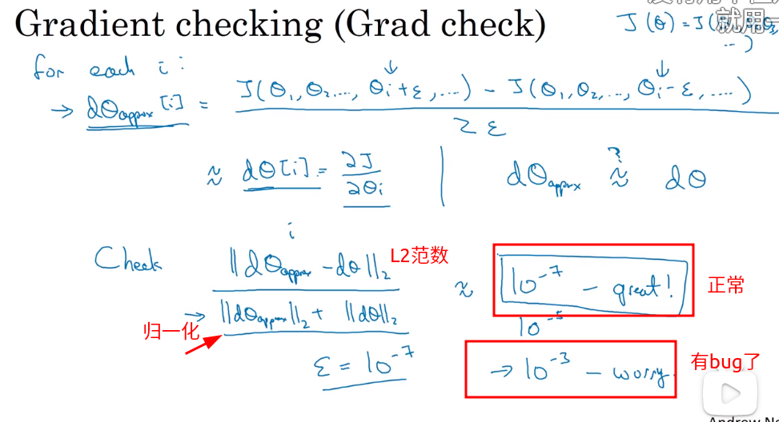
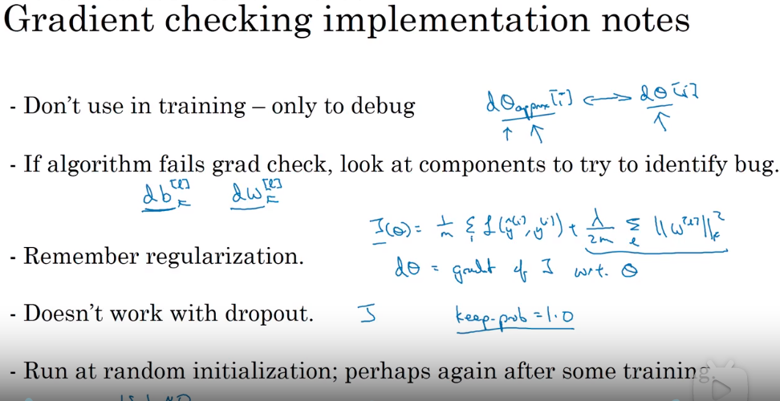

###  1.12 梯度的数值逼近

用双边误差来代替单边误差。

之前计算某个点的导数时，只取该点的右邻域或者左邻域，这样计算出来的导数误差较大。

使用双边误差计算导数，误差会减小：

### 1.13 梯度检验

- 为什么要进行梯度检验？

  反向传播算法因为实现起来比较复杂，所以会出现一些意想不到的bugs。具体表现是，我们的代码看上去运行的很正常，而且代价函数也在不断的减小，但是因为不知道的bug的存在，使得我们得到的神经网络并不是最优解。那有什么办法帮我们把这些不易觉察的bug给揪出来呢？

采用双边误差检验每一步的梯度误差：

- 第一步需要把所有的权重矩阵转换成一个大的$\theta$向量，其中，$\theta$ 和 $d \theta$ 的维度一样。

  

- 第二步进行L次迭代：

  计算每一层的双边误差和 $d\theta^{[i]}$ 的差，看差的范围，判断该层的梯度更新是不是出bug了。

  

### 1.14 关于梯度检验实现的注记（应用技巧）

5点。

