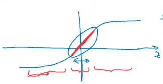
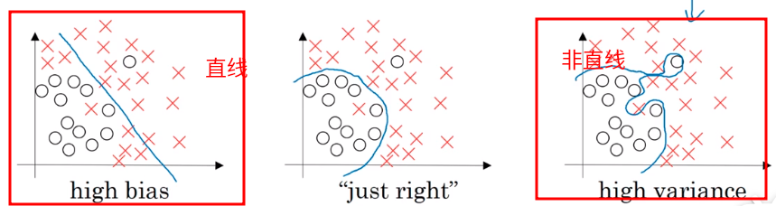

### 1.3 机器学习基础

要找到一个低方差、低偏差的网络：

- 正则适度，采用更多的数据可以减少方差，在不影响偏差的同时。
- 深度学习可以让监督学习权衡方差和偏差。


### 1.4 正则化

出现了高方差的情况，可能是过拟合了。可以采用正则化解决。

- 正则化：

  正则化就是在原来的代价函数上添加了一个正则项。
  $$
  J(W^{[1]}, b^{[1]},...,W^{[L]}, b^{[L]}) = \dfrac{1}{m} \sum\limits_{i=1}^m \ell(\hat{y}^{(i)}, y^{i}) + \dfrac{\lambda}{2m} \sum\limits_{l=1}^L {||W^{[l]}||}^2_F
  $$

  ```json
  m: '样本个数'
  L: '网络层数'
  入: '正则化参数'
  F: 'L2范数' 
  ```

  $$
  {||W^{[l]}||}^2_F =\sum\limits_{i=1}^{n^{[l-1]}}\sum\limits_{i=1}^{n^{[l]}}(W_{ij})^2 \\
  其中，W是n^{[l-1]} \times n^{[l]} 的矩阵，n是第几层的隐藏单元的个数。即计算W矩阵中所有元素的平方。
  $$


### 1.5 为什么正则化可以减少过拟合？

- 添加正则项，可以避免权值矩阵过大

  因为，如果正则化参数$\lambda $设置的足够大，权重矩阵`W`被设置为接近于0的值，于是基本消除了这些隐藏单元的许多影响。
  
  那么为什么权重矩阵`W`会变成接近0的值？`W`在反向梯度传播的过程中：
  $$
  W = W - \dfrac{dJ(W,b)}{dW} \\
  其中，正则化参数 \lambda 在减数项中，\lambda 越大W更新后的值越小。
  $$
  

- 用`tanh(z)` 函数理解

  图像：

  

  模型每一层的输出：
  $$
  A = \sigma(Z) \\
  Z = WX + b \\
  $$
  当`W`很小时，`Z`的值也很小，在`tanh(z)`函数中就体现为，`Z`在函数的中间（可以近似看作线性函数）。按照这样的训练方法训练出来的网络就可以近似的看成一个线性网络，拟合出来的结果就类似一条直线，从而产生第一种结果，不会产生第二种结果：

  

  

- 

