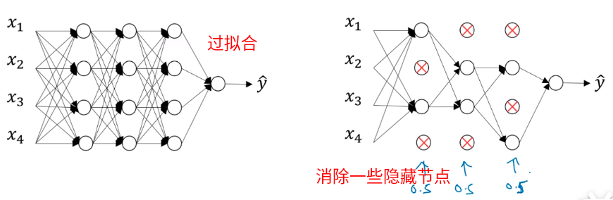
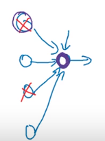
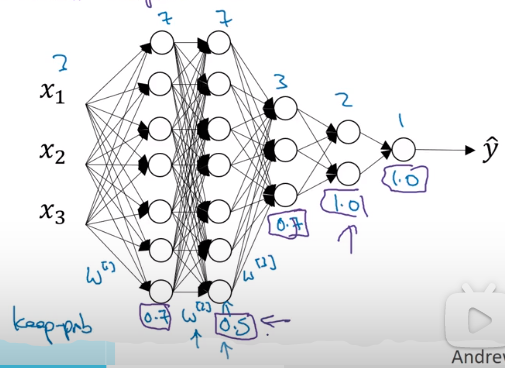

### 1.6 Dropout正则化（随机失活）

处理过拟合问题。

Dropout通过随机消除一些隐藏单元，然后对每个节点进行反向传播，这样就会训练出一个简单的函数，输出就类似于L2正则化的类线性输出，从而避免过拟合。

- 如何随机消除隐藏单元？

  维护一个keep_prob变量：表示隐藏单元不被消除的概率，那么：
  $$
  定义随机矩阵：d^{[3]} = np.random.rand(a^{[3]}.shape[0], a^{[3]}.shape[1]) < keep\_prob， \\
  那么，d^{[3]}是一个0/1矩阵， \\
  消除隐单元的操作：a^{[3]} = a^{[3]} \cdot d^{[3]}，这样隐单元就消除了0.8。
  $$

- 反向随机失活（inverted dropout）

  上述dropout过程每一层都会应用，那么每一层的参数会产生如下变化：
  $$
  z^{[4]} = W^{[4]} \cdot a^{[3]} + b^{[4]}, \\
  由于a的值越来越小，从而z的值也小，最后网络会输出一个非常小的值，落在激活函数的线性区间，\\
  产生较差的拟合效果，为了防止这种太线性的结果，需要扩大a的值，保持a的期望不变： \\
  a^{[3]} = a^{[3]} / keep\_prob
  $$

- 在上述操作用在训练网络的时候，在测试的时候不用。

### 1.7 理解Dropout

- 把权重平均分配给每一个节点

  因为每个单元都有被消除的可能，所以训练过程中，权重不会过度集中到某些节点上。

  

- 每层的keep_prob可能不一样

  对于第二隐层权重矩阵的大小是7x7，为了防止矩阵的过拟合，把keep_prob设置的小一点，消除更多的隐单元。对于权重较少的矩阵，就设置的大一点。

  

- dropout使代价函数J很难定义

  因为每次迭代，都会随机移除一些节点。