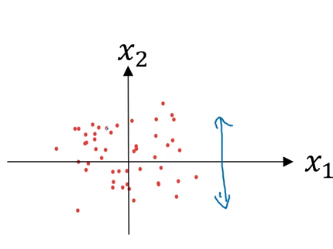

### 1.9 归一化输入

加速神经网络的训练。

- 两个步骤

  零均值化和归一化方差。

  **零均值化：**

  计算出m个样本的均值，然后每个样本减去均值，这样所有样本会聚集在零点附近：
  $$
  \mu = \dfrac{1}{m} \sum\limits_{i=1}^m x_{(i)}, \\
  x = x - \mu
  $$
  

  **归一化方差：**

  上图中x1的方差很大，x2的方差很小，把他们的方差都变成1：
  $$
  \sigma^2 = \dfrac{1}{m} \sum\limits_{i=1}^m x_{(i)}^2, \\
  x = x / \sigma^2
  $$
  

- 为什么要这样做？

  在没有归一化的时候，在数据图上的不同点梯度下降的速度是不同的，在归一化之后，数据模型会变得圆一点，使不同点在梯度下降时，速度几乎一样。

  

  

​		