# NCE 到 InfoNCE loss

[Noise Contrastive Estimation 前世今生——从 NCE 到 InfoNCE](https://zhuanlan.zhihu.com/p/334772391)

### 1 从NLP入手

#### 1.1 背景

NCE，也就是 [Noise Contrastive Estimation](http://proceedings.mlr.press/v9/gutmann10a/gutmann10a.pdf)（噪声对比估计）。论文中估计的是概率密度函数（pdf, probability density function）。而 NLP 中的 word 或 vision 中的 pixel 都是离散的，且我们感兴趣的是的概率质量函数（pmf, probability mass function），因此我主要参考了 [[4]](https://www.cs.toronto.edu/~amnih/papers/ncelm.pdf) 这篇论文。它就是在使用 NCE 时假设了离散分布，并用 pmf 代替其中 pdf，然后将 NCE 应用到 NLP 领域。

#### 1.2 n-gram

- **语言模型（language model，LM）**

  [语言模型](https://zhuanlan.zhihu.com/p/90741508)

  一个语言模型通常构建为字符串 $s$ 的概率分布 $p(s)$ ，这里 $p(s)$ 试图反映的是字符串 $s$ 作为一个句子出现的频率。

  对于一个由 $m$ 个基元（“基元”可以为字、词或短语等，为了表述方便，以后我们只用“词”来通指）构成的句子 $s=w_1,w_2,...,w_m$ ，其概率计算公式可以表示为
  $$
  p(s)=p(w_1)p(w_2|w_1)p(w_3|w_1,w_2)...p(w_m|w_1,...,w_{m−1})= \\
  ∏\limits_i^m = p(wi|w_1,...,w_{i-1})
  $$
  上式中， $p(w_i|w_1,w_2,⋯,w_{i−1})$ 表示产生第 $i(1≤i≤m)$ 个词的概率是由已经产生的 $i−1$ 个词 $w_1,w_2,⋯,w_{i−1}$ 决定的。如果能对这一项建模，那么只需把每个位置的条件概率相乘，就能计算出 $p(s)$ 。然而一般来说，这个参数量是巨大的，假设一门语言的词汇量为$V$，对于句子 $s=w_1,w_2,⋯,w_m$ ，所需参数数量为 $Vm$ 。

我们将条件概率的条件$(w_1,w_2,⋯,w_{i−1})$ 称为单词 $w_i$ 的上下文，用 $c_i$ 表示。
$$
p(s) = ∏\limits_i^m = p(w_i|c_i) \tag{1}
$$
可以看到，language model 就是条件概率  $p(w|c)$ 的集合，但是直接计算每个 $w$ 在语料库中的条件概率是需要很大计算量的。因此在统计语言模型中，引入了马尔可夫假设，即**“一个词出现的概率只与它前面出现的有限的一个或者 n 个词有关”**，将这 n 个词称为一个 gram，这就是著名的 n-gram 模型，因此可以将模型简化为：
$$
p(w_1,w_2,w_3,…,w_m)=∏\limits_{i=1}^m p(w_i∣w_{i−n+1},…,w_{i−1}) \tag{2}
$$

#### 1.3 最大似然估计

*概率是根据事物的性质判断将要发生的情况。似然是根据已经发生的情况，推测事物本身的性质。[最大似然估计的介绍](https://www.bilibili.com/video/BV1CR4y1L7RC)：利用已知的样本标记结果，反推最具有可能或者最大概率导致这些样本结果出现的模型参数。*

上面的 n-gram 构建语言模型的方法实际上就是，将一个训练语料库中的每个 $w_i$ 和它的 $c_i$ (也就是由前面n个 $w$ 构成)的条件概率计算出来并储存（实际操作上是统计每个gram出现的次数），然后下一次计算某个句子的出现的概率时，即 $(2)$ 式，就在存储中找到这个句子中出现的 $w$ 和 $c$ 的条件概率，然后乘起来即可。

因此，我们是否可以不事先计算并存储每个 $w$ 和  $c$  条件概率，而是建立一个模型(或者说函数)，给这个模型一组 $w$ 和  $c$  就能输出它们的条件概率。

在机器学习领域有一个方法是：对所要考虑的问题建模后为其构造一个目标函数，然后对这个目标函数进行优化，从而求得一组最优的参数，最后利用这组最优参数对应的模型进行预测，也就是**最大似然估计**。

[最大似然估计的一般求解步骤](https://baike.baidu.com/item/%E6%9C%80%E5%A4%A7%E4%BC%BC%E7%84%B6%E4%BC%B0%E8%AE%A1/4967925#4)

在建模统计语言模型时，利用最大似然估计，根据 $(1)$ 式目标函数，我们可以写出其对数似然函数如下：
$$
\mathcal{L}_{MLE}=\sum\limits_{i=2}^m log⁡p_θ(w_i∣c_i) \tag{3}
$$
然后最大化对数似然函数 $\ell_{MLE}$，实际上这样就是将 $p(w|c)$ 看成 $w$ 和  $c$  的函数， $θ$ 为待定参数集： 
$$
p_θ(w|c)=F(w,c;θ) \tag{4}
$$
这样一旦最优参数集 $θ^∗$ 可以确定，函数 $F$ 就被唯一确定，那么对于任何概率 $p(w|c)$ 都可以用函数 $F(w,c;θ^∗)$ 来计算了。

**那么如何计算出  $θ^∗$ 呢？**

根据上面最大似然估计的一般求解步骤的最后一步，等式两边都对 $θ$ 求导，然后令导数不断逼近于0，从而算出 $θ^∗$。

#### 1.4 神经概率语言模型

面的方法似然看起来很美好，但其中有两个问题：

- 如何构造一个好的函数 $F$ 。
- 最大似然估计虽然理论上简单可行，但对于某些模型，在实际计算时可能需要很大的计算量，因此未必容易。

首先来看第一个问题，这也就是我们为什么引入神经网络，因为神经网络理论上可以表示任何函数，那么通过训练，肯定能找到这个合适的 $F$ ，因此 Bengio 等人在 2003 年 A Neural Probabilistic Language Model [8] 中提出了神经概率语言模型（NPLM）。其不在受限于 gram 的大小，可以在包含任意大小上下文的情况下建模 $w$ 的条件概率。

具体来看，它把语言模型的建立当作一个多分类问题，我们用 $V={v_1,v_2,...,v_{|V|}}$ 表示一个包含所有单词的单词库，其大小为 $|V|$ ，将 $(w,c)$ 当成一对训练样本（实际上 $w$ 会转换成词向量，矩阵形式，这里不做详解），通**过神经网络后和 softmax 后**，输出一个向量 $\hat{y}=[\hat{y}_{i,1},\hat{y}_{i,2},...,\hat{y}_{i,|V|}]$ , 其中每一维 $\hat{y}_{i,j}=p(v_j|c_i)$ 表示上下文为 $ci$ 时 第 $i$ 个单词 $w_i$ 是单词库中第 $j$ 个单词 $v_j$ 的概率，训练过程要求最后单词库中概率最大的单词就是训练样本对中的 $w_i$ 。这样训练结束后，给神经网络一个上下文 $c_l=(w_1,w_2,...,w_{l−1})$ ，神经网络就能预测在当前上下文 $c_l$ 时，下一个 单词 $w_l$ 是单词库中的各个词的概率 $p(w_l|c_l)$ ，通过这个我们也就可以构建语言模型。

- softmax函数

  对于多类问题，类别标签 $y \in \{1,2,...,C\}$ 可以有 $C$ 个取值，给定一个样本 $x$ ，Softmax回归预测的属于类别 $c$ 的条件概率为，其中，$w_c$ 是第 $c$ 类的权重向量：
  $$
  p(y=c|x) = softmax(w_c^Tx)  = \dfrac{exp(w_c^Tx)}{\sum\limits_{c'=1}^C exp(w_{c'}^Tx)} \tag{邱锡鹏 p61}
  $$
  

假设输入到 softmax 前的结果用 $s_θ(w,c)$ 表示，实际上 $s_θ(w,c)$ 是有含义的，它是一个 socring function(**Attention机制，注意力打分函数**) ，**输出的分数用来量化** $w$ **在上下文** $c$ **中匹配性**（relation），那么 $w$ 条件概率(**注意力分布**)可以表示为以下形式： 
$$
p_θ(w|c)=\dfrac{exp(s_θ(w,c))}{∑\limits_{w'∈V}exp(s_θ(w',c))}= \dfrac{u_θ(w,c)}{Z(c)} \tag{5}
$$
式中， $u_θ(w,c)= exp(s_θ(w,c))$ 表示当前单词 $w$ 在单词库中的概率；令 $Z(c)=∑\limits_{w'∈V}exp(s_θ(w',c))$ 表示当前单词库中所有单词的概率的累和，通常将这一项叫做“配分函数”或“归一化因子”。一般来说，单词库 $|V|$ 的数量是非常巨大的，**因此计算** $Z(c)$ **是非常昂贵、耗时的一件事，这也就是 NCE 要解决的问题。（见附录1）**

如果我们不考虑 $s_θ(w,c)$ 的具体形式，那么 $(5)$ 式实际上就可以当作我们在 $(4)$ 式中所构造的函数 $F$ 的表达式， 既然如此，那我们接着用 1.3 中提到的最大似然估计的方式来试着求解 $F$ 的参数 $θ$ 。我们将从句子 $s$ 中取样的 $w$ 看成经验分布(数据分布，已知的) $\widetilde{p}(w|c)$ ， $(3)$ 式中的 $\mathcal{L}_{MLE}$ 可以写成（[最大期望算法](https://link.zhihu.com/?target=https%3A//baike.baidu.com/item/%E6%9C%80%E5%A4%A7%E6%9C%9F%E6%9C%9B%E7%AE%97%E6%B3%95/10180861%232)）：
$$
arg⁡max\mathcal{L}_{MLE} =arg⁡max∑_{w \sim \widetilde{p}(w|c)}log⁡p_θ(w∣c) \\
= arg⁡max \mathbb{E}_{w \sim \widetilde{p}(w|c)} \dfrac{log⁡u_θ(w,c)}{Z(c)} \tag{6}
$$
现在要最大化 $\mathcal{L}_{MLE}$ ，那么将其关于 $θ$ 求导：
$$
\dfrac{\partial\mathcal{L}_{MLE}}{\partial\theta}= \mathbb{E}_{w \sim \widetilde{p}(w|c)}\dfrac{\partial log\frac{\mu_\theta(w,c)}{Z(c)}}{\partial\theta} \\
=\mathbb{E}_{w \sim \widetilde{p}(w|c)}[{\dfrac{\partial log\mu_\theta(w,c)}{\partial\theta} - \dfrac{\partial Z(c)}{\partial\theta}}] \\
=\mathbb{E}_{w \sim \widetilde{p}(w|c)}{\dfrac{\partial log\mu_\theta(w,c)}{\partial\theta} - \dfrac{\partial Z(c)}{\partial\theta}} \\
\tag{7}
$$
这里解释一下上面到最后一步的转换，因为 $Z(c)=∑\limits_{w'∈V}exp(s_θ(w',c))$ ，其中 $w′$ 为单词库 $V$ 中所有的单词，而单词库其中每个单词的概率由 $p_θ(w|c)$ 产生，因此  $w′∼p_θ(w|c)$ ，与经验分布 $w∼\widetilde{p}(w|c)$ 不相关，所以可以把期望 $\mathbb{E}_{w \sim \widetilde{p}(w|c)}$ 去掉。

 $(7)$式结果中的 $\dfrac{∂log⁡Z(c)}{∂θ} $ 计算如下：
$$
\begin{aligned}
\frac{\partial}{\partial \theta} \log Z(c) &=\frac{1}{Z(c)} \frac{\partial}{\partial \theta} Z(c) \\
&=\frac{1}{Z(c)} \frac{\partial}{\partial \theta} \sum_{w^{\prime} \in V} u_\theta(w, c) \\
&=\frac{1}{Z(c)} \frac{\partial}{\partial \theta} \sum_{w^{\prime} \in V} \exp \left(s_\theta(w, c)\right) \\
&=\sum_{w^{\prime} \in V} \frac{1}{Z(c)} \exp \left(s_\theta(w, c)\right) \frac{\partial}{\partial \theta} s_\theta(w, c) \\
&=\sum_{w^{\prime} \in V} p_\theta(w \mid c) \frac{\partial}{\partial \theta} s_\theta(w, c) \\
&=\mathbb{E}_{w \sim p_\theta(w \mid c)} \frac{\partial}{\partial \theta} s_\theta(w, c) \\
&=\mathbb{E}_{w \sim p_\theta(w \mid c)} \frac{\partial}{\partial \theta} \log _\theta(w, c) \\
\end{aligned}
\tag{8}
$$
将 $(8)$ 式结果带回 $(7)$ 式中得：

$$
\begin{aligned}
\frac{\partial}{\partial \theta} \mathcal{L}_{\mathrm{MLE}} &=\mathbb{E}_{w \sim \tilde{p}(w \mid c)} \frac{\partial}{\partial \theta} \log u_\theta(w, c)-\frac{\partial}{\partial \theta} \log Z(c) \\
&=\mathbb{E}_{w \sim \tilde{p}(w \mid c)} \frac{\partial}{\partial \theta} \log u_\theta(w, c)-\mathbb{E}_{w \sim p_\theta(w \mid c)} \frac{\partial}{\partial \theta} \log u_\theta(w, c) \\
&=\sum_w \tilde{p}(w \mid c) \frac{\partial}{\partial \theta} \log u_\theta(w, c)-\sum_w p_\theta(w \mid c) \frac{\partial}{\partial \theta} \log _\theta(w, c) \\
&=\sum_w\left[\tilde{p}(w \mid c) \frac{\partial}{\partial \theta} \log u_\theta(w, c)-p_\theta(w \mid c) \frac{\partial}{\partial \theta} \log u_\theta(w, c)\right] \\
&=\sum_w\left[\left(\tilde{p}(w \mid c)-p_\theta(w \mid c)\right) \frac{\partial}{\partial \theta} \log u_\theta(w, c)\right]
\end{aligned}
\tag{9}
$$
最大似然好像很容易，但是实际上还是绕不开对“归一化常数$Z(c)$”的计算，所以就需要 NCE 登场了。

### 2 什么是NCE

上一节中说明了计算 $Z(c)$ 非常昂贵这个问题需要解决，一个简单的思路是将 $Z(c)$ 也看出模型的 一个参数 $z_c$ 来进行训练, 但是这种方法不适合于上面提到的最大似然估计, 因为由 (6) 式可以看 出来, 它会直接将 $z_c$ 趋于 0 来获得最大似然。因此，有人提利用这个思想提出了一些不定义 $Z(c)$, 直接用 $u_\theta(w, c)$ 估计模型的方法, 如 [contrastive divergence (Hinton, 2002)](https://link.zhihu.com/?target=https%3A//www.cs.toronto.edu/~hinton/absps/tr00-004.pdf)和 [score matching (Hyvarinen, 2005)](https://link.zhihu.com/?target=https%3A//jmlr.org/papers/volume6/hyvarinen05a/old.pdf)。（见附录2)

而 NCE 不同于上面两种方法, 它是通过最大化同一个目标函数来估计模型参数 $\theta$ 和归一化常数, NCE 的**核心思想就是通过学习数据分布样本和噪声分布样本之间的区别, 从而发现数据中的一些 特性**, 因为这个方法需要依靠与噪声数据进行对比, 所以称为 “噪声对比估计 (Noise Contrastive Estimation)"。更具体来说, **NCE 将问题转换成了一个二分类问题, 分类器能够对 数据样本和噪声样本进行二分类, 而这个分类器的参数 $\theta$ 就等价于 $1.4$ 中我们想要得到 $\theta$ 。**（见附录3)

现在假设一个特定上下文 $c$ 的数据分布为 $\tilde{p}(w \mid c)$, 我们称从它里面取出的样本为正样本, 令类别 $D=1$; 而另一个与 $c$ 无关的噪声分布为 $q(w)$, 我们称从里面取出的样本为负样本, 令类别为 $D=0$ 。遵循 [Gutmann and Hyvrinen (2012) [3]](https://link.zhihu.com/?target=https%3A//www.jmlr.org/papers/volume13/gutmann12a/gutmann12a.pdf) 中的设置, 假设现在取出了 $k_d$ 个正样本和 $k_n$ 个负样本，将这些正负样本混合形成一个混合分布 $p(w \mid c)$ 。

我们得到下面这些概率:
$$
\begin{array}{r}
p(D=1)=\frac{k_d}{k_d+k_n} \\
p(D=0)=\frac{k_n}{k_d+k_n} \\
p(w \mid D=1, c)=\tilde{p}(w \mid c) \\
p(w \mid D=0, c)=q(w)
\end{array}
\tag{10}
$$
所以可以计算后验概率(贝叶斯定理):
$$
\begin{aligned}
p(D=0 \mid w, c) &=\frac{p(D=0) p(w \mid D=0, c)}{p(D=0) p(w \mid D=0, c)+p(D=1) p(w \mid D=1, c)} \\
&=\frac{\frac{k_n}{k_d+k_n} \times q(w)}{\frac{k_d}{k_d+k_n} \times \tilde{p}(w \mid c)+\frac{k_n}{k_d+k_n} \times q(w)} \\
&=\frac{\frac{k_n}{k_d} \times q(w)}{\tilde{p}(w \mid c)+\frac{k_n}{k_d} \times q(w)} \\
\\
p(D=1 \mid w, c) &=\frac{p(D=1) p(w \mid D=1, c)}{p(D=0) p(w \mid D=0, c)+p(D=1) p(w \mid D=1, c)} \\
&=\frac{\frac{k_d}{k_d+k_n} \times \tilde{p}(w \mid c)}{\frac{k_d}{k_d+k_n} \times \tilde{p}(w \mid c)+\frac{k_n}{k_d+k_n} \times q(w)} \\
&=\frac{\tilde{p}(w \mid c)}{\tilde{p}(w \mid c)+\frac{k_n}{k_d} \times q(w)}
\end{aligned}
\tag{11}
$$
我们令负样本和正样本的比例为: $k=\frac{k_{n}}{k_{d}}$, 则有:
$$
p(D=0 \mid w, c)=\frac{k \times q(w)}{\tilde{p}(w \mid c)+k \times q(w)} \\ \\
p(D=1 \mid w, c)=\frac{\tilde{p}(w \mid c)}{\tilde{p}(w \mid c)+k \times q(w)}
\tag{12}
$$
现在我们观察 (12) 式, **NCE 所做的事情就是将式中的经验分布 $\tilde{p}(w \mid c)$ 替换成概率模型 $p_{\theta}(w \mid c)$ **，使后验概率成为参数为 $\theta$ 的函数。但问题是这样现在这样的形式还是需要计算 $Z(c)$, 我们只是 将原来问题进行了一定的转换从而引入了噪声分布。为了解决这个问题, NCE 做了两个设定:

- 一个就是前面提到的，将 $Z(c)$ 作为一个参数 $z_c$ 来进行估计，相当于引进了一个新的参数。
- 第二个是，事实证明([Mnih and Teh, 2012](https://link.zhihu.com/?target=https%3A//www.cs.toronto.edu/~amnih/papers/ncelm.pdf))，对于参数很多的神经网络来说，我们将 $z_c$ 固定为 1 对每个 $c$ 仍是有效的。

第二个设定， 即减少了参数的数量， 又使模型的输出符合” 归一化 “的性质（即 $Z(c) \approx 1$ )， 是很合理的， 如果 $Z(c) \approx 1$， 由 (5) 式可以得到 $p_{\theta}(w \mid c)=u_{\theta}(w \mid c)$， 那么 $(12)$ 式可以写成 如下形式， 即具有参数 $\theta$ 的后验概率:
$$
p(D=0 \mid w, c)=\frac{k \times q(w)}{\mu_\theta (w \mid c)+k \times q(w)} \\ \\
p(D=1 \mid w, c)=\frac{\tilde{p}(w \mid c)}{\mu_\theta (w \mid c)+k \times q(w)}
\tag{13}
$$
现在我们有了参数为 $θ$ 的二元分类问题，假设标签 $D_t$ 为[伯努利分布](../吴恩达/2.第二章/2.18 logistic损失函数的解释.md)，那么很容易写出他的条件对数似然 $\mathcal{L}_{NCE}^c$ 如下，实际上在它前面加上负号后， $-\mathcal{L}_{NCE}^c$  也就等价于 logistics 分类里的 log loss，或者说交叉熵损失函数：

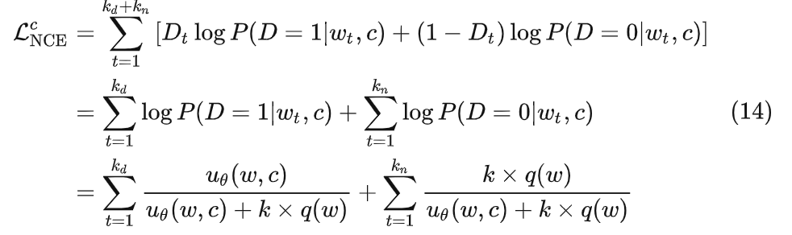

而 **NCE 的目标函数**还需要在 $(14)$ 式的基础上除以正样本的数量 $k_d$ ，即

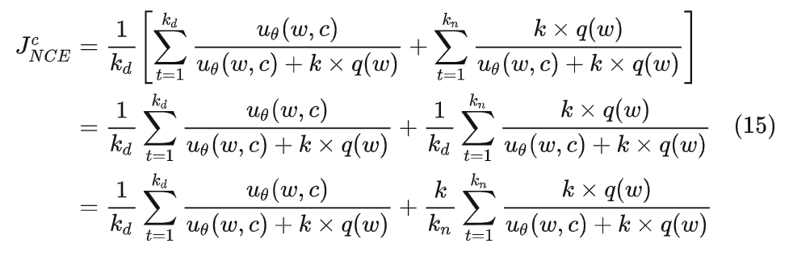

当数据数量很大时，根据[大数定律](https://baike.baidu.com/item/%E5%A4%A7%E6%95%B0%E5%AE%9A%E5%BE%8B/410082)，上式也可以写成：

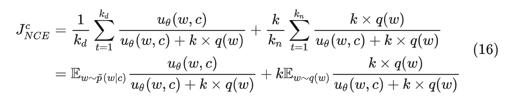

要最大化上述对数似然函数，也就是最大化如下目标函数：

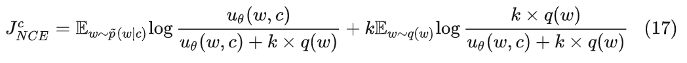

NCE 目标函数中的 $k$ 实际上就是在设置“二分类问题”时，选取的**负样本与正样本的比例**，通常的做法会默认正样本数量为 **1** ，然后将负样本的数量 $k$ 作为一个手动输入的参数，从而确定这个比例 $k$ 。在 [TensorFlow 的相关源码](https://link.zhihu.com/?target=https%3A//github.com/tensorflow/tensorflow/blob/v2.3.1/tensorflow/python/ops/nn_impl.py%23L1956-L2058) 中，正样本的数量 num_true 默认值为**1**，如果设置大于 **1**，那么会进行一个 1/num_ture 的归一化。

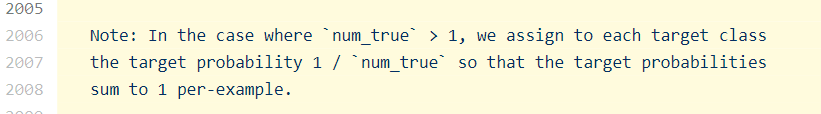

可以看到实际上这个比例 $k$ 对我们的 NCE 优化是有影响的，所以 NCE 的作者也考虑了什么样的比例 $k$ 是最好的，我这里就直接说结论了，有兴趣的可以看详细看下这篇论文 [Gutmann and Hyvrinen (2012) [3]](https://link.zhihu.com/?target=https%3A//www.jmlr.org/papers/volume13/gutmann12a/gutmann12a.pdf)。

结论是：对于设置的噪声分布 $q(w)$ ，我们实际上是希望它尽量接近数据分布 $\tilde{p}(w|c)$ ，否则这个二分类任务就过于简单了(噪声分布最好逼近真实的数据分布，以便能够对正样本产生足够的干扰)，也就无法很好的学到数据特性。而作者通过实验和推导证明（我在第三节中也会简单的证明），当负样本和正样本数量之比 $k$ 越大，那么我们的 NCE **对于噪声分布好坏的依赖程度也就越小**。换句话说，作者建议我们在计算能力运行的条件下，尽可能的增大比值 k 。也许这也就是大家都默认将正样本数量设置为 1 的原因：正样本至少取要 1 个，所以最大化比值 k ，也就是尽可能取更多负样本的同时，将正样本数量取最小值 1。

另外，如果我们希望目标函数不是只针对一个特定的上下文 $c$ ，而是使不同的上下文可以共享参数，也就是设置一批上下文的全局目标函数，$ P(c) $应该是 $c$ 的概率分布：

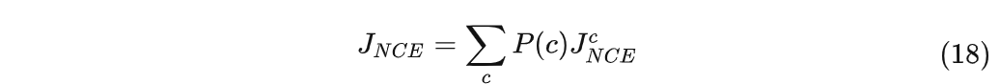

到这，NCE 的构建就完成了，总结一下就是：从上下文 $c$ 中取出单词作为正样本，从噪声分布中取出单词作为负样本，正负样本数量比为 $1:k$ ，**然后训练一个二分类器**，通过一个类似于交叉熵损失函数的目标函数进行训练（如果取正样本数量为 $1$，那么 $(14)$ 式与 $(15)$ 式等价，NCE 目标函数就等价于交叉熵损失函数）。

### 3 NCE 的原理

上面虽然推导了那么多公式，但实际只是按照 NCE 的思想进行问题的转换，那么这样做究竟是否正确呢？根据**附录 3** 的描述，直觉上看好像是没有问题的。

我们再看回 $(17)$ 式，我们对它关于 $θ$ 进行求导:

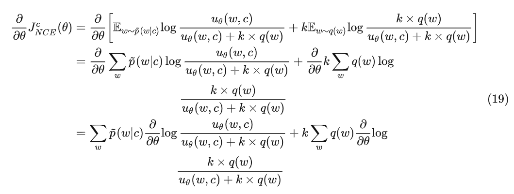

分布对上面的两项进行求导：

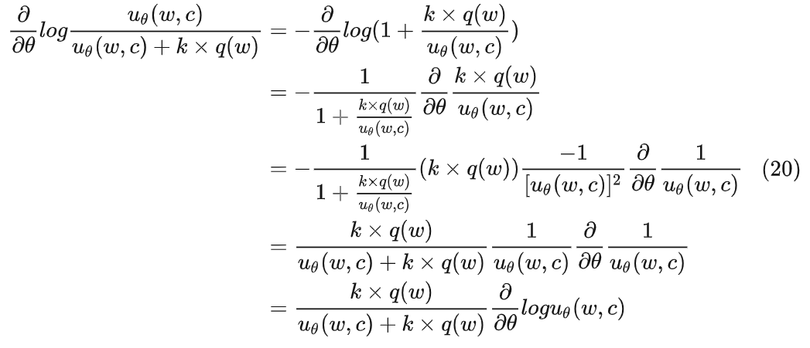

将上面两个结果再带回 $(19)$ 式中，并根据前面 $Z(c)≈1$ 的设定，也就是

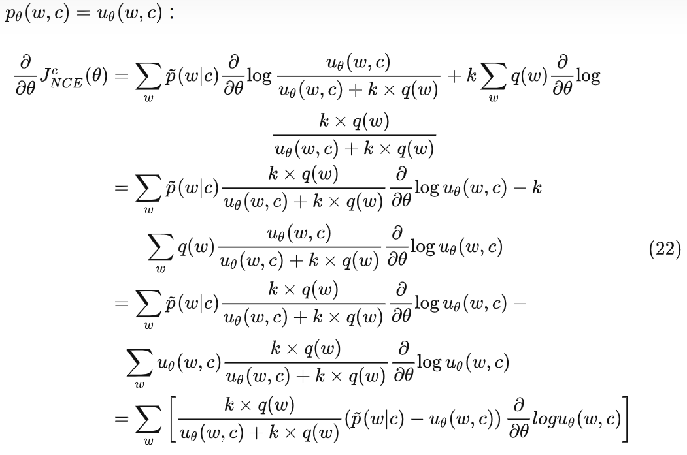

上一节中我们设定了 $Z(c)≈1$ ，也就是 $p_θ(w|c)=u_θ(w,c)$ ，因此：

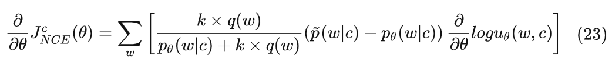

这里的参数 $k$ 依然指的是负样本与正样本数量的比例，如果我们令 $k→∞$ 的话，那么：

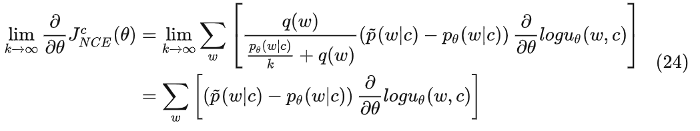

可以看到，当 $k$ 趋于无穷时， $(24)$ 式中 NCE 目标函数的梯度和 $(9)$ 式中 MLE 对数似然函数梯度是等价的，也就是说我们通过 NCE 转换后的优化目标，本质上就是对极大似然估计方法的一种近似，并且随着负样本和正样本数量比 $k$ 的增大，这种近似越精确，这也解释了为什么作者建议我们将 $k$ 设置的越大越好。

### 4 从 NCE 到 InfoNCE

到目前为止，应该对 NCE 的来龙去脉比较清楚了（公式太多，不知道多少人有耐心看到这里了...）。

InfoNCE 是在 [Representation Learning with Contrastive Predictive Coding](https://link.zhihu.com/?target=https%3A//arxiv.org/abs/1807.03748) 这篇论文中提出的，这里不会具体介绍 CPC ，而是着重说明如何借鉴 NCE 的思想提出 InfoNCE 并用于 CPC 中的，如果还不太了解的可以看我的这篇文章 [”对 CPC (对比预测编码) 的理解“](https://zhuanlan.zhihu.com/p/317711322)。

简单来说，CPC(对比预测编码) 就是一种通过无监督任务来学习(编码)高维数据的特征表示(representation)，而通常采取的无监督策略就是根据上下文预测未来或者缺失的信息，NLP 中已经利用这种思想来学习 word 的 representation [1]。

要构建这样的预测任务，一个方法是直接建模条件生成模型 $p(x_{t+k}|c_t)$ 根据当前上下文 $c_t$ 预测 $k$ 个时刻后的数据  （假设是像文本、语音中那样的序列数据）；但作者觉得这样的方法过于针对细节进行重建，并不是很好，于是引入了**互信息(mutual information)**的思想，认为我们可以通过**最大化当前上下文** $c_t$ **和要未来的数据** $x_{t+k}$ **之间的互信息**来构建预测任务，互信息的表示如下：

我们没办法知道 $x_{t+k}$ 和 $c_t$ 之间的联合分布 $p(x_{t+k},c_t)$，因此要最大化 $I(x_{t+k};c_t)$ ，就需要从 $\frac{p(x_{t+k} \mid c_t)}{p(x_{t+k})}$ 入手，即最大化 $\frac{p(x_{t+k} \mid c_t)}{p(x_{t+k})}$ 。

那么如何训练 $\frac{p(x_{t+k} \mid c_t)}{p(x_{t+k})}$ 呢？我们可以把这个比例定义为**密度比**，那么根据**附录 3**中的思想，分子 $p(x_{t+k} \mid c_t)$ 就相当于 $p_d$ ，是我们想得到的目标函数；分母 $p(x_{t+k})$ 就相当于 $p_n$ ，是用来进行对比的参考分布(噪声)。因此，我们就可以根据 NCE 中提供的思路，将问题转换为一个**二分类**的问题，更具体来解释：

1. 从条件 $p(x_{t+k} \mid c_t)$ 中取出数据称为“正样本”，它是根据上下文 $c_t$ 所做出的==预测数据==，将它和这个上下文一起组成“正样本对”，类别标签设为 $1$。
2. 将从 $p(x_{t+k})$ 中取出的样本称为“负样本”，它是与当前上下文 $c_t$ 没有必然关系的随机数据，将它和这个上下文 $c_t$ 一起组成“负样本对”，类别标签设为 $0$。（根据现有的单词，当前序列，喂给未来的encoder的输出就是负样本）
3. 正样本也就是与 $c_t$ 间隔固定步长 $k$ 的数据，根据 NCE 中说明的设定，正样本选取 $1$ 个；因为在 NCE 中证明了噪声分布与数据分布越接近越好，所以负样本就直接在当前序列中随机选取（只要不是那一个正样本就行），负样本数量越多越好。

所以要做的就是训练一个 logistics 分类模型，来区分这两个正负样本对。**问题转换后，训练的模型能够“成功分辨出每个正负样本的能力”就等价于“根据** $c_t$ **预测** $x_{t+k}$ **的能力”**。

根据 NCE 中的设置，现在假设给出一组大小为 $N$ 的 $X= \{x_1,…,x_N\}$ ，其中包含 $1$ 个从 $p(x_{t+k} \mid c_t)$ 中取样正样本和 $N−1$ 从一个指定分布(用于对比的噪声分布) $p(x_{t+k})$ ，假设第 $x_i$ 是正样本，且 $i=t+k$ ，上下文 $c_t$ 表示 $t$ 之前的数据，那么能够正确的同时找到那一个正样本 $x_{t+k}$ 和 $N−1$ 个负样本的情况可以写成如下形式：

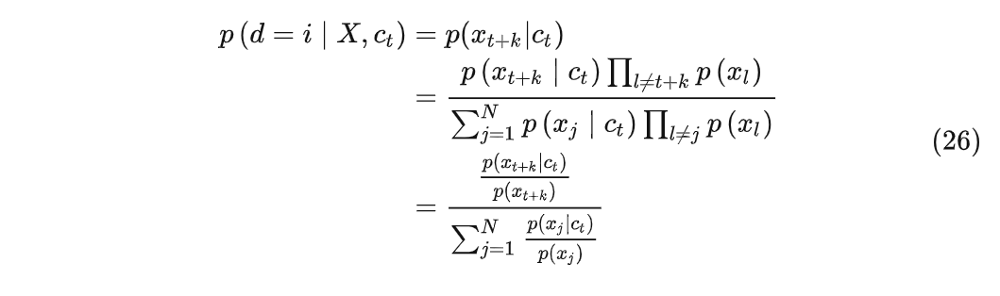

我们最大化上面这个式子，即最大化模型“成功分辨出每个正负样本的能力”，也就是最大化我们定义的密度比，也就是最大化 $c_t$ 与 $x_{t+k}$ 的互信息。

参考 $(5)$ 式，可以写出根据 $c_t$ 预测 $x_{t+k}$ 的形式：softmax(score function)

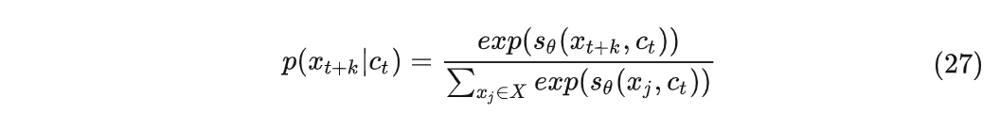

在上式中，我们知道 $s_θ(x,c)$ 是一个 socring function ，输出的分数用来量化 $x$ 在上下文 $c$ 中匹配性；放在这里 $s_θ(x_{t+k},c_t)$ 也就是量化对 $x_{t+k}$ 预测的结果和真实结果的相似程度，CPC 文章中用余弦相似度来量化，并且将 $exp(s_θ(x_{t+k},c_t))$ 定义为 $f_k(x_{t+k},c_t)$ ，也就是：

现在对比 $(26)(28)$ 两个式子，这两个式子的目标是一致的，也就意味着 $f_k(x_{t+k},c_t)$ 实际上就可以作为密度比 $ \frac{p(x_{t+k}∣c_t)}{p(x_{t+k})} $ 的一种表示形式，它们之间虽不直接等价，但是含义上是正相关的，即：

现在我们的优化目标就是使 $(26)$ 或 $(28)$ 式的结果最大，所以可以写出对应形式的交叉熵损失如下：

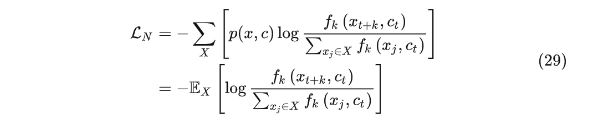

上式就是最终得到的 **InfoNCE 损失函数**了，并且最小化 InfoNCE，也就等价于最大化 $x_{t+k}$ 和 $c_t$ 之间互信息的下限，从而做到了我们所要求的最大化 $I(x_{t+k};c_t)$ ，证明如下，

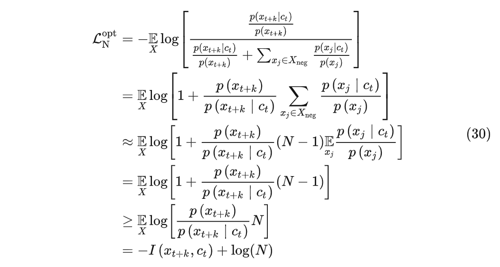

到底为止，如何从由 NCE 结合互信息的思想构建 $(29)$ 式中的 InfoNCE 也清楚了，**现在 InfoNCE 主要用在自监督学习中作为一个对比损失函数**，实际上 InfoNCE 的这个思想也是可以作为互信息的一个估计器，在论文中也有证明它和另一个互信息估计器 MINE 之间的关系，这里就不再详细说明了。

在使用 InfoNCE 时把它当作一个对比损失，那么分子上的 $(x_{t+k},c_t)$ 表示正样本对， 分母上的$(x_j,c_t)$ 表示负样本对，我们只要构建好正负样本对，然后利用 InfoNCE 的优化过程，就可以做到使正样本对之间的互信息最大，使负样本对之间的互信息最小这件事情了：

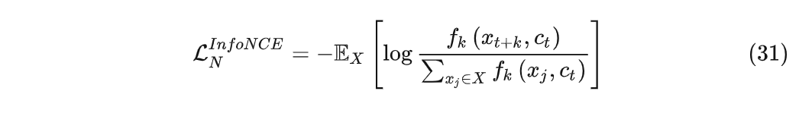

### 后记

最初目的只是因为看到很多地方直接使用了 InfoNCE（实际上就是 CPC），但没有说明详细的原理，网上除了[磊 爷](https://www.zhihu.com/people/matchaleimao)的文章[6]之外，很多都是浮于表面的解释，远不能解答我的疑惑 ，所以作为一个刚入门的小白，我还是想亲自推导一下 InfoNCE 的以及它的来源 NCE 的原理，没想到这个坑越挖越深，最后花的时间远远超出我的预期，主要是网上没有什么相关信息，只能去翻论文导致一堆其他事情没有做....好在最终还是按照我的理解基本弄清楚了（如果有哪里理解错的地方，请告诉我），也不知道这样做有没有意义。

### 附录 1——NCE 要解决的问题

实际上NCE 要解决的是**归一化参数密度估计问题**。

假设现在有一组观测样本 $X=\{x_1,x_2,…,x_n\}$ ，它遵循一个未知的参数化概率密度函数 $p_d(.;θ)$ ，参数密度估计问题就是根据观测样本 $X$ 找到一组最优参数 $θ$ ，通常使用极大似然估计的方法。对于这个密度函数 $p_m(.;θ)$ 的估计还需要满足下面两个约束条件：

1. $∫p(x;θ)dx=1$
2. $p_m(.;θ)≥0$

如果同时满足上面两个约束条件，那么称建模的密度函数是归一化的；如果只满足第 2 个正约束条件，那么称其未归一化。

语言模型中说的 $Z(c)$ 在 NCE 实际上指的就是 partition function，这里用 $Z(θ)$ 表示，假设 $p_m^0(.;θ)$ 为估计的未归一化模型，则 $Z(θ)=∫p_m^0(x;θ)dx$ ，而将模型归一化的方式就是： $\frac{p_m^0(.;θ)}{Z(θ)}$ 。而对于 $Z(θ)$ ，除非 $p_m^0(.;θ)$ 的形式特别简单，否则是没办法写出积分的解析解形式的，只能通过数值积分的方法来近似。这种数值积分对于低维问题是有较高的精度的，但是对于实际应用中的很多高维问题，在计算上就是非常昂贵甚至不可接受的。

### 附录 2——将归一化常数作为参数

这里解释一下为什么可以将归一化常数作为一个附加的参数。

附录1中提到可以通过 $\frac{p_m^0(.;θ)}{Z(θ)}$ 来对 $p_m^0(.;θ)$ 进行归一化，实际上可以看作对 $p_m^0(.;θ)$ 进行了一定的缩放，假设归一化后的密度函数为 $p_m(.;θ)$ ，则：

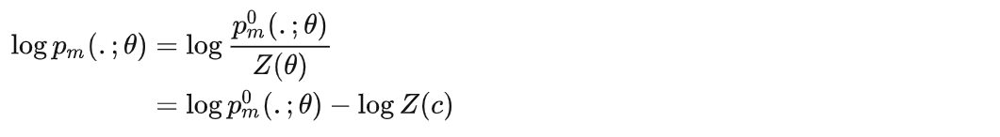

因此我们可以把 $log⁡Z(c)$ 当成一个参数 $c$ ，也就是：

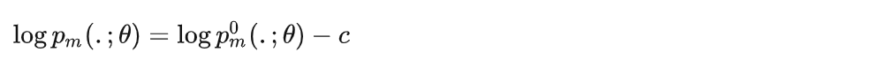

也就是学习一个参数 $c$ ，来对未归一化的 $p_m^0(.;θ)$ 进行大小为 $c$ 的缩放，最终达到归一化的效果。

### 附录 3——用噪声进行对比的直觉

知道负样本 $Y$ 又知道 $Y$ 和正样本 $X$ 的差异，那么就知道了 $X$ 。

这里解释一下用噪声的分布进行对比的直觉。

按照 [Gutmann and Hyvrinen(2012) [3]](https://link.zhihu.com/?target=https%3A//www.jmlr.org/papers/volume13/gutmann12a/gutmann12a.pdf) 中的解释（如果真的想弄懂 NCE，强烈推荐阅读一下这篇论文），估计数据的密度函数 $p(x)$ 实际上是确定观测数据 $X$ 的属性，而这种属性一般需要相对于另一些参考数据(噪声) $Y$ 的属性来体现(描述)出来的。如果我们参考(噪声)数据 $Y$ 是从概率密度函数为 $p_n$ 的分布中独立同分布采样出来的 ，$X$ 相对于 $Y$ 的属性用它们的密度比 $p_d/p_n$ 来描述。那么如果相对数据 $Y$ 的分布 $p_n$ 已知，也就能通过 $p_d/p_n$ 获得 $X$ 的密度函数 $p_d$ 。话句话说，如果我们知道 $Y$ 的属性，也知道了 $X$ 和 $Y$ 之间的差异，那么我们也就知道了 $X$ 的属性。

所以 NCE 中通过训练一个二分类器来对 $X$ 和 $Y$ 中的数据进行比较，为了区分出这两个数据，分类器就会比较它们属性的不同，换句话说，这个二分类也就学到了 $X$ 和 $Y$ 之间的差异，而这个差异根据 $(14)(15)$ 式的推导，也确实符合 $p_d/p_n$ 的形式的，实际上也就是训练了 logistic 分类器。

### 参考文献

[1] Tomas Mikolov, Kai Chen, Greg Corrado, and Jeffrey Dean. Efficient estimation of word representations in vector space. arXiv preprint arXiv:1301.3781, 2013.

[2] Michael Gutmann and Aapo Hyvärinen. 2010. Noise-contrastive estimation: A new estimation principle for unnormalized statistical models. In Proc. AISTATS.

[3] Gutmann, M.U. and Hyv¨ arinen, A. Noise-contrastive estimation of unnormalized statistical models, with applications to natural image statistics. Journal of Machine Learning Research, 13:307–361, 2012.

[4] Andriy Mnih and Y ee Whye Teh. 2012. A fast and simple algorithm for training neural probabilistic language models. In Proc. ICML.

[5] Aaron van den Oord, Yazhe Li, and Oriol Vinyals. Representation learning with contrastive predictive coding. arXiv preprint arXiv:1807.03748, 2018.

[6] Leo Mao. 2019. "Noise-Contrastive-Estimation". [online]. [https://leimao.github.io/article/Noise-Contrastive-Estimation/](https://link.zhihu.com/?target=https%3A//leimao.github.io/article/Noise-Contrastive-Estimation/)

[7] Dyer, C. (2014). Notes on Noise Contrastive Estimation and Negative Sampling. *arXiv:1410.8251 [cs]*.

[8] Y. Bengio, R. Ducharme, P. Vincent, and C. Jauvin, “A Neural Probabilistic Language Model,” p. 19.