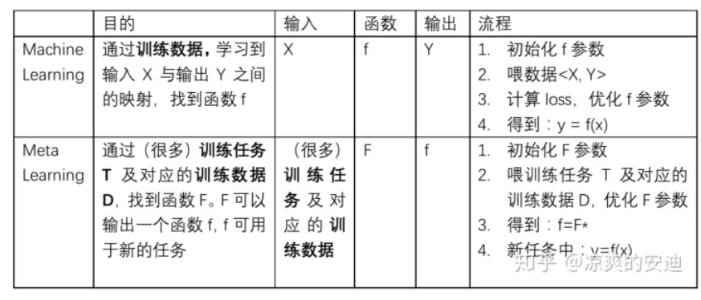

## Meta-Learning

[知乎：一文入门元学习](https://zhuanlan.zhihu.com/p/136975128)

### 1. 简单介绍

元学习Meta Learning，含义为学会学习，即learn to learn，Meta Learning希望使得模型获取一种“学会学习”的能力，使其可以在获取已有“知识”的基础（support set）上快速学习新的任务。

- 机器学习和元学习的一些区别：

  

在机器学习中，**训练单位是一条数据**，通过数据来对模型进行优化；数据可以分为训练集、测试集和验证集。在元学习中，训练单位分层级了，**第一层训练单位是任务，也就是说，元学习中要准备许多任务来进行学习，第二层训练单位才是每个任务对应的数据**。

**元学习中要准备许多任务来进行学习，而每个任务又有各自的训练集和测试集**

