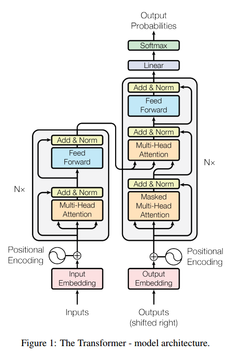
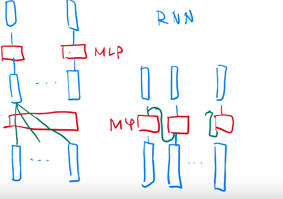
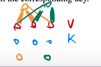
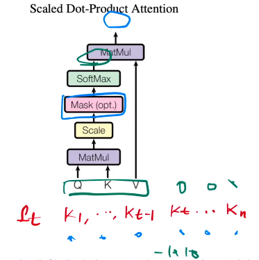
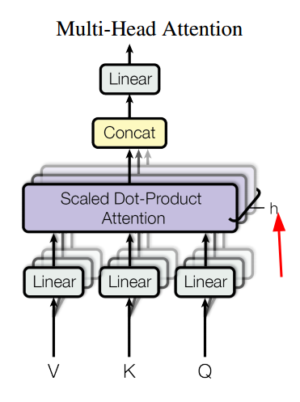
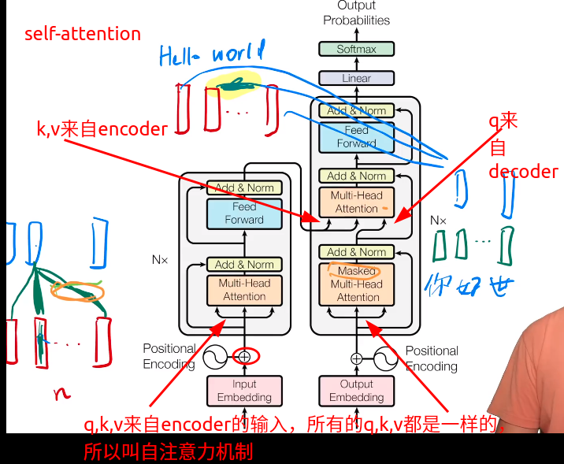
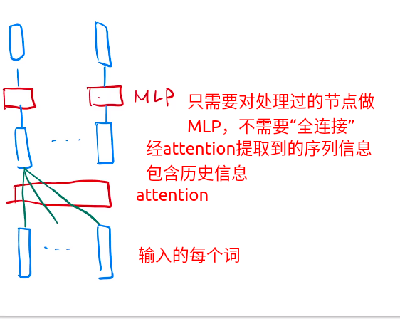
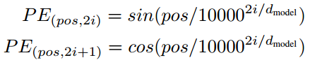

## Transformer

来源：NIPS2017

作者：谷歌

下载：[https://arxiv.org/pdf/1706.03762.pdf](https://arxiv.org/pdf/1706.03762.pdf)

题目：*Attention Is All You Need*

#### 摘要

之前的序列转导模型都和CNN和RNN(包含encoder和decoder)相关，效果最好的模型也使用一个attention机制把encoder和decoder连接在一起。

Transform：一个简单的网络架构，不用rnn和卷积，只单独的基于attention机制。

#### 结论

提出了Transformer，第一个只基于attention的序列转导模型，用multi-headed self-attention代替了encoder-decoder架构的RNN。

训练比RNN和CNN更快（多头可以并行）。

可以应用到图像，音频，视频上，使得生成不那么时序化。

#### 介绍

RNN，LSTM，Gated RNN（GRU）在序列模型和转导问题(语言模型和机器翻译)上都有SOT的性能。

在一个句子中，RNN顺序的读每一个单词，当前单词的隐层输出是 $h_t = f(h_{t-1}, word_t)$，这样RNN就把之前的单词的所有信息放在了隐藏状态中，这样就能有效的处理时序信息。RNN缺点：不能并行计算，如果要保存前面每个单词的隐藏信息，那么 $h_t$ 就必须很大，内存开销也很大。

attention应用在RNN上增加了计算的并行性。

Transformer不用循环的结构，只用attention来捕捉输入和输出之间的全局依赖。并行性更强。

#### 相关工作

基于CNN的网络，要得到两个记录很远的信号之间的联系，需要大量计算（不停的卷积）。在Transformer中，复杂度降为一个常数。CNN可以输出多个通道，每个通道可以看成识别一个模式，Transformer也想达到这个效果，于是就提出了Multi-Head Attention机制。

Self-attention（也 intra-attention）一种attention机制，把一个序列中不同位置联系起来，然后计算序列的表示。

End-to-end memory networks基于循环注意力机制，代替了序列对齐循环（sequencealigned recurrence）。

#### 模型架构

过去时刻的输出可能作为现在的输入，这个叫自回归。

##### 3.1 Encoder and Decoder Stacks

- **Encoder**

  6个块(Fig.1 左边)，每个块中有2个子层。第一层是multi-head self-attention mechanism(多头注意力机制)。第二层是MLP。每个子层都有一个残差连接，然后跟一个==layer normalization==(对参数做归一化，和BN有区别)。所以，每个子层的输出就是 $LayerNorm(x + Sublayer(x))$ 。

  残差连接需要输入和输出是一样的，为了方便计算，把每个子层的输出变成 $d_{model} = 512$ 。(包括embedding 层)

  

- **Decoder**

  6个块(Fig.1 右边)，每个子层中有3个子层。上下两层和encoder一样，中间一层对encoder的输出做了multi-head attention的计算。Decoder的第一层和Encoder的第一层略有差别，Decoder是masked多头，他把当前时刻之后的信息($ x_t, x_{t+1}, x_{t+2}, ... $)权值赋为0，只看当前时刻之前的信息(已经发生$x_{0},...,x_{t-1}$)。

##### 3.2 Attention

注意力函数可以看作是把query和key-values对映射成一个输出的函数。其中q，k，v都是向量，输出就是对values的加权和，这里的权值等于query和key的相似度。

###### 3.2.1 Scaled Dot-Product Attention

作者用到的attention：
$$
Attention(Q,K,V) = softmax(\frac{QK^T}{\sqrt{d_k}})V
$$
这里的Q，K都是等长的，长度是 $d_k$，V的长度是 $d_v$。

和Dot-Product Attention差不多，多了一个除以 $\sqrt{d_k}$ 的操作。为什么做这样的操作：当$d_k$不是很大的时候，除不除都没关系，但是当$d_k$较大的时候，做点积的时候值就会比较大，也可能是比较小(负数？)，值比较大的时候，之间的相对差距就会变大，导致最大的值的softmax就会更接近于1，剩下的值更靠近0，值就会向两端靠拢，这样情况下，计算的梯度比较小，（softmax就是希望预测值，置信的地方靠近1，不置信的地方靠近0，这样结果就收敛的差不多了），这时候模型就会跑不动，所以除以$d_k$是一个不错的选择。

如何计算Mask：

后面的时刻权值设置为负无穷。

###### 3.2.2 Multi-Head Attention

与其做一个单个的注意力函数，不如把整个query，key，value投影到一个低维，投影h次，再做h次的注意力函数，然后在把每个函数的输出并到一起，然后再投影回来得到最终的输出。

所以为什么要做多头注意力机制呢？回头看点积注意力函数，发现它没有什么可以学习的参数，具体 函数就是内积。但是有时候，为了识别不一样的那些模式，我希望有一些不一样的计算像素的办法。而多头注意力机制，先投影到低维(w)，这里的w是可以学的，给你h次机会，希望学到不一样的投影方法，使得在投影进去的那个嵌入空间里面，能够匹配不同的模式需要的相似函数，~~然后在把这些学到的参数更新~~，再做一次投影。这里就跟卷积神经网络，有多个输出通道的感觉。
$$
MultiHead(Q, K, V ) = Concat(head_1, ... , head_h)W^O \\
where，head_i = Attention(QW_i^Q, KW_i^K, VW_i^V )
$$
作者使用了h=8，即8个头。

因为有残差连接的存在，需要输入和输出是一样的，所以在每个头的输出，需要把 $d_k = d_v = d_{model}/h = 64$，然后在concat一起，投影回来。

###### 3.2.3 Applications of Attention in our Model

##### 3.3 Position-wise Feed-Forward Networks

MLP，把MLP对每个点(即输入的词)作用一次，MLP每次都一样
$$
FFN(x) = max(0， xW1 + b1)W2 + b2
$$
其中，x是512维的，W1把它转换成2048维，W2又把它转换回512维，相当于一个单隐层的MLP。

##### 3.4 Embeddings and Softmax

在encoder和decoder之后，经过embedding层，把输入和输出的tokens转换为 $d_{model} = 512$ 的向量。在我们的模型中，两个embedding层和softmax之前的线性层共享一个权重矩阵。在embedding层，权值还要乘 $\sqrt{d_{model}}$。

为什么要乘这样一个参数？~~因为在学embedding的时候，多多少少会把每个向量的L2 long学成相对比较小的长度~~ 

##### 3.5 Positional Encoding

为了让模型利用序列的顺序信息，我们必须把tokens的相对或者绝对位置信息，加入到encoder和decoder块的最下面，维度和embeddings的维度一样 $d_{model}$ 。

$pos$ 是位置，$i$ 是维度。也就是说，每个位置编码的每个维度都对应于正弦曲线。正弦曲线的波长是一个几何过程，从 $2\pi$ 到 $10000 \cdot 2\pi$。我们之所以使用这个函数是因为，我们假设这个函数允许模型能够简单的学到相对位置，因此，对于一个固定的偏移 $k$ ，$PE_{pos + k}$ 就可以用关于 $PE_{pos}$ 的线性函数来表示。