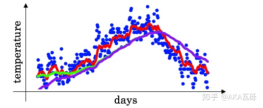
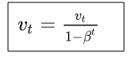
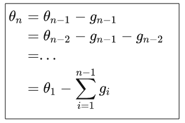
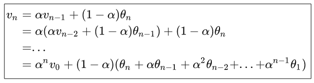
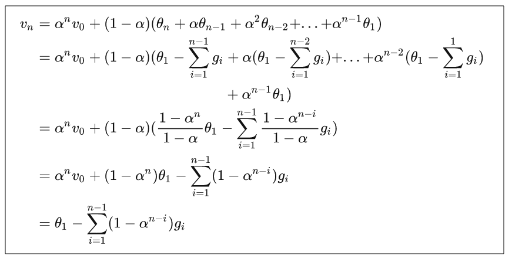
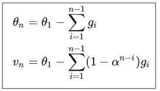

## 指数移动平均（EMA）的原理及PyTorch实现

参考：[[知乎](https://zhuanlan.zhihu.com/p/68748778)]

在深度学习中，经常会使用EMA（指数移动平均）这个方法对模型的参数做平均，以求提高测试指标并增加模型鲁棒。

### EMA定义

指数移动平均（Exponential Moving Average）也叫权重移动平均（Weighted Moving Average），是一种给予近期数据更高权重的平均方法。

假设我们有n个数据：$[\theta_1,\theta_2,\ldots,\theta_n]$ 

- 普通的平均数：

- EMA：，其中$v_t$表示前$t$条的平均值（$v_0=0$），$\beta$是加权权重值（一般设为0.9-0.999）。

吴恩达的课程中提到，EMA可以近似看成是过去$1/(1-\beta)$个时刻$v$的平均。

普通的过去 $n$ 时刻的平均是这样的：


类比EMA，可以发现当 $\beta=\frac{n−1}{n}$ 时，两式形式上相等。需要注意的是，两个平均并不是严格相等的，这里只是为了帮助理解。

实际上，EMA计算时，过去$1/(1-\beta)$个时刻之前的数值平均会decay到 $\frac{1}{e}$ 的加权比例，证明如下。

如果将这里的 $v_t$ 展开，可以得到：（$\alpha \rightarrow 1^-$时，求极限）


### 在深度学习的优化中的EMA

上面讲的是广义的ema定义和计算方法，特别的，在深度学习的优化过程中， $\theta_t$ 是t时刻的模型权重weights， $v_t$ 是t时刻的影子权重（shadow weights）。在梯度下降的过程中，会一直维护着这个影子权重，但是这个影子权重并不会参与训练。基本的假设是，模型权重在最后的n步内，会在实际的最优点处抖动，所以**我们取最后n步的平均，能使得模型更加的鲁棒**。

### EMA的偏差修正

实际使用中，如果令 $v_0=0$ ，且步数较少，EMA的计算结果会有一定偏差。



理想的平均是绿色的，因为初始值为0，所以得到的是紫色的。

因此可以加一个偏差修正（bias correction）：



显然，当t很大时，修正近似于1。

### EMA为什么有效

网上大多数介绍EMA的博客，在介绍其为何有效的时候，只做了一些直觉上的解释，缺少严谨的推理，瓦砾在这补充一下，不喜欢看公式的读者可以跳过。

令第n时刻的模型权重（weights）为 $\theta_n$ ，梯度为 $g_n$ ，可得：



令第n时刻EMA的影子权重为 $v_n$ ，可得：



代入上面 $\theta_n$ 的表达，令 $v_0=\theta_1$ 展开上面的公式，可得：



对比两式：（都是最后n步的参数取平均，前者是普通的梯度下降算法，后者是EMA算法）



EMA对第i步的梯度下降的步长增加了权重系数 $1-\alpha^{n-i}$ ，相当于做了一个learning rate decay。

### PyTorch实现

知乎作者实现的代码，不是某一篇论文里的。

```python
class EMA():
    def __init__(self, model, decay):
        self.model = model
        self.decay = decay
        self.shadow = {}
        self.backup = {}

    def register(self):
        for name, param in self.model.named_parameters():
            if param.requires_grad:
                self.shadow[name] = param.data.clone()

    def update(self):
        for name, param in self.model.named_parameters():
            if param.requires_grad:
                assert name in self.shadow
                new_average = (1.0 - self.decay) * param.data + self.decay * self.shadow[name]
                self.shadow[name] = new_average.clone()

    def apply_shadow(self):
        for name, param in self.model.named_parameters():
            if param.requires_grad:
                assert name in self.shadow
                self.backup[name] = param.data
                param.data = self.shadow[name]

    def restore(self):
        for name, param in self.model.named_parameters():
            if param.requires_grad:
                assert name in self.backup
                param.data = self.backup[name]
        self.backup = {}

# 初始化
ema = EMA(model, 0.999)
ema.register()

# 训练过程中，更新完参数后，同步update shadow weights
def train():
    optimizer.step()
    ema.update()

# eval前，apply shadow weights；eval之后，恢复原来模型的参数
def evaluate():
    ema.apply_shadow()
    # evaluate
    ema.restore()
```

