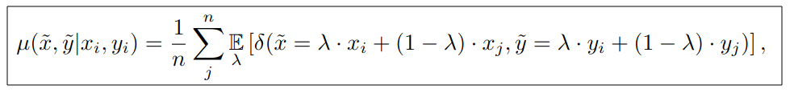
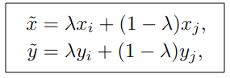
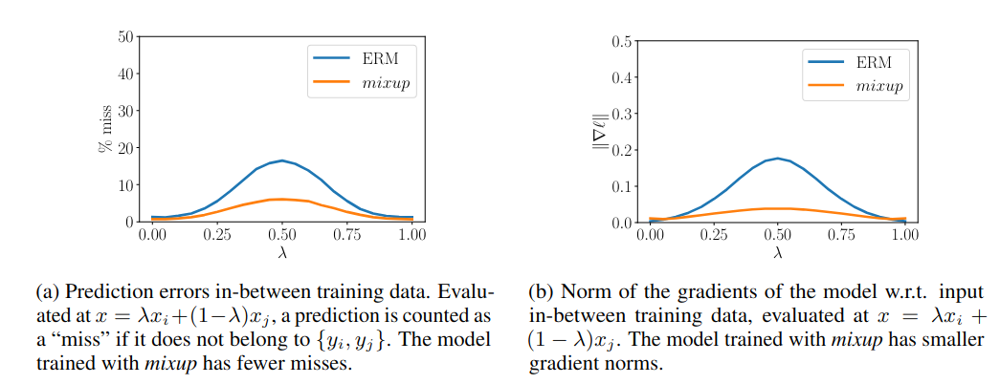

## Mixup

论文：[[arxiv](http://arxiv.org/pdf/1710.09412)]

参考：[[知乎](https://zhuanlan.zhihu.com/p/402511359)] [[mixup方法的一个综述 知乎](https://zhuanlan.zhihu.com/p/439205252)]

### mixup（综述）

**Mixup** [1]是ICLR2017年提出的针对计算机视觉的一项简单的数据增广策略。通过对输入数据进行简单的线性变换（即 $\tilde{\mathrm{X}} = \lambda \cdot \mathrm{X}_0 + (1 - \lambda) \cdot \mathrm{X}_1$），可以增加模型的泛化能力，并且能够提高模型对于对抗攻击(Adversarial Attack)的鲁棒性。

### 方法简述

mixup是一种运用在计算机视觉中的对图像进行混类增强的算法，它可以将不同类之间的图像进行混合，从而扩充训练数据集。在介绍mixup之前，我们首先简单了解两个概念：经验风险最小化（Empirical risk minimization，ERM）和邻域风险最小化（Vicinal Risk Minimization，VRM）。

“经验风险最小化”是目前大多数网络优化都遵循的一个原则，即使用已知的经验数据（训练样本）训练得到的学习器的误差或风险，也叫作“经验误差”或“训练误差”。相对的，在新样本（未知样本）上的误差称为“泛化误差”，显然，我们希望学习器的“泛化误差”越小越好。然而，通常我们事先并不知道新样本是什么样的，实际能做的是努力使经验误差越小越好。但是，过分的减小经验误差，通常会在未知样本上产生很差的结果，也就是我们常说的“过拟合”。

关于“泛化性”，通常可以通过使用大规模训练数据来提高，但是实际上，获取有标签的大规模数据需要耗费巨大的人工成本，甚至有些情况下根本无法获取数据。解决这个问题的一个有效途径是“邻域风险最小化”，即通过先验知识构造训练样本的邻域值。一般的做法就是传统的数据增强方法，比如加噪、翻转、缩放等，但是这种做法很依赖于特定的数据集和人类的先验知识。

Mixup是一种一般性（不针对特定数据集）的邻域分布方式，可以表示为：（原论文中给出的公式）



其中，$x_i,x_j$是输入的向量（图像），$y_i,y_j$是one-hot标签。$\lambda \sim \beta(\alpha,\alpha)$，$\alpha \in (0, \infty)$



$(x_i,y_i),(x_j,y_j)$是训练集的两个样本。$\lambda \in [0,1]$。α是mixup的超参数，控制两个样本插值的强度，当$\alpha \rightarrow 0$时，则退化到了ERM的情况。



上图展示了mixup和ERM的性能对比图，可以看出mixup方法能够产生更鲁棒的结果。

### 代码

```python
 def mixup_data(x, y, alpha=1.0, use_cuda=True):
    '''Returns mixed inputs, pairs of targets, and lambda'''
    if alpha > 0:
        lam = np.random.beta(alpha, alpha)
    else:
        lam = 1

    batch_size = x.size()[0]
    if use_cuda:
        index = torch.randperm(batch_size).cuda()
    else:
        index = torch.randperm(batch_size)

    mixed_x = lam * x + (1 - lam) * x[index, :]
    y_a, y_b = y, y[index]
    return mixed_x, y_a, y_b, lam


def mixup_criterion(criterion, pred, y_a, y_b, lam):
    return lam * criterion(pred, y_a) + (1 - lam) * criterion(pred, y_b)
```

