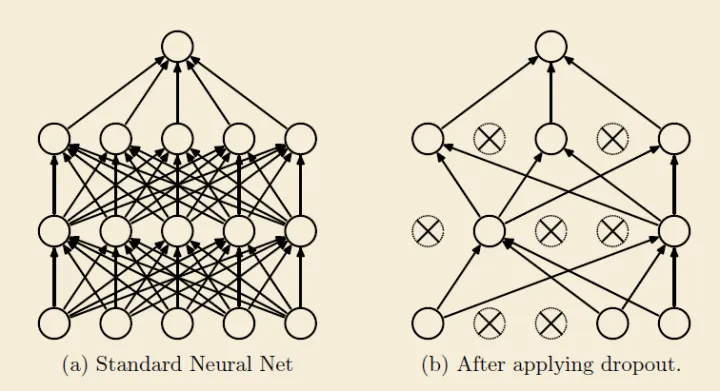

## Drop Path

参考：[[知乎 6.](https://zhuanlan.zhihu.com/p/427388113)] [[csdn](https://blog.csdn.net/qq_43135204/article/details/127912029)]

### 方法概述

Dropout是最早用于解决网络过拟合的方法，是所有drop类方法的始祖。方法示意图如下：



在向前传播的时候，让神经元以一定概率停止工作。这样可以使模型泛化能力变强，因为神经元会以一定概率失效，这样的机制会使结果不会过分依赖于个别神经元。训练阶段，以keep_prob概率使神经元失效，而推理的时候，会保留所有神经元的有效性，因此，训练时候加了dropout的神经元推理出来的结果要除以keep_prob。

接下来以dropout的思路来理解drop path，drop path没找到示意图，那直接看timm上的代码：

### 代码

```python
def drop_path(x, drop_prob: float = 0., training: bool = False):
    if drop_prob == 0. or not training:
        return x
    # drop_prob是进行droppath的概率
    keep_prob = 1 - drop_prob
    # work with diff dim tensors, not just 2D ConvNets
    # 在ViT中，shape是(B,1,1),B是batch size
    shape = (x.shape[0],) + (1,) * (x.ndim - 1)
    # 按shape,产生0-1之间的随机向量,并加上keep_prob  
    random_tensor = keep_prob + torch.rand(shape, dtype=x.dtype, device=x.device)
    # 向下取整，二值化，这样random_tensor里1出现的概率的期望就是keep_prob
    random_tensor.floor_()  # binarize
    # 将一定图层变为0
    output = x.div(keep_prob) * random_tensor
    return output
```

由代码可以看出，drop path是在batch那个维度，随机将一些图层直接变成0，以加快运算速度。