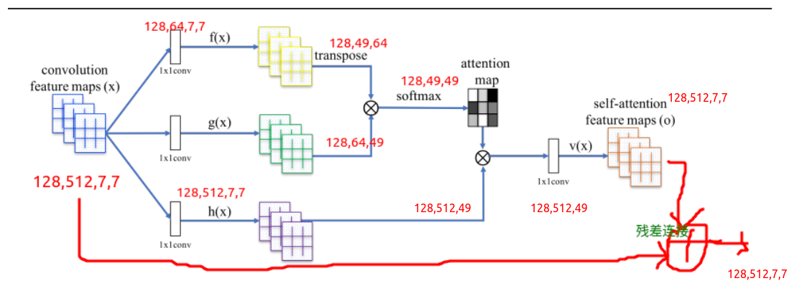
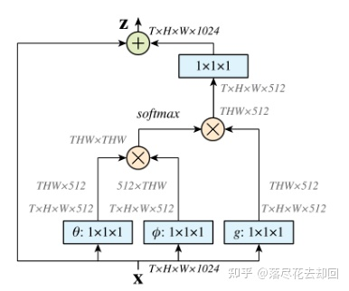
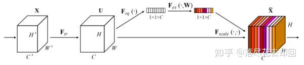
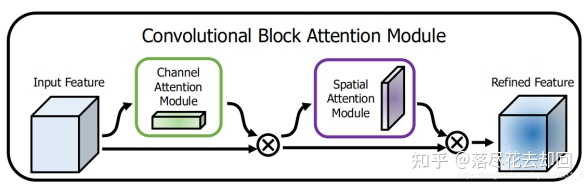
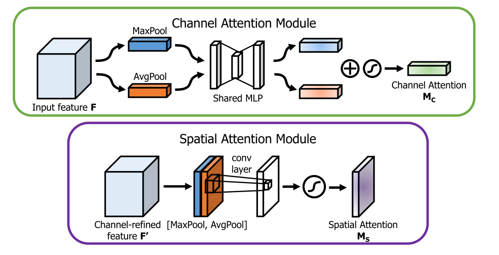

## 图像处理注意力机制Attention汇总（附代码）

参考：[[知乎](https://zhuanlan.zhihu.com/p/388122250)]

每个方法的代码：[[github ](https://github.com/ZhugeKongan/Attention-mechanism-implementation) cifar100]


### 2. 空间域注意力方法

对于卷积神经网络，CNN每一层都会输出一个C x H x W的特征图，C就是通道，同时也代表卷积核的数量，亦为特征的数量，H 和W就是原始图片经过压缩后的图的高度和宽度，而空间注意力就是对于所有的通道，在二维平面上，对H x W尺寸的特征图学习到一个权重矩阵，对应每个像素都会学习到一个权重。而这些权重代表的就是某个空间位置信息的重要程度 ，将该空间注意力矩阵附加在原来的特征图上，增大有用的特征，弱化无用特征，从而起到特征筛选和增强的效果。

#### 2.1. 自注意力

论文：[[Self-Attention Generative Adversarial Networks](http://proceedings.mlr.press/v97/zhang19d/zhang19d.pdf) 2019 cites:3177]

对于卷积而言，卷积核的设置限制了感受野的大小，导致网络往往需要多层的堆叠才能关注到整个特征图。而自注意的优势就是它的关注是全局的，它能通过简单的查询与赋值就能获取到特征图的全局空间信息。

自注意力的结构下图所示，它是从NLP中借鉴过来的思想，因此仍然保留了Query, Key和Value等名称。对应图中自上而下分的三个分支，计算时通常分为三步：

(1) 第一步是将query和每个key进行相似度计算得到权重，常用的相似度函数有点积，拼接，感知机等；

(2) 第二步一般是使用一个softmax函数对这些权重进行归一化，转换为注意力，softmax对矩阵的每一行做softmax；

(3) 第三步将权重和相应的键值value进行加权求和得到最后的attention。



```python
import torch
import torch.nn as nn
import snoop

# https://github.com/heykeetae/Self-Attention-GAN/blob/master/sagan_models.py
class Self_Attn_bchw(nn.Module):

    def __init__(self, in_dim, activation='None'):
        super(Self_Attn_bchw, self).__init__()
        self.chancel_in = in_dim
        self.activation = activation

        self.query_conv = nn.Conv2d(in_channels=in_dim, out_channels=in_dim // 8, kernel_size=1)
        self.key_conv = nn.Conv2d(in_channels=in_dim, out_channels=in_dim // 8, kernel_size=1)
        self.value_conv = nn.Conv2d(in_channels=in_dim, out_channels=in_dim, kernel_size=1)
        self.gamma = nn.Parameter(torch.zeros(1))   # ?

        self.softmax = nn.Softmax(dim=-1)

    # @snoop
    def forward(self, x):
        """
            inputs:
                x = (b, c, h, w)
            returns:
                out: self attention value + input feature
                attention = (b, n, n)     n = h * w
        """
        b, c, h, w = x.shape    # (128, 512, 7, 7)
        proj_query = self.query_conv(x).reshape(b, -1, h*w).permute(0, 2, 1)    # (128,512,7,7)->(128,64,7,7)->(128,64,49)->(128,49,64)
        proj_key = self.key_conv(x).reshape(b, -1, h*w)  # (128,512,7,7)->(128,64,7,7)->(128,64,49)
        energy = torch.bmm(proj_query, proj_key)    # (128,49,49)
        attention = self.softmax(energy)    # (128,49,49)
        proj_value = self.value_conv(x).reshape(b, -1, h*w)  # (128,512,7,7)->(128,512,49)

        out = torch.bmm(proj_value, attention.permute(0, 2, 1)) # (128,512,49)
        out = out.reshape(b, c, h, w)   # (128, 512, 7, 7)

        out = self.gamma * out + x  # 残差连接 1*out + x
        return out, attention


if __name__ == '__main__':
    diff_map = torch.randn((128, 512, 7, 7))
    _, c, _, _ = diff_map.shape
    self_attn = Self_Attn_bchw(c)
    # out, attn = self_attn(diff_map)
    out, _ = self_attn(diff_map)

```


#### 2.2. 非局部注意力

论文：[[Non-local Neural Networks](https://arxiv.org/pdf/1711.07971) CVPR2018 cites:6882]

Non-local Attention是研究self-attention在CV领域应用非常重要的文章。主要思想也很简单，CNN中的卷积单元每次只关注邻域kernel size 的区域，就算后期感受野越来越大，终究还是局部区域的运算，这样就忽略了全局其他片区（比如很远的像素）对当前区域的贡献。所以Non-local blocks 要做的是，捕获这种long-range 关系：对于2D图像，就是图像中任何像素对当前像素的关系权值；对于3D视频，就是所有帧中的所有像素，对当前帧的像素的关系权值。



论文中有谈及多种实现方式，在这里简单说说在深度学习框架中最好实现的Matmul 方式，如上所示：

- 代码实现：

  ```python
  # 和上面自注意力的实现一样
  ```

### 3. 通道域注意力方法

不同与空间注意力，通道域注意力类似于给每个通道上的特征图都施加一个权重，来代表该通道与关键信息的相关度的话，这个权重越大，则表示相关度越高。在神经网络中，越高的维度特征图尺寸越小，通道数越多，通道就代表了整个图像的特征信息。如此多的通道信息，对于神经网络来说，要甄别筛选有用的通道信息是很难的，这时如果用一个通道注意力告诉该网络哪些是重要的，往往能起到很好的效果，这时CV领域做通道注意力往往比空间好的一个原因。代表的是SENet、SKNet、ECANet等。

#### 3.1. SENet

论文：[[Squeeze-and-Excitation Networks](https://arxiv.org/pdf/1709.01507) CVPR2018 cites:17114]



上图是SENet的模型结构，该注意力机制主要分为三个部分：挤压(squeeze)，激励(excitation)，以及注意(scale )。

首先是 Squeeze 操作，从空间维度来进行特征压缩，将h*w*c的特征变成一个1*1*c的特征，得到向量某种程度上具有全域性的感受野，并且输出的通道数和输入的特征通道数相匹配，它表示在特征通道上响应的全域性分布。算法很简单，就是一个全局平均池化。

其次是 Excitation 操作，通过引入 w 参数来为每个特征通道生成权重，其中 w 就是一个多层感知器，是可学习的，中间经过一个降维，减少参数量。并通过一个 Sigmoid 函数获得 0~1 之间归一化的权重，完成显式地建模特征通道间的相关性。

最后是一个 Scale 的操作，将 Excitation 的输出的权重看做是经过选择后的每个特征通道的重要性，通过通道宽度相乘加权到先前的特征上，完成在通道维度上的对原始特征的重标定。

#### 3.2 SKNet

论文：[[Selective Kernel Networks](https://arxiv.org/pdf/1903.06586) CVPR2019 cites:1243]

### 4. 混合域注意力方法

#### 4.1. CBAM

论文：[[CBAM: Convolutional Block Attention Module](https://arxiv.org/pdf/1807.06521) ECCV2018 cites:7969]

CBAM来自于 ECCV2018的文章Convolutional Block Attention Module，是如今CV领域注意力食物链顶端的存在。它也是基于SENet的改进，具体来说，论文中把 channel-wise attention 看成是教网络 Look ‘what’；而spatial attention 看成是教网络 Look ‘where’，所以它比 SE Module 的主要优势就多了后者。





上图所示是CBAM的基本结构，前面是一个使用SENet的通道注意力模块，后面的空间注意力模块设计也参考了SENet，它将全局平均池化用在了通道上，因此作用后就得到了一个二维的空间注意力系数矩阵。值得注意的是，CBAM在空间与通道上同时做全局平均和全局最大的混合pooling，能够提取到更多的有效信息。