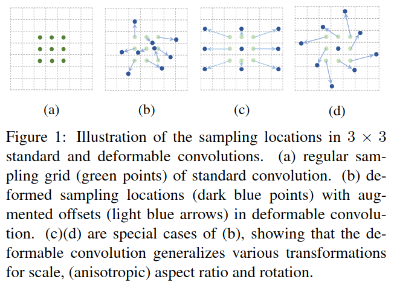
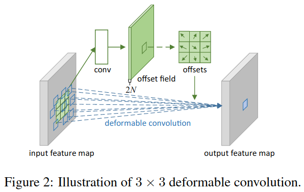
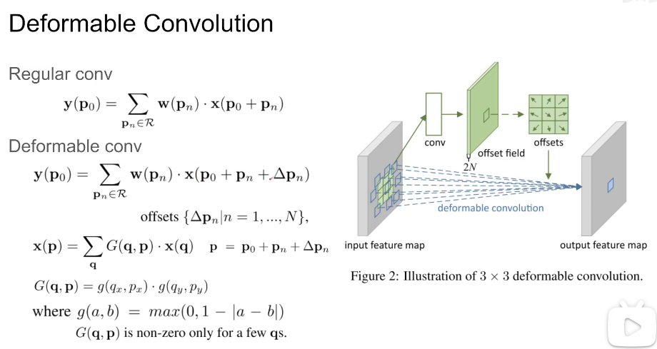

## Deformable Convolutional Networks

来源：ICCV 2017

作者：Jifeng Dai 微软亚洲研究院

论文：[[thecvf](http://openaccess.thecvf.com/content_ICCV_2017/papers/Dai_Deformable_Convolutional_Networks_ICCV_2017_paper.pdf)]

代码：[[github](https://github.com/msracver/Deformable-ConvNets)] [[逐行解读版：github](https://github.com/4uiiurz1/pytorch-deform-conv-v2)]

被引数：3638

### 创新点

- deformable convolution。在传统CNN的基础上增加可变卷积，这个可变卷积是根据特征图学出来的，加到原来的卷积上，可以增大感受野，提高CNN的迁移能力。
- deformable RoI pooling。对原来的RoI池化的每个规则的bin加入了偏移，称为可变RoI池化。这个偏移也是从特征图上学出来的。

在原来CNN基础上加入的参数很少。

### 具体方法

#### 2. Deformable Convolutional Networks

特征图和卷积都是3D的，可变卷积和RoI池化模块在2D的空间维度上操作。这些操作不会改变通道的维度。

##### 2.1. Deformable Convolution

这里的 $N = 9$ ，表示一个 $3 \times 3$ 卷积核的大小，offset field的空间大小和输入的特征图相等，通道数 $2N$ 表示在每个位置都学到了9个方向的偏移，每个方向都有两个分量(x, y)。把学到的偏移加上卷积操作，就得到了输出的特征。

其中，可变卷积和普通卷积的不同之处在于加了 $\Delta p$ 。可变卷积里， $p_0$ 点的像素值是 $x(p_0 + p_n + \Delta p_n)$ ，现在记 $p = p_0 + p_n + \Delta p_n$ ，那么点 $p$ 的像素值由 $q$ 点像素值的加权和决定。由公式 $g(a,b)$ 知， $q$ 点就是离 $p$ 点在 1 个像素内的点。但是，论文中是这样解释 $q$ 的：

> q enumerates all integral spatial locations in the feature map x, and G(·, ·) is the bilinear interpolation kernel.

上图中的式子 $x(p) = \sum\limits_q G(q, p) \cdot x(q)$ 是双线性插值法，解释见[[笔记](/home/mkid/Typora/数学知识/3.双线性插值.md)]

### 代码解释

参考：[[知乎](https://zhuanlan.zhihu.com/p/102707081)]
