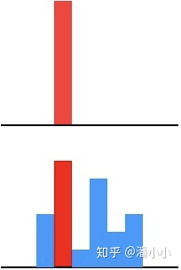
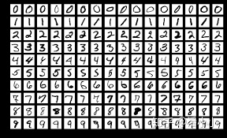
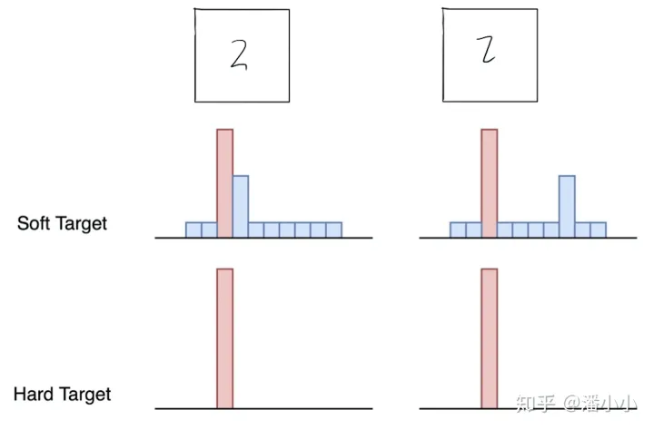
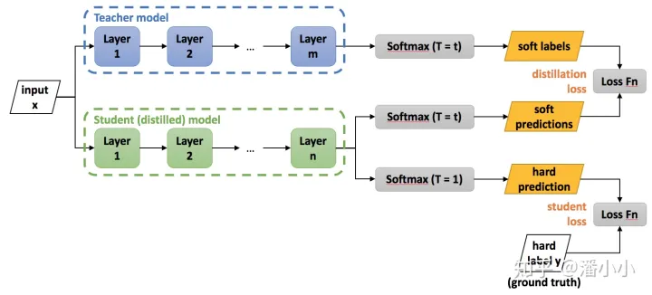
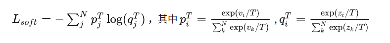
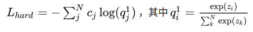

## 知识蒸馏

参考：[[知乎](https://zhuanlan.zhihu.com/p/102038521)]

作者：Geoffrey Hinton（谷歌）

论文：[[arxiv](https://arxiv.org/pdf/1503.02531.pdf)]

### 2. 知识蒸馏的理论依据

**自蒸馏（Self Distillation）**：是采用有监督学习进行知识蒸馏。只是知识蒸馏的方法，采用的方式是teacher模型和student模型是一个模型，也就是一个模型来指导自己进行学习，完成知识蒸馏，所以是自蒸馏，自己蒸馏知识来指导自己。

#### 2.1. 教师模型和学生模型

知识蒸馏使用的是Teacher—Student模型，其中teacher是“知识”的输出者，student是“知识”的接受者。知识蒸馏的过程分为2个阶段:

1. 原始模型训练: 训练"Teacher模型", 简称为Net-T，它的特点是模型相对复杂，也可以由多个分别训练的模型集成而成。我们对"Teacher模型"不作任何关于模型架构、参数量、是否集成方面的限制，唯一的要求就是，对于输入X, 其都能输出Y，其中Y经过softmax的映射，输出值对应相应类别的概率值。
2. 精简模型训练: 训练"Student模型", 简称为Net-S，它是参数量较小、模型结构相对简单的单模型。同样的，对于输入X，其都能输出Y，Y经过softmax映射后同样能输出对应相应类别的概率值。

在本论文中，作者将问题限定在**分类问题**下，或者其他本质上属于分类问题的问题，该类问题的共同点是模型最后会有一个**softmax层**，其输出值对应了相应类别的概率值。

#### 2.2. 知识蒸馏的关键点

而在知识蒸馏时，由于我们已经有了一个泛化能力较强的Net-T，我们在利用Net-T来蒸馏训练Net-S时，可以直接让Net-S去学习Net-T的泛化能力。

一个很直白且高效的迁移泛化能力的方法就是：使用softmax层输出的类别的概率来作为“soft target”。

**【KD的训练过程和传统的训练过程的对比】**

1. 传统training过程(**hard targets**): 对ground truth求极大似然
2. KD的training过程(**soft targets**): 用large model的class probabilities作为soft targets

softmax层的输出，除了正例之外，**负标签也带有大量的信息**，比如某些负标签对应的概率远远大于其他负标签。而在传统的训练过程(hard target)中，所有负标签都被统一对待。也就是说，**KD的训练方式使得每个样本给Net-S带来的信息量大于传统的训练方式**。

【**举个例子】**

在手写体数字识别任务MNIST中，输出类别有10个。

假设某个输入的“2”更加形似"3"，softmax的输出值中"3"对应的概率为0.1，而其他负标签对应的值都很小，而另一个"2"更加形似"7"，"7"对应的概率为0.1。这两个"2"对应的hard target的值是相同的，但是它们的soft target却是不同的，由此我们可见soft target蕴含着比hard target多的信息。并且soft target分布的熵相对高时，其soft target蕴含的知识就更丰富。

这就解释了为什么通过蒸馏的方法训练出的Net-S相比使用完全相同的模型结构和训练数据只使用hard target的训练方法得到的模型，拥有更好的泛化能力。

#### 2.3. softmax函数

先回顾一下原始的softmax函数:
$$
q_i = \frac{\exp(z_i)}{\sum_j \exp(z_j)}
$$

但要是直接使用softmax层的输出值作为soft target, 这又会带来一个问题: 当softmax输出的概率分布熵相对较小时，负标签的值都很接近0，对损失函数的贡献非常小，小到可以忽略不计。因此**"温度"**这个变量就派上了用场。

下面的公式时加了温度这个变量之后的softmax函数:
$$
q_i = \frac{\exp(z_i / T)}{\sum_j \exp(z_j / T)}
$$
 

- 这里的T就是**温度**。
- 原来的softmax函数是T = 1的特例。 T越高，softmax的output probability distribution越趋于平滑，其分布的熵越大，负标签携带的信息会被相对地放大，模型训练将更加关注负标签。

### 3. 知识蒸馏的具体方法

#### 3.1. 通用的知识蒸馏方法

- **第一步**是训练Net-T；**第二步**是在高温T下，蒸馏Net-T的知识到Net-S

  

训练Net-T的过程很简单，下面详细讲讲第二步:高温蒸馏的过程。高温蒸馏过程的目标函数由distill loss(对应soft target)和student loss(对应hard target)加权得到。示意图如上。
$$
L = \alpha L_{soft} + \beta L_{hard}
$$

- $v_i$: Net-T的logits

- $z_i$: Net-S的logits

- $p_i^T$: Net-T的在温度=T下的softmax输出在第i类上的值

- $q_i^T$: Net-S的在温度=T下的softmax输出在第i类上的值

- $c_i$: 在第i类上的ground truth值, $c_i \in {0,1}$ ，正标签取1，负标签取0.

- $N$: 总标签数量

- Net-T 和 Net-S同时输入 transfer set (这里可以直接复用训练Net-T用到的training set), 用Net-T产生的softmax distribution (with high temperature) 来作为soft target，Net-S在相同温度T条件下的softmax输出和soft target的cross entropy就是**Loss函数的第一部分** $L_{soft}$ 。

  

- Net-S在T=1的条件下的softmax输出和ground truth的cross entropy就是**Loss函数的第二部分** $L_{hard}$ 。

  

- 第二部分Loss $L_{hard}$ 的必要性其实很好理解: Net-T也有一定的错误率，使用ground truth可以有效降低错误被传播给Net-S的可能。打个比方，老师虽然学识远远超过学生，但是他仍然有出错的可能，而这时候如果学生在老师的教授之外，可以同时参考到标准答案，就可以有效地降低被老师偶尔的错误“带偏”的可能性。

**【注意】** 在Net-S训练完毕后，做inference时其softmax的温度T要恢复到1.