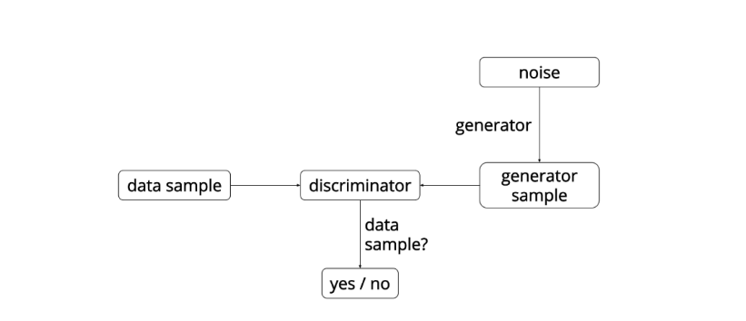
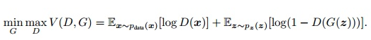
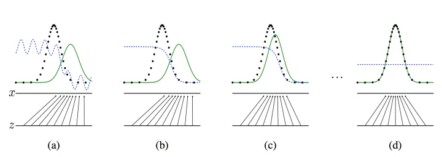
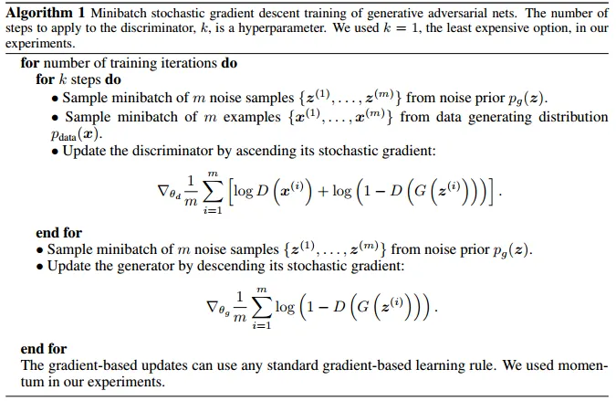
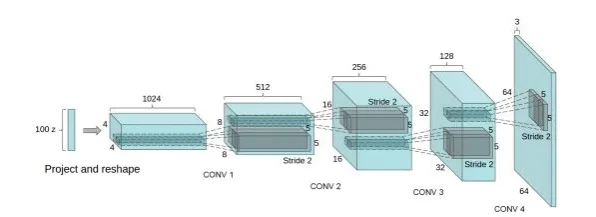
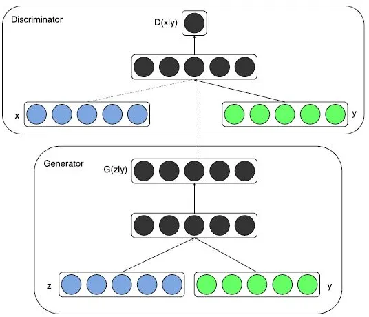
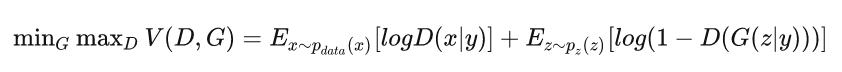

## 生成对抗网络（GAN）

参考：[[知乎](https://zhuanlan.zhihu.com/p/34287744) 2018]

GAN包含有两个模型，一个是生成模型（generative model），一个是判别模型(discriminative model)。生成模型的任务是生成看起来自然真实的、和原始数据相似的实例。判别模型的任务是判断给定的实例看起来是自然真实的还是人为伪造的（真实实例来源于数据集，伪造实例来源于生成模型）。

这可以看做一种零和游戏。论文采用类比的手法通俗理解：生成模型像“一个造假团伙，试图生产和使用假币”，而判别模型像“检测假币的警察”。生成器（generator）试图欺骗判别器（discriminator），判别器则努力不被生成器欺骗。模型经过交替优化训练，两种模型都能得到提升，但最终我们要得到的是效果提升到很高很好的生成模型（造假团伙），这个生成模型（造假团伙）所生成的产品能达到真假难分的地步。

然后GAN网络整体示意如下：

注：这里的G网络的输入是一个符合简单分布如高斯分布或者均匀分布的随机噪声。

结合整体模型图示，再以生成图片作为例子具体说明下面。我们有两个网络，G（Generator）和D（Discriminator）。Generator是一个生成图片的网络，它接收一个随机的噪声z，通过这个噪声生成图片，记做G(z)。Discriminator是一个判别网络，判别一张图片是不是“真实的”。它的输入是x，x代表一张图片，输出D（x）代表x为真实图片的概率，如果为1，就代表100%是真实的图片，而输出为0，就代表不可能是真实的图片。

### GAN模型优化训练

在训练过程中，生成网络的目标就是尽量生成真实的图片去欺骗判别网络D。而网络D的目标就是尽量把网络G生成的图片和真实的图片分别开来。这样，G和D构成了一个动态的“博弈过程”。这个博弈过程具体是怎么样的呢？

先了解下**纳什均衡**，纳什均衡是指博弈中这样的局面，对于每个参与者来说，只要其他人不改变策略，他就无法改善自己的状况。对应的，对于GAN，情况就是生成模型 G 恢复了训练数据的分布（造出了和真实数据一模一样的样本），判别模型再也判别不出来结果，准确率为 50%，约等于乱猜。这是双方网路都得到利益最大化，不再改变自己的策略，也就是不再更新自己的权重。

GAN模型的目标函数如下

在这里，训练网络D使得最大概率地分对训练样本的标签（最大化log D(x)和 log(1−D(G(z))) ），训练网络G最小化log(1 – D(G(z)))，即最大化D的损失。而训练过程中固定一方，更新另一个网络的参数，交替迭代，使得对方的错误最大化，最终，G 能估测出样本数据的分布，也就是生成的样本更加的真实。

> 或者我们可以直接理解G网络的loss是log(1−D(G(z))，而D的loss是−(log(D(x))+log(1−D(G(z)))

然后从式子中解释对抗，我们知道G网络的训练是希望D(G(z))趋近于1，也就是正类，这样G的loss就会最小。而D网络的训练就是一个2分类，目标是分清楚真实数据和生成数据，也就是希望真实数据的D输出趋近于1，而生成数据的输出即D(G(z))趋近于0，或是负类。这里就是体现了对抗的思想。

然后，这样对抗训练之后，效果可能有几个过程，原论文画出的图如下：

黑色的线表示数据x的实际分布，绿色的线表示数据的生成分布，蓝色的线表示生成的数据对应在判别器中的分布效果

对于图a，D还刚开始训练，本身分类的能力还很有限，有波动，但是初步区分实际数据和生成数据还是可以的。图b，D训练得比较好了，可以很明显的区分出生成数据。然后对于图c：绿色的线与黑色的线的偏移，蓝色的线下降了，也就是生成数据的概率下降了。那么，由于绿色的线的目标是提升概率，因此就会往蓝色线高的方向移动。那么随着训练的持续，由于G网络的提升，G也反过来影响D的分布。假设固定G网络不动，训练D，那么训练到最优，Dg∗(x)=pdata(x)/(pdata(x)+pg(x))。因此，随着pg(x)趋近于pdata(x),Dg∗(x)会趋近于0.5，也就是到图d。而我们的目标就是希望绿色的线能够趋近于黑色的线，也就是让生成的数据分布与实际分布相同。图d符合我们最终想要的训练结果。到这里，G网络和D网络就处于纳什均衡状态，无法再进一步更新了。

详细的叙述和证明过程见原论文。

然后看下原论文的整体算法：

简单理解：对于辨别器，如果得到的是生成图片辨别器应该输出 0，如果是真实的图片应该输出 1，得到误差梯度反向传播来更新参数。对于生成器，首先由生成器生成一张图片，然后输入给判别器判别并的到相应的误差梯度，然后反向传播这些图片梯度成为组成生成器的权重。直观上来说就是：辨别器不得不告诉生成器如何调整从而使它生成的图片变得更加真实。

### GAN的优缺点

- GNs是一种以半监督方式训练分类器的方法,可以参考我们的[NIPS paper](https://link.zhihu.com/?target=https%3A//arxiv.org/abs/1606.03498)和[相应代码](https://link.zhihu.com/?target=https%3A//github.com/openai/improved-gan).在你没有很多带标签的训练集的时候,你可以不做任何修改的直接使用我们的代码,通常这是因为你没有太多标记样本.我最近也成功的使用这份代码与谷歌大脑部门在[深度学习的隐私方面](https://link.zhihu.com/?target=https%3A//qz.com/814934/ai-can-learn-from-data-without-ever-having-access-to-it/)合写了[一篇论文](https://link.zhihu.com/?target=https%3A//arxiv.org/abs/1610.05755)
- G的参数更新不是直接来自数据样本,而是使用来自D的反向传播
- 理论上,只要是可微分函数都可以用于构建D和G,因为能够与深度神经网络结合做深度生成式模型
- GANs可以比完全明显的信念网络(NADE,PixelRNN,WaveNet等)更快的产生样本,因为它不需要在采样序列生成不同的数据.
- 模型只用到了反向传播,而不需要马尔科夫链
- 相比于变分自编码器, GANs没有引入任何决定性偏置( deterministic bias),变分方法引入决定性偏置,因为他们优化对数似然的下界,而不是似然度本身,这看起来导致了VAEs生成的实例比GANs更模糊.
- 相比非线性ICA(NICE, Real NVE等,),GANs不要求生成器输入的潜在变量有任何特定的维度或者要求生成器是可逆的.
- 相比玻尔兹曼机和GSNs,GANs生成实例的过程只需要模型运行一次,而不是以马尔科夫链的形式迭代很多次.

**劣势**

- 训练GAN需要达到纳什均衡,有时候可以用梯度下降法做到,有时候做不到.我们还没有找到很好的达到纳什均衡的方法,所以训练GAN相比VAE或者PixelRNN是不稳定的,但我认为在实践中它还是比训练玻尔兹曼机稳定的多.
- 它很难去学习生成离散的数据,就像文本
- 相比玻尔兹曼机,GANs很难根据一个像素值去猜测另外一个像素值,GANs天生就是做一件事的,那就是一次产生所有像素, 你可以用BiGAN来修正这个特性,它能让你像使用玻尔兹曼机一样去使用Gibbs采样来猜测缺失值, 我在伯克利大学的课堂上前二十分钟讲到了这个问题.[课程链接](https://link.zhihu.com/?target=https%3A//www.youtube.com/watch%3Fv%3DJRKl9QPiRok%26feature%3Dplayer_embedded),油管视频,请自带梯子~
- 可解释性差,生成模型的分布 Pg(G)没有显式的表达

### GAN的一些经典变种

需要注意的是，在这篇文章中所说的GAN变种基本上都是应用来生成图像的。

**DCGAN:**

DCGAN是继GAN之后比较好的改进，其主要的改进主要是在网络结构上，到目前为止，DCGAN的网络结构还是被广泛的使用，DCGAN极大的提升了GAN训练的稳定性以及生成结果质量。

DCGAN中的G网络示意，相等于普通CNN的逆过程

DCGAN把上述的G和D用了两个卷积神经网络（CNN）。同时对卷积神经网络的结构做了一些改变，以提高样本的质量和收敛的速度，这些改变有： 

- 取消所有pooling层。G网络中使用转置卷积（transposed convolutional layer）进行上采样，D网络中用加入stride的卷积代替pooling。
- 在D和G中均使用batch normalization
- 去掉FC层，使网络变为全卷积网络
- G网络中使用ReLU作为激活函数，最后一层使用tanh
- D网络中使用LeakyReLU作为激活函数

> DCGAN原文：[Unsupervised Representation Learning with Deep Convolutional Generative Adversarial Networks](https://link.zhihu.com/?target=https%3A//arxiv.org/pdf/1511.06434.pdf)

**WGAN和WGAN-GP**

WGAN也是一篇经典，WGAN主要从损失函数的角度对GAN做了改进，损失函数改进之后的WGAN即使在全链接层上也能得到很好的表现结果，具体的来说，WGAN对GAN的改进有：

- 判别器最后一层去掉sigmoid
- 生成器和判别器的loss不取log
- 对更新后的权重强制截断到一定范围内，比如[-0.01，0.01]，以满足论文中提到的lipschitz连续性条件。
- 论文中也推荐使用SGD， RMSprop等优化器，不要基于使用动量的优化算法，比如adam。

> 对于W-GAN的解释有很多，比如[看穿机器学习(W-GAN模型)的黑箱](https://link.zhihu.com/?target=https%3A//mp.weixin.qq.com/s/5gyZqxhdvtH-zIxKini2TQ)。再比如[令人拍案叫绝的Wasserstein GAN](https://zhuanlan.zhihu.com/p/25071913)，有兴趣都可以看下，这篇论文实在经典。
> 原文：[[1701.07875\] Wasserstein GAN](https://link.zhihu.com/?target=https%3A//arxiv.org/abs/1701.07875)

之前的WGAN虽然理论上有极大贡献，但在实验中却发现依然存在着训练困难、收敛速度慢的问题，这个时候WGAN-GP就出来了，它的贡献是：

- 提出了一种新的lipschitz连续性限制手法—梯度惩罚，解决了训练梯度消失梯度爆炸的问题。
- 比标准WGAN拥有更快的收敛速度，并能生成更高质量的样本
- 提供稳定的GAN训练方式，几乎不需要怎么调参，成功训练多种针对图片生成和语言模型的GAN架构

> WGAN-GP原文：[Improved Training of Wasserstein GANs](https://link.zhihu.com/?target=https%3A//arxiv.org/abs/1704.00028)

**Conditional GAN**

因为原始的GAN过于自由，训练会很容易失去方向，从而导致不稳定又效果差。而Conditional GAN就是在原来的GAN模型中加入一些先验条件，使得GAN变得更加的可控制。具体的来说，我们可以在生成模型G和判别模型D中同时加入条件约束y来引导数据的生成过程。条件可以是任何补充的信息，如类标签，其它模态的数据等。然后这样的做法应用也很多，比如图像标注，利用text生成图片等等。

Conditional GAN整体架构

对比之前的目标函数，Conditional GAN的目标函数其实差不多：

就是多了把噪声z和条件y作为输入同时送进生成器火热把数据x和条件y作为输入同时送进判别器（如上整体架构图）。这样在外加限制条件的情况下生成图片。

> 我觉得GAN额外加一些其他东西，这样的做法是一大类，可以深挖做其他应用的！
> 原文：[Conditional Generative Adversarial Nets](https://link.zhihu.com/?target=http%3A//xueshu.baidu.com/s%3Fwd%3Dpaperuri%3A%282bc8c7a28835ef2a599ea0df524c1867%29%26filter%3Dsc_long_sign%26tn%3DSE_xueshusource_2kduw22v%26sc_vurl%3Dhttp%3A%2F%2Farxiv.org%2Fpdf%2F1411.1784v1.pdf%26ie%3Dutf-8%26sc_us%3D6422065203626979588)