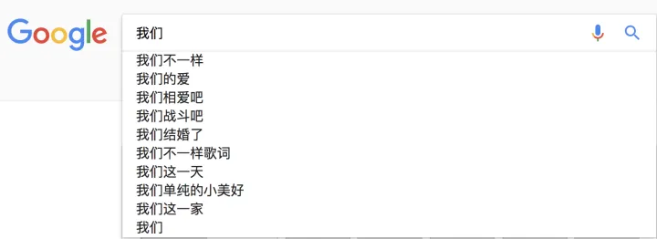
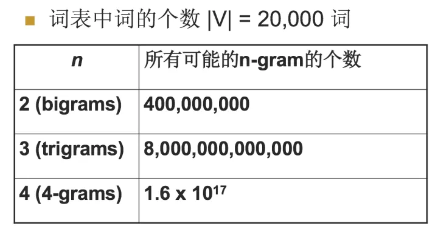

# 自然语言处理中N-Gram模型介绍

参考：[知乎](https://zhuanlan.zhihu.com/p/32829048)

### 1. 什么是n-gram模型

N-Gram是一种基于统计语言模型的算法。它的基本思想是将文本里面的内容按照字节进行大小为N的滑动窗口操作，形成了长度是N的字节片段序列。

每一个字节片段称为gram，对所有gram的出现频度进行统计，并且按照事先设定好的阈值进行过滤（出现频率太低的会被过滤掉），形成关键gram列表，也就是这个文本的向量特征空间，列表中的每一种gram就是一个特征向量维度。

该模型基于这样一种假设，第N个词的出现只与前面N-1个词相关，而与其它任何词都不相关，整句的概率就是各个词出现概率的乘积。这些概率可以通过直接从语料中统计N个词同时出现的次数得到。常用的是二元的Bi-Gram和三元的Tri-Gram。

说完了n-gram模型的概念之后，下面讲解n-gram的一般应用。

### 2. n-gram模型用于评估语句是否合理

当预测当前位置是哪个单词时，可以计算 $P(w_1, w_2, ..., w_m) = P(w_i \vert w_{i-n+1, ..., w_{i-1}})$ ，（马尔科夫假设，当前词的概率只和前面几个词有关）。在实际情况中也确实如此。

下面给出一元模型，二元模型，三元模型的定义：

当 n=1, 一个一元模型（unigram model)即为 ：$ P(w_1, w_2, ..., w_m) = \prod\limits^m_{i=1} P(w_i) $

当 n=2, 一个二元模型（bigram model)即为 ：$ P(w_1, w_2, ..., w_m) = \prod\limits^m_{i=1} P(w_i \vert w_{i-1}) $

当 n=3, 一个三元模型（trigram model)即为：$ P(w_1, w_2, ..., w_m) = \prod\limits^m_{i=1} P(w_i \vert w_{i-1}w_{i-2}) $

然后下面的思路就很简单了，在给定的训练语料中，利用贝叶斯定理，将上述的条件概率值（**因为一个句子出现的概率都转变为右边条件概率值相乘了**）都统计计算出来即可。

如果给定两个句子，用2-gram的模型去分析哪个句子更合理，可以用上面的概率模型直接计算，哪个概率大哪个更合理。（具体看[知乎](https://zhuanlan.zhihu.com/p/32829048)中算s1和s2的概率的例子）

### 3. n-gram模型一个常见应用

那么原理是什么呢？也就是我打入“我们”的时候，后面的“不一样”，”的爱“这些是怎么出来的，怎么排序的？

实际上是根据语言模型得出。假如使用的是二元语言模型预测下一个单词：

排序的过程就是：

p(”不一样“|"我们")>p(”的爱“|"我们")>p(”相爱吧“|"我们")>.......>p("这一家"|”我们“)，这些概率值的求法和上面提到的完全一样，数据的来源可以是用户搜索的log。

### 4. n-gram的n大小对性能的影响

- n更大的时候

  n: 对下一个词出现的约束性信息更多，更大的辨别力，但是更稀疏，并且n-gram的总数也更多，为 $V^n$ 个（V为词汇表的大小）

- n更小的时候

  在训练语料库中出现的次数更多，更可靠的统计结果，更高的可靠性 ，但是约束信息更少

其中当N为特定值的时候，我们来看一下n-gram可能的总数，如下表：

对于上图，我用一个例子来进行解释，加入目前词汇表中就只有三个单词，”我爱你“，那么bigram的总数是3^2=9个，有”我我“，我爱，我你，爱爱，爱你，爱我，你你，你我，你爱这9个,所以对应上面的表示是bigrams是20000^2=400000000,trigrams=20000^3 = 8*10e12