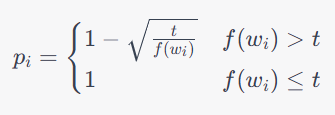

### 下采样和负采样

负采样（Negative Sampling）和下采样（Subsampling）是用于处理大规模数据集中高频词的两种常见的词向量训练技术。

下采样是一种对高频词进行减少采样的技术，其主要思想是在训练过程中丢弃一部分高频词，使得低频词能够得到更多的训练，从而提高低频词的表示效果。具体来说，对于每个单词 $w_i$，下采样算法会计算一个概率 $p_i$，该单词将以 $p_i$ 的概率被丢弃，以 $1-p_i$ 的概率被保留下来参与训练。常用的下采样算法是基于单词在数据集中的出现频率 $f(w_i)$ 和一个预设的下采样阈值 $t$ 计算 $p_i$ 的值：

其中，$t$ 是一个预先设定的阈值，通常在 $10^{-4}$ 到 $10^{-5}$ 之间。

负采样是一种通过随机采样负样本来近似计算softmax函数的技术，其主要思想是对每个中心词 $w_c$，以及对应的上下文词 $w_o$，随机采样 $k$ 个噪声词 $w_n$，然后将这些词组成一组样本，通过最大化样本的条件概率来学习词向量。具体来说，对于一个给定的中心词 $w_c$ 和一个上下文词 $w_o$，我们需要最大化以下目标函数：

其中，$\mathbf{v}*{w_c}$ 和 $\mathbf{v}*{w_o}$ 分别是中心词 $w_c$ 和上下文词 $w_o$ 的词向量，$k$ 是采样的噪声词数量，$\sigma(x)=1/(1+\exp(-x))$ 是sigmoid函数，$P_n(w)$ 是噪声词的分布，通常选择一些高频词作为噪声词，例如以 $f(w_i)^{0.75}/\sum_jf(w_j)^{0.75}$ 的概率选择单词 $w_i$。

总的来说，下采样是一种在数据预处理阶段进行的。