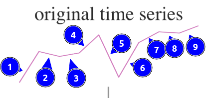
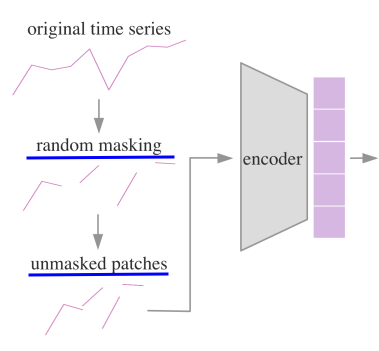
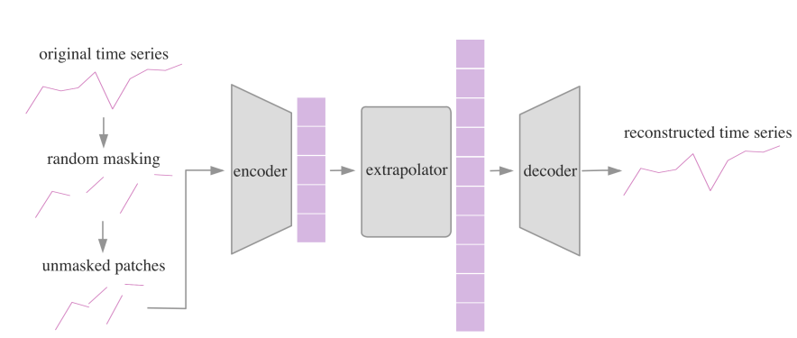

## TIME SERIES GENERATION WITH MASKED AUTOENCODER

使用MAE产生时序数据

---


### 摘要

ExtraMAE(MAE with extrapolator)是一种可扩展的用于时序生成的自监督模型。E-MAE随即mask掉一些原时间序列，然后通过恢复这些masked patches学习时间动态(temporal dynamics)。本文的方法有两个核心设计。

**一、**E-MAE是自监督的。监督让E-MAE高效的捕捉原时间序的时间动态信息。

**二、** E-MAE提出了一个外推器(extrapolator)来分离解码器的两个工作：恢复潜在的表示并将其映射回特征空间。

这两个独特的设计让E-MAE在时序生成中的表现由于SoTA。这种轻量级的架构使E-MAE更快更易扩展。E-MAE在各种下游任务中展示了出色的结果，例如：时序分类、预测、补插imputation(?)。作为一个自监督生成模型，E-MAE允许对合成数据进行显式管理。作者希望本文将通过自我监督模型迎来时间序列生成的新时代。


### 2.方法

E-MAE从部分观测中恢复原始信号。E-MAE有三部分组成：encoder, extrapolator, decoder。encoder之作用于unmasked patches。一旦masked patches被编码，我们把unmasked patches的潜在表示外推到所有patches的潜在表示（masked and unmasked patches）。最后，decoder把完成的潜在表示映射回特征空间。我门现在陈述问题，并介绍模型架构的细节。

- **Multivariate time series，多元时间序列**

  我们这样表示时间序列（time series）$ X = [x_1|x_2|...|x_L]\in\mathbb{R}^{d\times L} $  作为 $L$ 观测的一个序列。每个观测$ x_i = (x^1_i,x^2_i,...,x^d_i)^T\in\mathbb R^d $  由 $d$ 个特征组成，其中$ i = 1,2,...,L $.

- **Patches**

  我们把上述时间序列$ X \in \mathbb{R}^{d\times L} $ 切片成 $T$ 个规则的不重叠的patches $\{P_1,P_2,...,P_T\}$。第 $j$ 个patch $P_j\in\mathbb{R}^{d\times l} $ 由 $l = {L\over T}$ 个连续的观测组成，其中 $P_j = [x_{(j-1)l+1},x_{(j-1)l+2},...,x_{(j)l+1}]$ ，其中 $j = 1,2,...,T$。这里，$T$ 和 $l$ 都是 $L$ 的除数。在图 **1** 中，原时间序列由9条线组成，因此我们可以把时间序列分成 $T = 9$ 个patches。每个patch是一条线。

  

- **Masking**

  选 $m$ 个patches进行mask，剩下的不动($l-m$个)。masked patches的索引集合 $M = \{j_1,j_2,...j_m\} \subset \{1,2,...,T\}$。unmasked patches的索引集合 $N = \{1,2,...,T\}/M = \{k_1,k_2,...,k_n\}$ ，这里 $m + n = T$ 。为了简单起见，我们这样表示invisible masked patches $P_M = [P_{j1}|P_{j2}|...|P_{jm}]$ ，visible unmasked patches表示为 $P_N = [P_{k1}|P_{k2}|...|P_{kn}]$ 。注意在masked patch中的所有元素 $P_j \in \mathbb{R}^{d \times l} $ 将作为一个整体被移除，其中 $j \in M = \{j_1,j_2,...,j_m\}$。在图 **1 **中，我们随机maks $m = 4$ 个patches，同时，把剩下的 $n = 5$ 个patches合在一起得到 $P_N$ 。一条线一旦被masked掉就作为一个整体消失。masked patches的索引集合是 $M = \{3,5,7,9\}$。unmasked patches的索引集合 $N = \{1,2,4,6,8\}$。

  

- **Encoder**（维度的推导？）

  encoder只作用visible，unmasked patches $P_N \in \mathbb{R}^{d \times (n \cdot l)}$ 。encoder把unmasked patches $P_N \in \mathbb{R}^{d \times (n \cdot l)}$ 映射成它的潜在表示 $H_N \in \mathbb{R}^{h \times (n \cdot l)}$ 。这里 $h$ 是潜在空间(latent space)的维度。在图 **1** 中，encoder 把 $P_N = [P_1|P_2|P_4|P_6|P_8]$ 映射成了他们的潜在表示(整幅图左边的紫色方块)。我们把encoder表示成一个函数 $E : \prod_{k=1}^{n \cdot l}(\mathbb{R}^d)_k \to \prod_{k=1}^{n \cdot l}(\mathbb{R}^h)_k$ ，它的作用是把unmaksed patches $P_N$ 转化成他们的潜在表示 $H_N$ 。
  $$
  H_N = E(P_N)
  $$
  我们用一个**<u>堆叠的RNN</u>**(stacked RNN)实现函数 $E$ ，后面**<u>紧跟一个全连接层</u>**。注意encoder只作用于visible patches，跟masked tokens没关系。

  

- **Extrapolator**

  extrapolator恢复masked掉位置的潜在表示。我们把extrapolator表示成一个函数 $I : \prod_{k=1}^{n \times l}(\mathbb{R}^h)_k \to \prod_{k=1}^{T \times l}(\mathbb{R}^h)_k$ ，用来从visible邻居之间外推出遗失的(missing, masked)潜在表示。在图 **1** 中，extrapolator从unmasked patches的潜在表示 $H_N$ (左边紫色方块)推断出了所有patches的潜在表示 $\tilde{H}$ (右边的紫色方块)。我们用一个<u>**全连接层**</u>实现函数 $I$。一个堆叠的RNN加一个全连接层
  $$
  \tilde{H} = I(H_N)
  $$
  

- **Decoder**

  decoder从extrapolator输出的潜在表示中重建原始信号。我们把decoder表示成 $D : \prod_{k=1}^{T \cdot l}(\mathbb{R}^h)_k \to \prod_{k=1}^{T \cdot l}(\mathbb{R}^d)_k$ ，它把潜在表示 $\tilde{H} \in \mathbb{R}^{h \times (T \cdot l)}$ 映射成合成的时间序列 $\hat{X} \in \mathbb{R}^{d \times (T \cdot l)}$ 。和encoder一样，$D$ 的实现是**<u>一个堆叠的RNN加一个全连接层</u>**。
  $$
  \hat{X} = D(\tilde{H})
  $$
  

- **Training** 

  首先，从原始的时间序列 $X$ 中随机mask一些patches。然后，E-MAE接收unmasked patches $P_N$ 并生成重建的时间序列 $\hat{X}$。我们的损失函数计算**<u>MSE损失</u>**，在重建的时间序列 $\hat{X}$ 和原始的时间序列 $X$ in $\mathbb{R}^{d \times (T \cdot l)}$。预计损失是：
  $$
  \ell_{recon} = \mathbb{E}_X||X - \hat{X}||_2
  $$
  **<u>不像MAE那样只计算masked patches上的损失</u>**，我们计算所有patches的损失。整体重建损失 $\ell_{recon}$ 确保重建的时间序列 $\hat{X}$ 保持了原始时间序 $X$ 的连续性。


- **Generation**

  ```tex
  1. 
  ```

  
