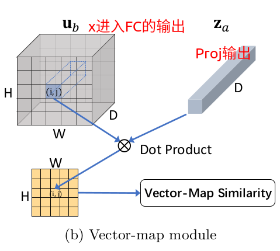
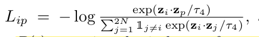
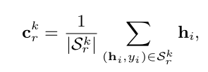

## Few-Shot Classification with Contrastive Learning


### 创新

在pre-training和meta-training中都加入了`instance-discriminative contrastive learning`

- pre-training

  加入了map-map和vector-map的自监督contrastive loss损失。

- meta-training

  将`contrastive learning`和正常的episodic训练结合。

  定义了`distance-scaled contrastive loss`，用来提升表示的传递性。


### 训练框架


其中，

```json
DA: '数据扩增'， // 把N个样本扩增到
CNN： '提取特征', //(C, H, W)
GAP: '全局特征', // (C), 输出h
Proj: '映射成D维的向量', // C -> D，一个隐层的MLP实现，输出z
Attn: '注意力机制', // 把number of heads修改为1
```


### pre-training

- 创新点


- 作用：

  self-supervision能提高表示的广泛性。

  使用supervised contrastive loss能捕捉相同类中不同实例之间的联系。

  

- 损失定义

  

  1. 

  

  其中，
  $$
  z_i:第一个view中Proj的输出，\\
  z_i^,: 第一个view中Proj的输出 \\
  \mathbb{1}:  indicator function
  $$
  

  2. 

     提高表示的鲁棒性。

     

     - **map-map**

       

       

       

       其中，

       $ f_q,f_k,f_v把输入的x_i分别映射成 $ query, key, value: $ q_i,k_i,v_i $

       

       

       两个view输入的x之间的相似度：

       

       维度：

       

       

       

       

     - **vector-map** 

       

       

       **FC的输出：**

       

       

       

  3. 

     

     其中，

     

     $ P(i) $ 是除i外的所有索引的集合。


### Meta-training 

- 创新点

  `cross-viewepisodic training`机制

  

  在GAP之后计算prototype

  

  其中，

  $ S_r^k $是第r个view第k个类的support set，r = {1,2}，k = {1, 2, ..., M}，M是train set一共M个类。

  

  使用`Attn`去aligned prototype

  

  基于上述结果

  

