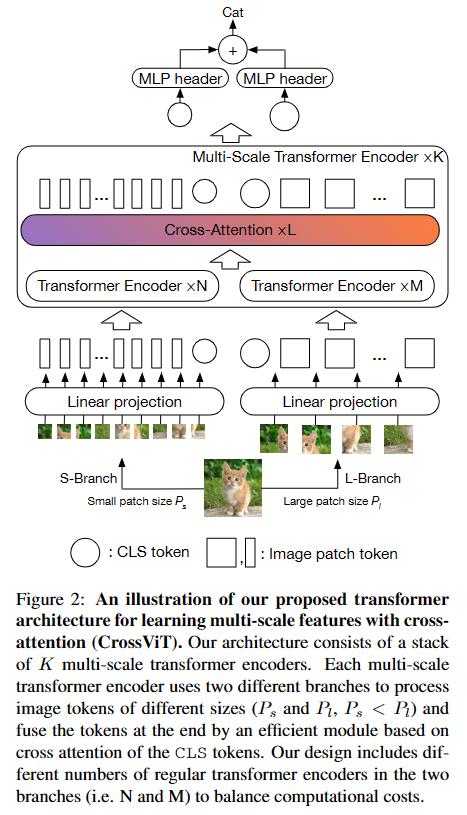
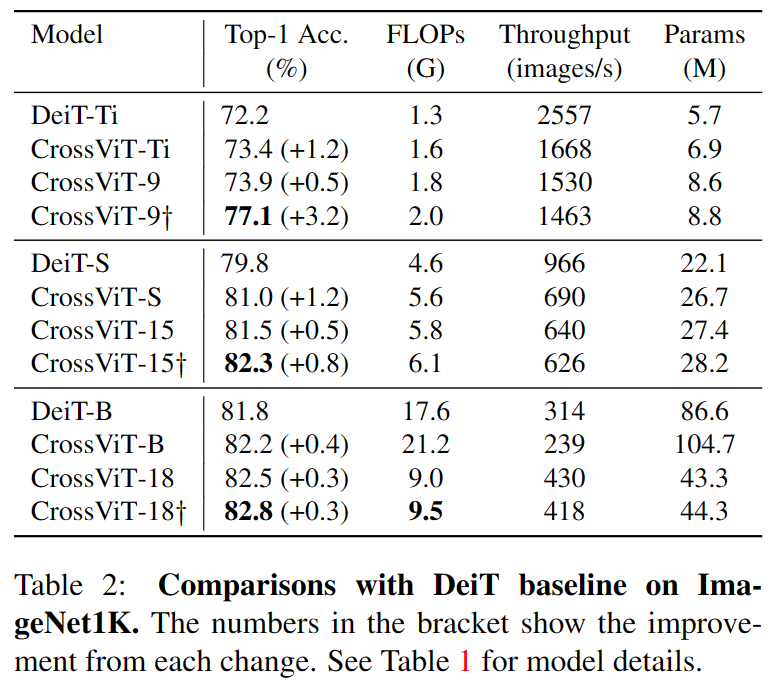
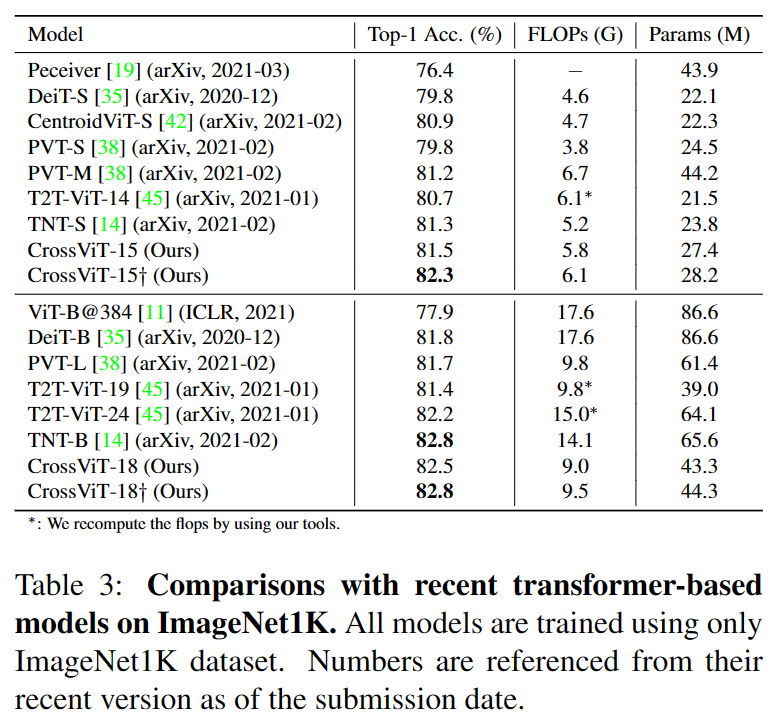
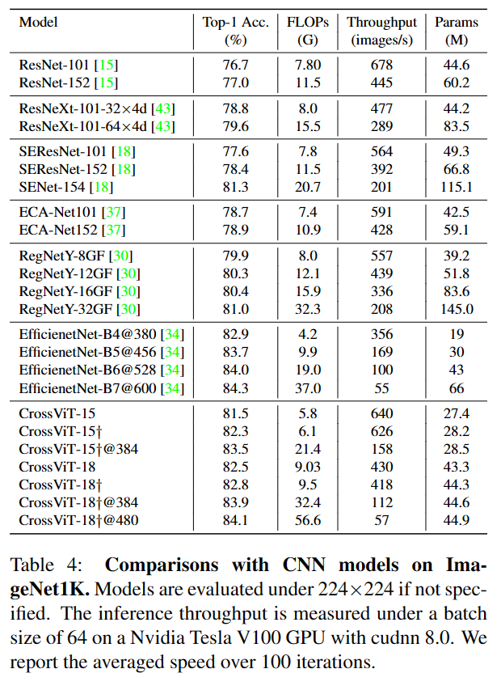
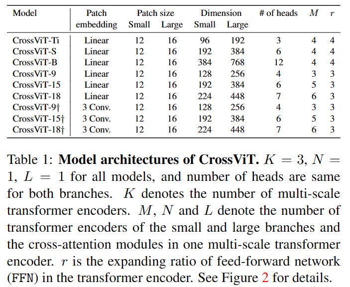

## CrossViT: Cross-Attention Multi-Scale Vision Transformer for Image Classification

作者：Chun-Fu (Richard) Chen（MIT & IBM）

来源：ICCV 2021

论文：[[thecvf](https://openaccess.thecvf.com/content/ICCV2021/papers/Chen_CrossViT_Cross-Attention_Multi-Scale_Vision_Transformer_for_Image_Classification_ICCV_2021_paper.pdf)]

代码：[[github](https://github.com/IBM/CrossViT)]

引用数：375

#### 前提

Multi-Scale：Single scale 就是指一个图片送给CNN一个图片，对应的Multi scale 一般是会送给CNN十张图片，比如高宽是256***256的图片，multi scale 则会在四个角和中心crop 5个224\***224，再把五个crop的图片flip ,总共得到十个图片送给CNN。

### 创新点

把图像分成小的patch序列和大的patch序列分别送入两个Traansformer的encoder中，出来的两组特征（包括两个cls_token）送入交叉注意力模块，得到新的两组特征，这时只有两个cls_token过两个MLP，最后把过MLP之后token cat或stack到一起，在维度为0（batch维度）取平均，得到最后的分类logits（后面使用有监督的交叉熵损失）。

### 实验结果

| 和baseline比                                                | 基于Transformer的方法                                       | 基于卷积的方法                                              |
| ----------------------------------------------------------- | ----------------------------------------------------------- | ----------------------------------------------------------- |
|  |  |  |

| CrossViT网络结构                                            |
| ----------------------------------------------------------- |
|  |

