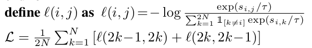
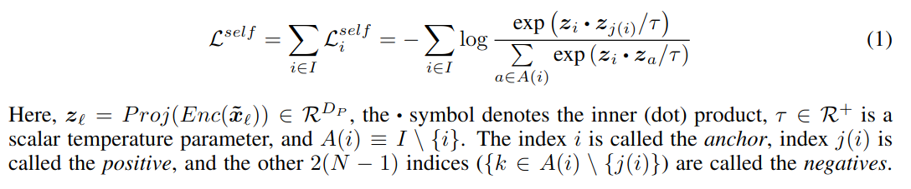
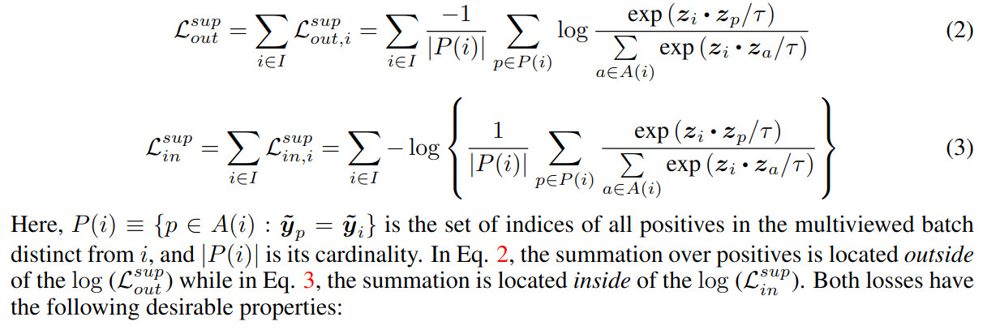
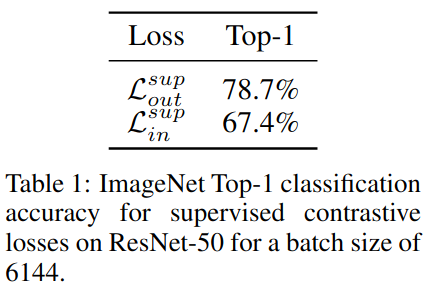
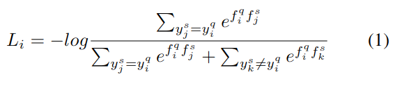
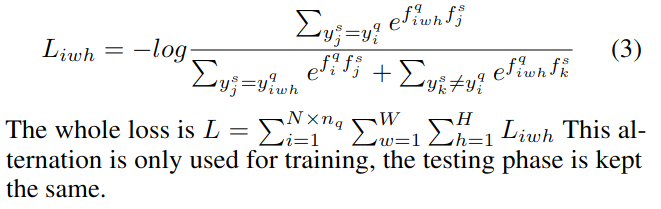

### 0. 对比损失表格


### 1. SimCLR中的损失

论文：[[arxiv](https://arxiv.org/pdf/1807.03748)]

代码：[[github](https://github.com/sthalles/SimCLR/blob/master/simclr.py)]

#### 损失公式

SimCLR论文中给出的公式：



Supervised contrastive learning 论文中给出的公式：



#### 代码实现

数据集：[[斯坦福大学stl10](https://cs.stanford.edu/~acoates/stl10/)]，10个类，96x96的彩色图像，每个类500训练图片，800测试图片。

- 前提的参数

  | 参数       | 值   | 备注                                         |
  | ---------- | ---- | -------------------------------------------- |
  | batch_size | 256  |                                              |
  | n_views    | 2    | 对256个样本作论文中提到的数据扩增，256*2=512 |
  | temperture | 0.07 | 损失公式中的 $\tau$                          |
  | out_dim    | 128  | 从embedding网络中出来的维度：(512,128)       |

  

```python
def info_nce_loss(self, features):  # (512,128)
	# [0, 1, ..., 255, 0, 1, ..., 255]
    labels = torch.cat([torch.arange(self.args.batch_size) for i in range(self.args.n_views)], dim=0)   # (512,)
    # 对角线全是1，单位矩阵
    '''
    [0, 1, 0, 1] == [0, 1, 0, 1].T
    1 0 1 0
    0 1 0 1
    1 0 1 0
    0 1 0 1
    '''
    labels = (labels.unsqueeze(0) == labels.unsqueeze(1)).float()   # (512,512)   
    labels = labels.to(self.args.device)

    features = F.normalize(features, dim=1) # (512, 128)  # 送入对比损失之前要归一化
	# 归一化之后做点积相当于是余弦相似度，
    # 特征之间两两做矩阵乘法，对角线上是自己和自己的相似度
    similarity_matrix = torch.matmul(features, features.T)  # (512,512)

    # discard the main diagonal from both: labels and similarities matrix
    # 从标签和相似度矩阵中删除主对角线(自己x自己)，即对角线是False
    mask = torch.eye(labels.shape[0], dtype=torch.bool).to(self.args.device)    # (512,512)
    '''
    o o o	x o o	o o
    o o o	o x o	o o
    o o o	o o x	o o
    '''
    labels = labels[~mask].view(labels.shape[0], -1)    # (512,511)    # 把除了自己的样本标签留下
    similarity_matrix = similarity_matrix[~mask].view(similarity_matrix.shape[0], -1)   # (512,511)

    # select and combine multiple positives
    # 选择并组合多个正样本
    positives = similarity_matrix[labels.bool()].view(labels.shape[0], -1)  # (512,1)

    # select only the negatives
    # 只选择负样本
    negatives = similarity_matrix[~labels.bool()].view(similarity_matrix.shape[0], -1)  # (512,510)

    logits = torch.cat([positives, negatives], dim=1)   # (512,511)   # infoNCE的分母
    # 正样本都在第0个位置
    labels = torch.zeros(logits.shape[0], dtype=torch.long).to(self.args.device)    # (512,)

    logits = logits / self.args.temperature # (512,511)
    return logits, labels   # (512,)
    
# 计算损失
logits, labels = info_nce_loss(features)
criterion = torch.nn.CrossEntropyLoss()
loss = criterion(logits, labels)
```


### 2. 监督对比损失

论文：[[neurips](https://proceedings.neurips.cc/paper/2020/file/d89a66c7c80a29b1bdbab0f2a1a94af8-Paper.pdf)]

代码：[[github](https://github.com/HobbitLong/SupContrast)]

#### 损失公式

论文中给出了两个形式的损失（一个在log外，一个在里边）：



论文中，在这两个公式下面详细的介绍了这两个损失的区别。并说明了在计算对比损失之前，对特征进行归一化的必要性。



在经过一系列的数学证明之后，作者的出结论：使用 $\mathcal{L}^{sup}_{out}$ 。

#### 监督对比损失和Triple Loss，N-pairs Loss的联系

> In the Supplementary, we show that the triplet loss is a special case of the contrastive loss when one positive and one negative are used. When more than one negative is used, we show that the SupCon loss becomes equivalent to the N-pairs loss.

- 三元损失是对比损失的一种特殊情况，当只使用一个正样本和一个负样本时。
- 负样本大于一个时，SupCon Loss就等于N-pairs损失。

#### 代码实现

这个代码可以实现SimCLR的同源图像的InfoNCE损失，和监督损失的同类图像的InfoNCE损失，要求输入的特征经过l2归一化，如果再输入labels，那么计算的就是监督损失，不输入labels就是SimCLR的损失（因为SimCLR默认第一列是正样本对）。

- 前提参数

  | 参数             | 值          | 备注                               |
  | ---------------- | ----------- | ---------------------------------- |
  | batch_size       | 256         |                                    |
  | n_views          | 2           | 和SimCLR中的一样                   |
  | labels           | (256,)      | 对于cifar10来说，256个[0-9]的标签  |
  | features         | (256,2,128) | 输入损失函数的是特征               |
  | out_dim          | 128         | 从embed网络出来的维度              |
  | temperature      | 0.1         | 用来和base_temperature一起计算损失 |
  | base_temperature | 0.07        | 和SimCLR中的一样                   |

- 对损失公式代码实现的讨论

  ```tex
  https://github.com/HobbitLong/SupContrast/issues/110
  https://github.com/HobbitLong/SupContrast/issues/116
  https://github.com/HobbitLong/SupContrast/issues/102
  https://github.com/HobbitLong/SupContrast/issues/64	（作者解释分母包含同类和不包含同类的作用）
  https://zhuanlan.zhihu.com/p/268685814	（解释log_prob = logits - torch.log(exp_logits.sum(1, keepdim=True))）
  ```


- 代码中变量的解释

  | 变量                            | 值        | 备注                                                     |
  | ------------------------------- | --------- | -------------------------------------------------------- |
  | mask                            | (512,512) | 同类样本对应位置是1，其他是0，用来过滤正样本之间的相似度 |
  | logits_mask                     | (512,512) | 对角线全0的矩阵，用来过滤样本自己和自己的相似度          |
  | logits                          | (512,512) | 相似度矩阵                                               |
  | exp_logits.sum(1, keepdim=True) | (512,512) | 公式中的分母，每一行的和表示该样本和所有样本的相似度     |

实现公式的计算：

```python
log_prob = logits - torch.log(exp_logits.sum(1, keepdim=True))  # (512,512)

# compute mean of log-likelihood over positive
# 公式(2)中的：\frac{1}{\vert P(i) \vert}
mean_log_prob_pos = (mask * log_prob).sum(1) / mask.sum(1)  # (512,)

# loss
loss = - (self.temperature / self.base_temperature) * mean_log_prob_pos  # (512,)
loss = loss.view(anchor_count, batch_size).mean()   # (2,256).mean()

return loss
```


```python
def forward(self, features, labels=None, mask=None):    # features(256,2,128) labels(256,): [cifar10: 256个0-9内的数]
    """Compute loss for model. If both `labels` and `mask` are None,
        it degenerates to SimCLR unsupervised loss:
        https://arxiv.org/pdf/2002.05709.pdf

        Args:
            features: hidden vector of shape [bsz, n_views, ...].
            labels: ground truth of shape [bsz].
            mask: contrastive mask of shape [bsz, bsz], mask_{i,j}=1 if sample j
                has the same class as sample i. Can be asymmetric.
        Returns:
            A loss scalar.
        """
    device = (torch.device('cuda')
              if features.is_cuda
              else torch.device('cpu'))

    if len(features.shape) < 3:
        raise ValueError('`features` needs to be [bsz, n_views, ...],'
                         'at least 3 dimensions are required')
        if len(features.shape) > 3:
            features = features.view(features.shape[0], features.shape[1], -1)  # (256,2,128)

            batch_size = features.shape[0]  # 256
            if labels is not None and mask is not None:
                raise ValueError('Cannot define both `labels` and `mask`')
            elif labels is None and mask is None:
                mask = torch.eye(batch_size, dtype=torch.float32).to(device)
            elif labels is not None:
                labels = labels.contiguous().view(-1, 1)    # (256,1)
                if labels.shape[0] != batch_size:
                    raise ValueError('Num of labels does not match num of features')
                    mask = torch.eq(labels, labels.T).float().to(device)    # (256,256) 和SimCLR中的(labels.unsqueeze(0) == labels.unsqueeze(1))等价
                else:
                    mask = mask.float().to(device)

                    contrast_count = features.shape[1]  # 2
                    contrast_feature = torch.cat(torch.unbind(features, dim=1), dim=0)  # (512,128)
                    if self.contrast_mode == 'one': # 只取第一个图片当anchor，(256,128)
                        anchor_feature = features[:, 0]
                        anchor_count = 1
                    elif self.contrast_mode == 'all':
                        anchor_feature = contrast_feature   # (512,128)
                        anchor_count = contrast_count   # 2
                    else:
                        raise ValueError('Unknown mode: {}'.format(self.contrast_mode))

                        # compute logits
                        anchor_dot_contrast = torch.div(
                            torch.matmul(anchor_feature, contrast_feature.T),
                            self.temperature)   # (512,512) 相似度矩阵
                        # for numerical stability   (归一化)
                        logits_max, _ = torch.max(anchor_dot_contrast, dim=1, keepdim=True)  # (512,1)
                        logits = anchor_dot_contrast - logits_max.detach()  # (512,512) 归一化之后的相似度矩阵

                        # tile mask
                        mask = mask.repeat(anchor_count, contrast_count)    # (256,256) -> (512,512)
                        # mask-out self-contrast cases
                        logits_mask = torch.scatter(    # 最后返回一个对角线全0，其他位置全1的矩阵，和SimCLR中的~mask等价
                            torch.ones_like(mask),  # 需要替换的张量 (512,512)
                            1,  # 在dim=1上替换 self[i][index[i][j]] = src[i][j]
                            torch.arange(batch_size * anchor_count).view(-1, 1).to(device),  # index (512,1)
                            0   # src
                        )   # (512,512)
                        mask = mask * logits_mask   # (512,512) 把mask对角线上的1全变成0

                        # compute log_prob
                        exp_logits = torch.exp(logits) * logits_mask    # (512,512) 不包含自己x自己的相似度矩阵，A(i)集合
                        # ？这行代码的讨论：https://github.com/HobbitLong/SupContrast/issues/110
                        # log(a/b) = log(a) - log(b)
                        # logits 的 exp 和 log 抵消了，所以只要logits本身即可
                        log_prob = logits - torch.log(exp_logits.sum(1, keepdim=True))  # (512,512)

                        # compute mean of log-likelihood over positive
                        # 公式(2)中的：\frac{1}{\vert P(i) \vert}
                        mean_log_prob_pos = (mask * log_prob).sum(1) / mask.sum(1)  # (512,)

                        # loss
                        loss = - (self.temperature / self.base_temperature) * mean_log_prob_pos  # (512,)
                        loss = loss.view(anchor_count, batch_size).mean()   # (2,256).mean()

                        return loss
```

### 3.监督对比损失：patch loss(小样本)

论文：[[aaai](https://ojs.aaai.org/index.php/AAAI/article/download/17047/16854)]

代码：[[github](https://github.com/corwinliu9669/Learning-a-Few-shot-Embedding-Model-with-Contrastive-Learning)]

#### 损失公式

InfoNCE的公式：



Patch Loss的公式：



#### 代码实现

以 5-way 1-shot 6-query 为例。

##### 计算相似度矩阵（在模型的forward的函数里实现）

- 计算相似度时的前提参数

  | 参数   | 值             | 备注                   |
  | ------ | -------------- | ---------------------- |
  | xtrain | (4,5,3,84,84)  | support set            |
  | xtest  | (4,30,3,84,84) | query set              |
  | ytrain | (4,5,5)        | support one hot labels |
  | ytest  | (4,30,5)       | query one hot labels   |

  ```python
  # (4, 5, 3, 84, 84), (4, 30, 3, 84, 84), (4, 5, 5), (4, 30, 5)
  def forward(self, xtrain, xtest, ytrain, ytest):    
      batch_size, num_train = xtrain.size(0), xtrain.size(1)  # 4, 5
      num_test = xtest.size(1)    # 30
      # K = ytrain.size(2)
      # 好像没啥用？one_hot矩阵转置不变
      ytrain = ytrain.transpose(1, 2)  # (4, 5, 5)
  
  
      xtrain = xtrain.view(-1, xtrain.size(2), xtrain.size(3), xtrain.size(4))    # (20, 3, 84, 84)
      xtest = xtest.view(-1, xtest.size(2), xtest.size(3), xtest.size(4)) # (120, 3, 84, 84)
      x = torch.cat((xtrain, xtest), 0)   # (140, 3, 84, 84)  把一个batch的support 和 query set送进模型
      # ResNet-12 做embedding
      f = self.base(x)    # (140, 512, 11, 11)
      # 经过一个线性层进行分类，这个参数后面用来做普通的交叉熵分类损失
      global_cls = self.clasifier(f)  # (140, 64, 11, 11)     经过了一个线性层512->64，Cond2d
  
      ftrain = f[:batch_size * num_train] # (20, 512, 11, 11) support
      ftrain = ftrain.view(batch_size, num_train, -1) # (4, 5, 61952)
      # 这个好像也没用，和单位单位矩阵(one_hot矩阵)相乘不变
      ftrain = torch.bmm(ytrain, ftrain)  # 矩阵乘法 (4, 5, 5) (4, 5, 61952) -> (4,5,61952)
      # 归一化
      ftrain = ftrain.div(ytrain.sum(dim=2, keepdim=True).expand_as(ftrain))  # 除法
      ftrain = ftrain.view(batch_size, -1, *f.size()[1:]) # (4, 5, 512, 11, 11)
      ftest = f[batch_size * num_train:]  # (120, 512, 11, 11)   query
      if self.training:
          # mask掉11x11中的一个位置
          ftrain = random_block(ftrain)   # 对 support block
          ftest = ftest.view(batch_size, num_test, *f.size()[1:])     # (4, 30, 512, 11, 11)
          # 把query和support转换为相同大小
          # (4, 30, 5, 512, 11, 11), (4, 30, 5, 512, 11, 11) <- (4, 5, 512, 11, 11)(4, 30, 512, 11, 11)
          ftrain, ftest = self.reform(ftrain, ftest)  
          ftrain = ftrain.mean(4)  # (4, 30, 5, 512, 11)
          ftrain = ftrain.mean(4)  # (4, 30, 5, 512)   # GAP
          if not self.training:
              return self.test(ftrain, ftest)
          ftest_norm = F.normalize(ftest, p=2, dim=3, eps=1e-12)  # (4, 30, 5, 512, 11, 11)
          ftrain_norm = F.normalize(ftrain, p=2, dim=3, eps=1e-12)    # (4, 30, 5, 512)
          ftrain_norm = ftrain_norm.unsqueeze(4)  # (4, 30, 5, 512, 1)
          ftrain_norm = ftrain_norm.unsqueeze(5)  # (4, 30, 5, 512, 1, 1) # 恢复原来的维度
          # tmp = ftest_norm * ftrain_norm  # (4, 30, 5, 512, 11, 11)
          # (4, 30, 5, 11, 11)    # 和prototype之间的相似度   # 相当于做了一个512个1x1的卷积，卷积核的参数是support向量
          cls_scores = self.scale_cls * torch.sum(ftest_norm * ftrain_norm, dim=3)
          # (120, 5, 11, 11)  # query
          cls_scores = cls_scores.view(batch_size * num_test, *cls_scores.size()[2:]) 
          return global_cls, cls_scores
  ```

- 计算损失的前提参数

  | 参数              | 值            | 备注                       |
  | ----------------- | ------------- | -------------------------- |
  | cls_scores        | (120,5,11,11) |                            |
  | labels_test_patch | (4,30,11,11)  | 一个query中每个patch的标签 |
  |                   |               |                            |

  ```python
  def patch_loss_local(labels_test_patch, cls_scores):    # (4,30,11,11) (120,5,11,11)
      criterion = torch.nn.CrossEntropyLoss()
      labels_test_patch = labels_test_patch.view(-1)  # (4,30,11,11) -> (14520)
      # (120,5,11,11) -> (120,5,121) -> (120,121,5) -> (14520,5)
      cls_scores = cls_scores.view(cls_scores.size()[0], cls_scores.size()[1], -1).transpose(1, 2).reshape(-1, cls_scores.size()[1])
      loss = criterion(cls_scores, labels_test_patch.view(-1))
      return loss
  ```

  

