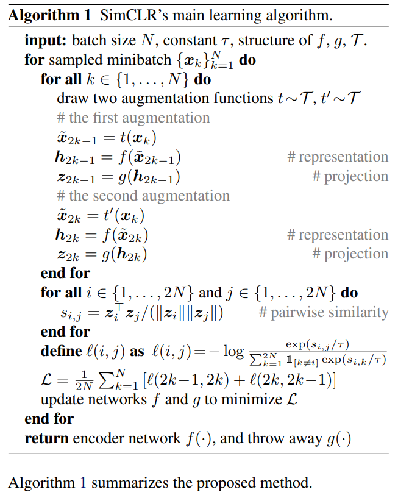

## A Simple Framework for Contrastive Learning of Visual Representations

来源：CVPR2020

作者：谷歌 Ting Chen

论文：[arxiv](https://arxiv.org/pdf/2002.05709.pdf)

代码：[github](https://github.com/google-research/simclr)

### 摘要

提出了一种对比自监督方法，没有复杂的架构和存储。为了理解为什么对比预测任务能学到有用的特征，作者系统的分析他们自己框架的每个组成部分，得到如下结论：

- DA很重要
- 在表征和对比损失之间引入一个可学习的非线性变换可以稳定的改善学习到的表征
- 相较于监督学习，需要更大的batch_size和更多的训练次数

用SimCLR得到的自监督特征训练一个分类器，在ImageNet上得到了 76.5% 的 top-1准确率，和监督方式ResNet-50的表现一样。用 1% 的标签微调可以达到 85.8% 的 top-5 准确率。

### 结论

作者提出提出了对比学习的一个简单框架。

论文中的方法和监督学习的不同只在于：

- DA的选择
- 网络结束后使用一个非线性的头（nonlinear head）
- 损失函数

自监督学习还很有潜力。

### 2.方法

#### 2.1. The Contrastive Learning Framework

SimCLR通过最大化一个样本的两个增强版本的视图之间的 agreement 学到一个表征，通过一个对比损失学到的（表征空间）。

SimCLR框架包括如下四部分：

- 一个随机的DA模块。

  生成任意给定一个样本 $x$ 的两个DA视图。如上图所示，分别表示为 $\tilde{x}_i, \tilde{x}_j$ ，这两个构成正样本。

  三种数据增强方式：resize紧接着random cropping，random color distortions，random Gaussian blur。

- encoder $f(\cdot)$

  提取特征，ResNet实现。作者表示可以用不同的网络做encoder，没有限制。

  $h_i = f(\tilde{x}_i) = ResNet(\tilde{x}_i)$ ，$h_i$ 是GAP之后的输出（不经过全连接层和线性分类器，相当于把分类器部分丢掉了）。

- 映射头 $g(\cdot)$

  把encoder得到的特征在映射一下，得到的向量用在对比损失上。

  一个隐层的MLP实现，输出： $z_i = g(h_i) = W^{(2)} \sigma(W^{(1)}h_i)$ ，其中， $\sigma$ 是ReLU，$W^{(2)}, W^{(1)}$ 分别是MLP输出层参数和隐层参数。

  为什么不直接用 $h_i$ 而是 $z_i$ ，作者做了实验表示，后者效果好。

- 对比损失函数

  用在对比预测任务。

  给定一个集合 $\{\tilde{x}_k\}$ ，其中包含样本的正样本对  $\tilde{x}_i, \tilde{x}_j$ 。

  ？对比预测任务目的是：给定 $\tilde{x}_i$ ，在 $\{\tilde{x}_k\}_{k \neq i}$ 中识别 $\tilde{x}_j$ 。

作者随机选取了一个batch（ $N$ 个样本），并在数据增强的样本上 定义了对比预测任务，那么最后就有 $2N$ 个数据点。作者没有明确的规定负样本。相反，给定一个正样本对，剩下的 $2(N-1)$ 个样本对就是负样本。

相似度函数的定义： $sim(u, v) = \frac{u^Tv}{||u||||v||}$ （余弦相似度）。那么一个正样本对的损失定义为：
$$
\mathcal{l}_{i,j} = - \log \frac{\exp(sim(z_i, z_j) / \tau}{\sum^{2N}_{k=1} \mathbb{1}_{[k \neq i]} \exp(sim(z_i, z_k) / \tau}	\tag{1}
$$
最终的损失是：所有 $2N$ 个样本都交叉计算损失，包括 $(i,j)$ 和  $(j,i)$ 。

为了方便上述损失记为：NT-Xent 。

#### SimCLR伪代码

