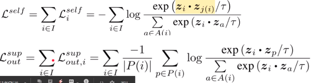
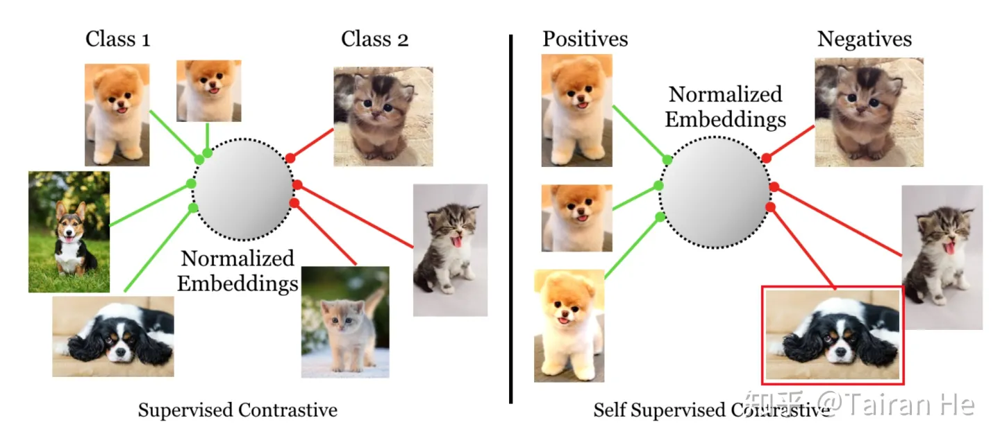
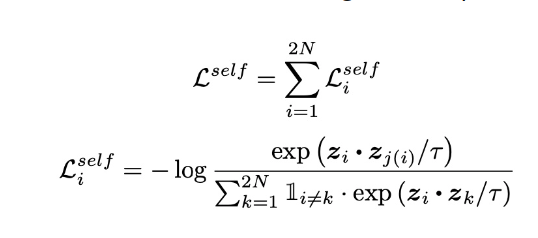
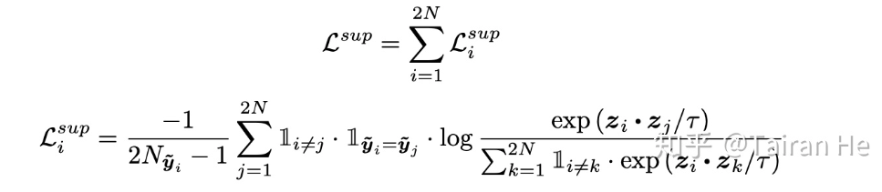
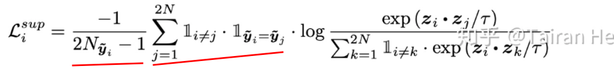

# Supervised Contrastive Learning

[Supervised Contrastive Learning](https://zhuanlan.zhihu.com/p/265529937)

自监督对比学习学到的InstDisc是同源和不同源之间的差别。

监督对比学习，加上了同类和不同类之间的差别。

其中，$z_p$ 是和 $z_i$ 同类的样本（不是同源）。

自监督：

为了让同类图片的feature彼此接近，需要使用类别信息来判断哪些图片属于同一个类，因此，方法的名字从“自监督”变成了“监督”。对比学习的依据，从“是否来源于同一张图片“，变成了”是否属于同一个类“。训练使用的loss函数变为：

多了这些项：

其中，$2N_{\tilde{y_i} - 1}$ 是所有和第 $i$ 个样本同类的数量，不包含第 $i$ 个样本。

“监督对比学习“，相比”自监督对比学习“，将对比策略，从“同源” vs “非同源”（经DA之后，来源都是同一张图片），扩展为“同类” vs "非同类“。