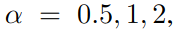
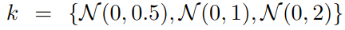

## DiffAlign : Few-shot learning using diffusion based synthesis and alignment

作者：Aniket Roy（约翰霍普金斯大学）

来源：arxiv

论文：[[arxiv](https://arxiv.org/pdf/2212.05404)]

代码：[[一作github主页](https://github.com/aniket004)] （暂无代码）

### 创新点

提出 DiffAlign ，可以从图像的标签生成图像。作者用最近效果很好的从文本生成图像的生成模型（例如：DALL-E和扩散模型）。但是在生成的这些图像上训练还是不够，因为生成图像和真实的图像毕竟不一样。所以，作者提出了最大平均差异损失（maximum mean discrepancy (MMD)）让生成的图像和真实图像对齐，减少他们之间的差距。

### 结论

DiffAlign 是一种使用文本-图像生成模型的数据扩增方法，在小样本分类中，用标签的名字生成图像。

MMD损失 让生成的图像和真实图像对齐。

### 实验结果

| FC-100                                                       | miniImageNet                                                 | miniImageNet →CUB                                            | 损失消融实验                                                 |
| ------------------------------------------------------------ | ------------------------------------------------------------ | ------------------------------------------------------------ | ------------------------------------------------------------ |
|  |  |  |  |

### 4. 方法

使用 [[High-resolution image synthesis with latent diffusion models](https://openaccess.thecvf.com/content/CVPR2022/papers/Rombach_High-Resolution_Image_Synthesis_With_Latent_Diffusion_Models_CVPR_2022_paper.pdf)] 中提到的扩散模型，用标签的文本信息生成图像。

- 在base数据集上学习一个分类器
- 给base数据生成伪标签
- 在novel类上做数据扩增（扩散模型）
- 用MMD损失对齐生成图像和真实图像
- 在合成+真实图像的数据集上训练一个小样本分类器

#### 4.1. 在base数据集上学习一个分类器（预训练+微调）

使用 [[Exploring complementary strengths of invariant and equivariant representations for few-shot learning (IER)](https://openaccess.thecvf.com/content/CVPR2021/papers/Rizve_Exploring_Complementary_Strengths_of_Invariant_and_Equivariant_Representations_for_Few-Shot_CVPR_2021_paper.pdf)] 的框架，作者在base数据集上是使用自监督损失，进行了对比预训练（contrastive pretraining ）。然后跟一个普通的交叉熵分类损失( $L_{CE}$ )。用 ResNet-12 做嵌入网络，用交叉熵损失训练 ResNet-12。

#### 4.2. 给base数据集生成伪标签

使用 [[Label hallucination for few-shot classification](https://ojs.aaai.org/index.php/AAAI/article/view/20659/20418)] 中的方法生成伪标签。

具体操作：在novel数据集上，训练一个逻辑回归分类器( $g_{\phi}$ )。然后用这个训练好的分类器预测base数据集中图像的标签。预测的标签记为伪标签。这些有伪标签的base图像，和novel类里的图像一起训练一个分类器( $h_{\phi}$ )。每个episode，我们用support集合，交叉熵损失，训练一个分类器 $g_{\phi_i}(\cdot)$ 。

用 ResNet-12 出来的特征进行计算的。 $g_{\phi_i}$ 用来给整个base数据集生成伪标签。

我们随机采样一个base图像集合和伪标签上相应的softmax分布，去计算KL散度损失。

#### 4.3. 数据扩增：给novel类生成合成的图像

使用 [[High-resolution image synthesis with latent diffusion models (stable diffusion)](https://openaccess.thecvf.com/content/CVPR2022/papers/Rombach_High-Resolution_Image_Synthesis_With_Latent_Diffusion_Models_CVPR_2022_paper.pdf)] 中的扩散模型从标签文本生成图像。

##### 扩散模型

给定一张图像 $x$ ，然后逐渐加高斯噪声，得到 $x_t$ 。然后不断去噪，训练一个去噪的AE。因为目的是学到数据分布 $p(x)$ ，所以训练这个AE最小化 $p(x)$ 的变分下界。由于高斯噪声的假设，这些模型可以表示成一个去噪AE的等权重序列  ，和每个去噪的步骤相关  。因此，相应的目标函数就是

在扩散过程中，为了代替高维的输入，[[High-resolution image synthesis with latent diffusion models (stable diffusion)](https://openaccess.thecvf.com/content/CVPR2022/papers/Rombach_High-Resolution_Image_Synthesis_With_Latent_Diffusion_Models_CVPR_2022_paper.pdf)] 把输入映射到一个低维的向量，然后在这个向量上做扩散。把这个特征空间记为 $z_t = G(x_t)$ ，$G(\cdot)$ 是UNet类型的encoder。那么，扩散损失变为：

对于文本条件的图像生成，还用了一个encoder( $\tau_{\theta}$ )，用来把标签 $y$ 映射成到UNet中间层的中间表示\向量，通过一个cross-attention。最后，文本条件的扩散模型使用 [[High-resolution image synthesis with latent diffusion models (stable diffusion)](https://openaccess.thecvf.com/content/CVPR2022/papers/Rombach_High-Resolution_Image_Synthesis_With_Latent_Diffusion_Models_CVPR_2022_paper.pdf)] 中的损失：

##### 稳定扩散（Stable diffusion）

Stable diffusion是这样一个扩散模型：

> table diffusion is a diffusion model conditioned on text embedding of CLIP ViT-L/14 [35] text encoder and trained on LAION-400M dataset [41] usingimage-text pairs. 

我们用novel类的名字（ $y^{novel}$ ）输入扩散模型，生成图像（ $x^{syn}$ ）。

我们使用生成好的这些图像训练小样本分类器。注意，我们在交叉熵损失中（ $L_{CE_{smooth}}$ ）使用了标签平滑避免过拟合。那么损失就是：

##### 生成图像和真实图像对齐

生成图像和真实图像的区别：

提出多核最大化平均差异损失（MMD）减少两者之间的差异。

假设，给定一个源（$\mathcal{D}_s$）和目标区域（$\mathcal{D}_t$），他俩是从集合 $\chi$ 中的分布为 $P$ 和 $Q$ 的区域中分别采样出来的。这些区域中样本的特征分别表示为 $\{x^s_i\}$ 和 $\{x^t_i\}$ 。一个两个概率分布 $P$ 和 $Q$ 之间的多核的MMD（$D_k(P,Q)$） 定义为：

 $k$ 是函数空间的核函数

 $k_p$ 是一个单独的核。特征映射  映射成一个再生核希尔伯特空间。我们使用三个高斯核，标准差分别是 ，因此  。如果核是  ，那么使用核trick，MMD可以估计为，不需要直接学习  ：

因此，真实图像（$x^{novel}$）和合成图像（$x^{syn}$）的MMD损失就是：

##### 训练小样本分类器

最后，我们训练整个的backbone（$f_{\theta}$）和分类器（$g_{\phi}$）：

- 在novel数据集上使用交叉熵损失： 
- 在生成的图像上使用标签平滑的交叉熵损失： 
- 在带有伪标签的base数据集上使用KL散度损失： 
- 真实图像和生成图像之间的MMD损失： 

因此，最终的损失函数就是：

其中，作者在实验中设置  。

### 4.6. 作者实现上的一些参数

ResNet-12作为backbone网络。在ResNet-12之后添加了一个两层的MLP用来进行 N-way 的分类。SGD中，momentum 0.9，backbone和分类器学习率设置为 0.025 和 0.05，weight decay是5e-4。在250张图像的batch的训练过程中，执行标准的数据增强： color jittering, random crop, and horizontal flip ，在