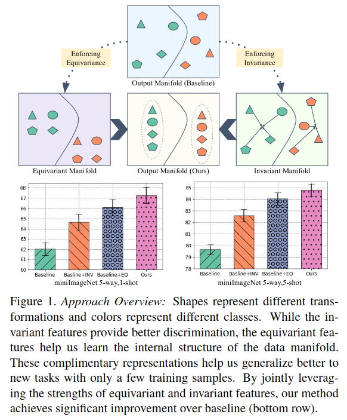

## Exploring Complementary Strengths of Invariant and Equivariant Representations for Few-Shot Learning

作者：Mamshad Nayeem Rizve（中佛罗里达大学）

来源：CVPR 2021

论文：[[thecvf](https://openaccess.thecvf.com/content/CVPR2021/papers/Rizve_Exploring_Complementary_Strengths_of_Invariant_and_Equivariant_Representations_for_Few-Shot_CVPR_2021_paper.pdf)]

代码：[[github](https://github.com/nayeemrizve/invariance-equivariance)]

引用数：65

理解参考：[[知乎](https://zhuanlan.zhihu.com/p/397639612)] [[知乎](https://zhuanlan.zhihu.com/p/354771341)]

### 创新点

提出了一个问题：只是简单的提高特征提取器的性能，FSL的性能能到什么程度？

