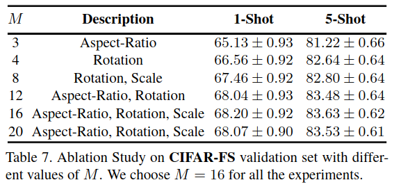

## Exploring Complementary Strengths of Invariant and Equivariant Representations for Few-Shot Learning

作者：Mamshad Nayeem Rizve（中佛罗里达大学）

来源：CVPR 2021

论文：[[thecvf](https://openaccess.thecvf.com/content/CVPR2021/papers/Rizve_Exploring_Complementary_Strengths_of_Invariant_and_Equivariant_Representations_for_Few-Shot_CVPR_2021_paper.pdf)]

代码：[[github](https://github.com/nayeemrizve/invariance-equivariance)]

引用数：65

理解参考：[[知乎](https://zhuanlan.zhihu.com/p/397639612)] [[知乎](https://zhuanlan.zhihu.com/p/354771341)]

### 等变性和不变性

### 创新点

提出了一个问题：只是简单的提高特征提取器的性能，FSL的性能能到什么程度？

通过同时学习等变性和不变性，训练了比RFS更好的特征提取器，得到范化性和迁移性更强的特征。

### 实验结果

| CIFAR-FS                                                     | FC100                                                        | miniImageNet                                                 | tieredImageNet                                               | 多个数据集                                                   |
| ------------------------------------------------------------ | ------------------------------------------------------------ | ------------------------------------------------------------ | ------------------------------------------------------------ | ------------------------------------------------------------ |
|  |  |  |  |  |

| 网络每个部分的分析                                           |
| ------------------------------------------------------------ |
|  |

| 不同的M的值                                                  |
| ------------------------------------------------------------ |
|  |

| 自监督(SSL)方法的对比                                        |
| ------------------------------------------------------------ |
|  |

### 3. 方法

#### 3.1. 训练框架

两阶段的训练过程：先在整个base数据集上预训练，再在novel数据集上微调。

特征提取器： $f_{\Theta}$ ，分类器： $f_{\Phi}$ ，然后在整个base训练集（$\mathcal{D}_b$）上用交叉熵损失训练：

再加上一个正则项：

#### 3.2. 通过自监督学习加入归纳偏置

通过自监督学习给一个几何变换集合 $\mathcal{T}$ 加入等变性和不变性。对于表示学习，自监督方法通常旨在实现某些输入变换的等价性，或通过使表示不变来学习区分实例。作者提出，在自监督的文献中，还没有在一个通用的几何变换集合中同时加入等变性和不变性的工作，作者是第一个。

如图2所示，一个通用的几何变换集合就是：放大，缩小，旋转之类的。一共又 $M$ 个图像变换方法，输入 $x$ 输出 $M$ 个变换的版本，然后把这个M个组合成一个张量送入网络，  。

##### 3.2.1 执行等变性

等变特征能帮助编码数据固有的结构，提高特征在新任务上的范化性能。

> To enforce equivariance for the set $\mathcal{T}$ comprising of $M$ quantized transformations, we introduce an MLP $f_{\Psi}$ with  parameters $\Psi$.

图2，用一个两层的MLP $f_{\Psi}$ ，在 $M$ 个变换组成的 $\mathcal{T}$ 集合上执行等变性。  ， $z = f_{\Theta}(x_{all})$ 。

为了训练 $f_{\Psi}$ ，作者创造了不用人工标注的代理标签。对一个具体的变换，一个 $M$ 维的one-hot向量 $u \in \{0,1\}^M$ 用来表示 $f_{\Psi}$ 的标签。分配了代理标签之后，就用监督的交叉熵损失训练：

> This supervised training with proxy labels in the equivariant space $\mathcal{U}$ ensures that the output embedding $z$ retains transformation equivariant features.

##### 3.2.2 执行不变性

虽然等变特征对于编码数据中的结构很重要，但它们对于类的区分可能不是最佳的。

> This is because the transformations we consider are nuisance variations that do not change the image class, therefore a good feature extractor should also encode representations that are independent of these input variations. 

这是因为我们考虑的转换是不会改变图像类的讨厌的变化，因此一个好的特征提取器也应该编码独立于这些输入变化的表示。

图2，用 $f_{\Omega}$ 学习不变性，  。

用对比损失训练 $f_{\Omega}$ 。作者通过最大化 $v^m$ 和 $v^0$ 之间的相似度执行不变性（$v^m$ 是第m个变换后得到的，$v^0$ 是第一个变换得到的，第一个变换不执行任何图像transform）。作者又提出，用一个batch里的负样本不够，用一个 [(memory bank) [Self-supervised learning of pretext-invariant representations](https://openaccess.thecvf.com/content_CVPR_2020/papers/Misra_Self-Supervised_Learning_of_Pretext-Invariant_Representations_CVPR_2020_paper.pdf)] 存更多的负样本。损失函数：

其中， $m$ 表示变换的索引， $\tilde{v}^0$ 表示 $v^0$ 的副本（一样的），函数 $h(\cdot)$ 定义为：（infoNCE格式）

##### 3.2.3 多头蒸馏

图2的右半部分。

模型学到等变性和不变性的特征之后，用自蒸馏训练一个新模型，使用之前模型的输出作为锚点。典型的知识蒸馏中，通过匹配两个模型的soften输出信息把大模型（教师模型）的信息交换给小模型（学生模型）。

##### 3.2.4 最后的损失函数

#### 3.3. 小样本验证过程

用novel类中的 N-way K-shot 的任务测试特征提取器 $f_{\Theta}$ 。然后用 RFS 中的验证过程中的方法计算准确率：用 support 集合（包含SimCLR类型的5个DA版本，共25个）训练一个线性分类器（逻辑回归实现），然后预测 query 的类。